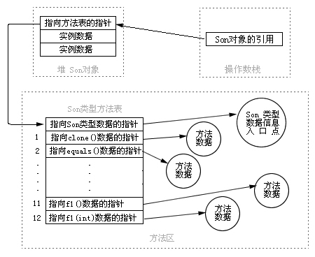

##### Java 语言特性

**JDK 版本**

+ JDK7 和 JDK8 的区别 

+ Java各个版本的新特征

+ **如何在C++中调用汇编代码** 

+ 除 Java 生态还会什么？

  C++ 析构函数、不写析构函数会怎么样，还能释放内存吗

  C++ 和 Java 区别

+ Java 开发的 6  个原则

  1. **单一职责原则**：有且只有一个原因引起 **类/接口/方法** 的变更。即一个 **类/接口/方法** 只描述一种类型的职责。
  2. **里氏替换原则**：任何使用父类的地方，都能够透明地使用子类对象代替。
  3. **依赖倒置原则**：
     + 模块之间的依赖关系应该由 抽象 产生；类之间的依赖关系不应该由实现类产生，而应该由 接口、抽象类 产生。
     + 接口、抽象类 不依赖于 实现类。
     + 实现类依赖于 接口、抽象类。
  4. 接口隔离原则
  5. 迪米特法则
  6. 开闭原则

**Java 特性**

+ 面向过程：

  > 面向过程，注重的**过程化、结构化**地解决问题，**程序结构由需求决定**。
  >
  > 通俗的讲：会按照处理流程一层层的拆分需求，将各个流程函数化，最终依次调用这些函数，解决具体问题。
  >
  > 因此，在面向过程的开发方式中，代码的层级关系往往会随着需求的变更而发生较大的改变；进而使得代码复用率低，程序的可维护性低。

+ 面向过程  vs 面向对象

  + 编程世界中，我认为，宏观上程序的运行，都是数据在 方法/函数 中执行的结果。

    这里就涉及到两个内容：**数据、方法/功能/函数**。

    数据作为程序输入，通过一系列的程序处理，得到最终的结果。面向过程编程 与 面向对象编程 就在数据的处理过程中产生了区别。

  + *面向过程*

    在处理数据的过程中，按照需求，层层划分程序结构，每一层以函数的形式呈现，再依次调用这些函数形成数据处理流程 —— **函数为特定类型的数据服务，但数据本身 与 函数 却是相互独立的关系。**

  + *面向对象*

    + 在数据处理的过程中，*按照事物特征创建对象，程序的执行就是对象之间的交互过程*。
    + *为什么是对象之间的交互过程呢？因为，对象既拥有属性特征（数据），也拥有行为特征（函数/方法）。*
    + 对象的出现，打破了 数据 与 函数 之间固有的关系。**对象即数据**，**对象拥有特定的行为（函数）**，**对象的行为又为其他数据服务。**这就使得，系统能够实现更加复杂的功能。
    + 并且，**面向对象天生的有 3 大特性：封装、继承、多态**，这些特性，在对象通信的过程中，天然的铸就了 面向对象编程 的优越性。

+ 面向对象特性

  - 封装：
    + 将事物抽象成一个类型的事物（不是说 new 的对象），总结出该类型事物共有的属性、共有的行为，并以这个类型为单位，将这些属性和行为封装在这个类里面。
    + 通过访问控制修饰符，可以控制属性和行为是否对外部可见，保证数据的安全性。
  - 继承：
    + 类之间的 is-a 关系，是父类和子类之间的关系。
    + 通过继承实现代码高度复用性。子类拥有父类所有的非私有方法和属性，并且可以在此之上增加自身的特有的方法和属性。
  - 多态
    + 即多种状态，是指在编译期无法确定 对象的具体类型，只有在运行时动态确定。
    + 通过多态，实现了代码的高度灵活性，可以编写出更加通用的代码，适应需求的不断变化。

+ 方法调用

  + **方法调用 之 绑定**

    + 将一个方法调用 与 方法主体关联起来称为 绑定。

    + 方法调用绑定分为：前期绑定、后期绑定（动态绑定/运行时绑定）

    + 前期绑定：在编译期，有编译器和连接程序实现。C 语言只有这一种方法调用。

    + 后期绑定：在运行时根据对象的类型进行绑定。

      **Java 中除了 static、final、private 修饰的方法之外，其他所有的方法都是 动态绑定。**

      注意：将方法声明为 final 能够有效的“关闭”动态绑定，但大多数情况下，这并不会对程序的整体性能有什么改观。

  + 方法调用示例：

    ```java
    public class Father {
        // 父类 invoke 方法
        public void invoke(Map map) {
            System.out.println("this is father map invoke");
        }
    }
    
    public class Child extends Father {
    
        // 重载方法
        public void invoke(HashMap map) {
            System.out.println("this is child hash map invoke");
        }
    
        // 重写方法
        @Override
        public void invoke(Map map) {
            System.out.println("this is child override map invoke");
        }
    }
    
    public class Main {
        public static void main(String[] args) {
            Father father = new Father();
            HashMap hashMap = new HashMap();
            father.invoke(hashMap);
    
            // 声明类型为 Child：调用了 Child 的重载方法
            Child child = new Child();
            child.invoke(hashMap);
    
            // 声明类型为 Father：调用了 Child 的重写方法
            Father child2 = new Child();
            child2.invoke(hashMap);
        }
    }
    /*
    测试结果：
    
    this is father map invoke
    this is child hash map invoke
    this is child override map invoke
    */
    ```

  + **字节码分析**

    ```
    在目标 .java 目录下执行如下指令：
    javac xxx.java --- 编译 .java 文件，生成 .class 字节码文件。
    javap -c -verbose xxx.class --- 使用 javap 工具查看生成的字节码文件，直接打开是乱码。
    ```

    上述 main 方法中三个 invoke 方法调用的指令：

    ```
    0: new			  #2  // class design/replace_design/Father
    18: invokevirtual #6  // Method design/replace_design/Father.invoke:(Ljava/util/Map;)V
    
    21: new        #7  // class design/replace_design/Child
    31: invokevirtual #9  // Method design/replace_design/Child.invoke:(Ljava/util/HashMap;)V
    
    34: new        #7  // class design/replace_design/Child
    46: invokevirtual #6  // Method design/replace_design/Father.invoke:(Ljava/util/Map;)V
    ```

    三个 invoke 调用方式都相同，取出一个进行详细解析

    ```java
    Father child2 = new Child();
    child2.invoke(hashMap);
    ```

    字节码指令如下：

    ```java
    /* Father child2 = new Child(); 4 条指令 */
    34: new				 #7		// class .../Child —— new 关键字创建 Child 类的对象
    37: dup						// 赋值栈顶数值，并将复制值压入栈顶
    38: invokespecial	 #8		// Method .../Child."<init>":()V —— 调用初始化代码块，为 Child 对象赋予初值
    41: astore			 4		// 将栈顶引用型数值存入指定的本地变量
    
    /* child2.invoke(hashmap); 3 条指令 */
    43: aload			 4		// 将指定引用类型本地变量推送至栈顶 ：child2 引用变量推送至栈顶
    45: aload_2					// 将第3个引用类型本地变量推送至栈顶 ：hashmap 引用变量推送至栈顶
    46: invokevirtual 	 #6		// .../Father.invoke:(Ljava/util/Map;)V —— invokevirtual 指令调用 Father中的实例方法 
    ```

    字节码解释：`46:invokevirtual	#6`

    ```
    46:		字节码指令行号
    invokevirtual:	字节码指令
    #6：		字节码指令操作的对象，表示常量池中对应的 常量
    
    例如：第 6 项常量
     #6 = Methodref          #2.#23         // design/replace_design/Father.invoke:(Ljava/util/Map;)V
     #2 = Class				    #21           // design/replace_design/Father
     #23 = NameAndType        #28:#29		    // invoke:(Ljava/util/Map;)V
     
     #21 = Utf8				design/replace_design/Father
     #28 = Utf8         invoke
     #29 = Utf8				(Ljava/util/Map;)V
     解释：第 6 项常量，表示方法引用（Methodref），该方法是 #2 号常量引用的类，该方法是 #23 号常量指定的方法
    ```

  + **方法调用过程**

    [Java 动态绑定原理_1](https://www.jianshu.com/p/e9cf9af1e450) | [Java 动态绑定原理_2](https://www.cnblogs.com/kaleidoscope/p/9790766.html)

    + 编译期

      1. 对象的**声明类型** + 调用的**方法名**

         编译器列举 声明类型 中 指定方法名的方法，同时会列举其超类中访问属性为 public 的同名方法。

      2. **重载解析**：调用方法提供的**参数类型**

         在编译器列举的所有同名方法中，选择一个与 **给定参数类型完全匹配**的方法。

         编译器会在 class 文件常量池中生成属于该方法的*符号引用（该方法所属类的全限定名 与 方法签名 组成）*

         此时，生成该方法调用的字节码指令，该指令的调用目标就是 该方法的符号引用。

         ```
         如果编译器没有找到与参数类型匹配的方法，或者经过类型转换后有多个方法与之匹配，则会报错。
         ```

      3. 如果调用的方法是 **构造器** 或者是 **private、final、static 修饰的方法**，则编译生成的调用指令为 **invokespecial、invokestatic**，能够直接确定该方法所属的类  —— **静态解析**！

         ```
         特别说明：final 方法由于不能被覆盖，可以唯一确定，因此 Java 语言规范规定 final 方法属于非虚方法，但仍然使用 invokevirtual 指令调用。
         ```

    + 运行期：

      1. 解析字节码指令 => 解析方法调用指令 => 解析该方法的 符号引用。
      2. 若调用指令为**invokestatic、invokespecial**，根据所属类的全限定名查找该类，若该类未加载，则先执行类加载过程，加载完成后，将该方法的符号引用替换为 指向方法区中该方法内存地址的直接引用，最后调用方法。
      3. 其余全部的方法（**invokevirtual、invokeinterface**） —— **动态绑定**调用。

    + 动态绑定 之 **方法表**

      + 类加载时，虚拟机会为每个类创建一个 **方法表**，表中列出了 所有方法的方法签名 和 实际调用的方法。

      + 方法表 具有两个特性：

        1. 子类方法表中继承了可见的父类方法

        2. 相同的方法（继承的方法 + 重写的方法）在所有类的方法表中的索引相同。（例如下图的 f1() 和 f1(int) 方法在父类和子类方法表的位置）

           

    + **动态绑定**

      > 1. 解析方法调用指令 => 解析方法的符号引用。
      >
      >    在该**符号引用指定的类（声明类型）** 的方法表中，找到该方法，并将符号引用替换成 方法表中 的索引值。
      >
      > 2. 根据**对象实际类型**，查找实际类型的方法表
      >
      >    调用方法前，编译器会将对象的实际类型压到栈顶。
      >
      >    虚拟机根据该对象的实际类型，找到该对象实际的类，进而找到该类对应的方法表。根据上述解析到的方法的索引值，直接查找到目标方法，最终得到目标方法的直接引用。
      >
      >    ```
      >    至于目标方法 何时解析得到 直接引用，视情况而定，可能会在该类的类加载时期就将 方法的符号引用解析成直接引用，可能在运行期，该方法第一次调用时将符号引用解析成直接引用，虚拟机会将运行时解析的结果做一个缓存。
      >    ```
      >
      > 3. 方法调用。

      

+ 面向对象中的多态特性如何理解？

  重载和覆盖的区别？

  ```
   1. 重载：同一个类中有相同的方法名，但方法签名不同，方法的返回值不作为判断标准。
  	覆盖：子类与父类、父接口间有相同的方法声明，且子类对方法有不同的实现。
  
   2. 重载：实现了代码的可读性和可维护性，面向过程的语言中就存在。
  	覆盖：实现了面向对象中方法调用的多态性。
  ```
  
+ 泛型擦除

  > Java 的**泛型**是通过 **泛型擦除** 实现的。
  > 
  > **类型检查发生在编译期**，编译器在编译时就擦除了所有的类型信息，只保留了原始类型。**类型参数**只会在源程序代码中程序，在编译后的字节码中泛型会被替换为原始类型，而关于泛型的类型参数，它会以**强制类型转换**的方式插入到对应的字节码中。
  > 
  > 因此，在运行期对于 Java 而言， ArrayList\<Integer\> 和 Array\<String\> 是同一个类型，分别需要进行强制类型转换。

+ 抽象类 vs 接口

  > + 抽象类：类继承的方式：只支持单继承。
  > 
  >   抽象类具备高度的通用性，用于声明抽象行为，行为的具体实现由子类决定。
  >
  >   **用于声明类之间更加通用的 行为和属性！！**
  >
  >   例如：**AbstractStringBuilder 就声明了一些抽象方法，供 StirngBuilder 和 StringBuffer 根据自身特点进行实现，这些抽象方法，对于 StirngBuilder 和 StringBuffer 而言都是相同的语义，仅仅是具体实现上不同，所以说是一个通用的方法。**
  > + 接口：类实现的方式：允许实现多个接口，通过接口达到多重继承的效果。
  >
  >**接口声明的是类的功能，是一个类功能的规范！！**
  >
  >例如：**Collection 接口，就是声明了集合相关的功能，具体的集合实现由子类决定**，并不能给出每个功能的具体实现。（默认实现、静态实现除外）

  + 若只需要声明抽象方法，而不需要其他额外的 变量和具体方法实现，则可以选择接口。
  
    若需要多继承，则可以使用 接口代替。
  
    其余情况可以使用 抽象类。

**Java 基本类型**

+ Java基本变量类型 ， java中的基本变量类型，各占多少比 bit

+ Int的范围

  ```xml
  int：4 Byte
  int 有符号位：2^31 ~ 2^31-1
  Integer 包装类：-128 ~ 127 都是缓存
  ```

+ Long 和 long 的区别，两者 的 == 比较（值比较）

+ [一个 Java 字符占用多少空间？](https://mp.weixin.qq.com/s/gbYCSj2c0voXEk8Xy6tkaQ)

**Java 关键字**

+ static 关键字的作用 

  ```
  被修饰的 属性、方法、内部类 都将为类所有，不再是某个对象的独家珍藏！
  使用 类变量 可以作为共享资源，被各个对象上的线程共享！
  静态初始化块、静态变量 会在类加载的初始化阶段被执行，而普通构造器会在 创建对象的时候被执行！
  ```

+ final，finally，finalize区别

  - final 是修饰符：能够修饰 变量、方法、类，表示最终的意思。
  - finally 是 异常体系中的关键字，和 try 联合使用，通常在 finally 中执行必须要执行的代码块。
  - finalize 是 方法名，可以实现 finalize 方法拯救将死对象。

+ this 关键字

  + [用法 1](https://blog.csdn.net/qq_43555323/article/details/84993460)

  1. 方法中**区分 成员变量 和 局部变量**（当成员变量和局部变量同名时）

  2. this 关键字**将当前对象传递给其他方法**（其他对象的成员方法、其他类的静态方法）

  3. 当需要**返回当前对象的引用时**，常常返回 this 关键字，即：return this

  4. 在**构造器中调用 同类的构造器**时，使用 this 关键字，避免相同的初始化代码。

     ```
     Java 编程思想：
     通常写 this 的时候，都是指“这个对象”或者“当前对象”，而且它本身表示对当前对象的引用。
     在构造器中，如果为 this 添加了参数列表，就有不同的含义，这种产生对符合此参数列表的某个构造器的明确调用，这样调用其他构造器就有了直接的途径。
     ```

     ```java
     public class Test{
         public Test(int a){
             this(a, 0);
         }
         public Test(int a, int b){
             this(); // 能避免和 无参构造器 中的初始化代码重复
             // todo
         }
         public Test(){
             // tood
         }
     }
     ```

     + 注意：
       + this只可以调用一个构造器，在一个构造器中不能同时调用两个构造器；
       + 必须将你所调用的构造器放在最开始的位置，这也解释了为什么不能在一个构造函数中调用两个构造器，那第二个势必不在最开始位置。
       + 在构造函数之外的方法内不能使用this调用构造函数。代码里面注释的都不能正确编译。

  5. this 关键字不能再 static 静态方法中使用！

     因为静态方法 在 类加载 就已经存在了，对象是在运行时在内存中生成的，this 指代的是对象。

     this 和 super 都无法出现在 static 静态方法中，因为 static 方法属于类，由类调用，因此无法找到 this 所指代的对象。

+ super 关键字

  1. 指向当前对象的父类，可以通过 super.xxx 的形式引用父类成员（实际上都是当前对象的属性，super 使得可读性更强）

  2. 区分子类的成员变量 和 父类的成员变量（变量/方法 同名）

  3. 调用父类的构造器

  4. 从本质上说，this 是当前对象的引用，而 super 仅仅是代表父类的一个关键字。

     不能像使用 this 一样将 super 当做当前对象的 引用返回。

**Java 拷贝**

+ Java 深拷贝的方式

**Java 反射**

+ java反射讲一下  java序列化(这个我真的不会。。。)  
+ [Java 动态代理](https://mp.weixin.qq.com/s/P-nrfyyWfRUurKgF4dnugA) 

**Java 序列化**

+ Java 序列化

+ 序列化的方式有哪些

  [序列化相关](https://mp.weixin.qq.com/s/LUD1GCNDkz9yo6pTpfR9-A) | [Java 序列化、反序列化](https://mp.weixin.qq.com/s/uEBWNHiEM0iP30MekoVjtw)

  JSON 和 protoBuf 比较

  二进制序列号怎么序列化的

**Java IO**

+ [Java 高效读取大文件（内存占用少）](https://blog.csdn.net/qq_24607837/article/details/80192083)

+ [Java NIO + 多线程 按行读取并处理大文件](https://blog.csdn.net/qq_25473933/article/details/79603253)

+ *既然有了字节流，为什么还要有字符流？*

  ```
   · 字符流基于字节流实现！
   · 字节流可以处理任何文件任何数据，但是遇到 字符的时候，就要考虑 字符集 的问题（需要知道编码类型，否则容易出现乱码），因此Java设计了字符流，对字符提供统一的操作接口，方便对字符文件进行操作！
   
  · 需要注意的是，字符流只能适用于文本文件中，而视频音频等二级制文件还是需要适用字节流处理！
  ```

**Java 异常**


- 异常处理

**Java 字符串**

+ String、StringBuilder、StringBuffer 区别，StringBuffer的所有方法都是加Syn么？

  ```
  StringBuilder、StringBuffer 能够避免拼接 String 的过程中创建多余的 String 对象。
  StringBuffer 是线程安全的，StringBuilder 是线程不安全的，但是是高效率的。
  
  StringBuffer 和 StringBuilder 都继承于 AbstractStringBuilder，实现字符串拼接的相关功能。
  String、StringBuffer、StringBuilder 都实现了 CharSequence 接口，实现了 字符串 的相关功能。
  ```

+ 为什么会有 StringBuilder、StringBuffer（优化 String）

+ StringBuilder 、StringBuffer 性能

  ```
  单个线程的 StringBuilder 和 StringBuffer 的区别：偏向锁！
  ```

+ 字符串拼接的几种方式

**Java 其他**

+ i++和++i的区别


- 深拷贝 和 浅拷贝有啥区别呢？

  ```
   · 深拷贝：开辟新空间，拷贝数据
    	拷贝前后的对象，互不相干，除了数值相同，其他内容毫无关联！新对象的任何操作，都不会影响到原对象的状态。
    	拷贝对象：对于基本类型而言，直接拷贝属性的值，对于引用类型而言，会创建新的对象，将对象的属性以深拷贝的方式拷贝到新对象中！
   
   · 浅拷贝：开辟新空间，拷贝引用
   	拷贝前后的对象，除了基本类型属性意外，引用类型的属性是相互影响的！
   	拷贝对象：对于基本类型而言，直接拷贝属性的值，对于引用类型而言，直接拷贝引用，即让新/旧 对象的属性 引用同一个对象！
  ```

  [Java 的深拷贝 vs 浅拷贝](https://blog.csdn.net/ccc_ccc8/article/details/89412177)

+ Object 类有哪些方法

+ 已知 rand(3) 求 rand(5)

  ```
  rand(3): 1, 2, 3
  rand(5): 1, 2, 3, 4, 5
  
  A = (rand(3) - 1 ) * 3: 0, 3, 6
  B = rand(3) - 1: 0, 1, 2
  
  A + B = 0 1 2 3 4 5 6 7 8
  A + B + 1 = C = 1 2 3 4 5 6 7 8 9
  
  C >= 5 去掉!
  0 1 2 3 4
  
  D = C%5 + 1
  D = 1 2 3 4 5
  ```

