[MongoDB 中文社区](https://mongoing.com)

##### MySQL

+ [面试题](https://mp.weixin.qq.com/s/Ad3PJM3sBKJD2j2NvMno7w)


1. [数据库连接池](https://mp.weixin.qq.com/s/6qrqt2haHNo47W5tG2WtCw)

2. 一条 sql 的执行过程

   [sql 执行过程_1](https://mp.weixin.qq.com/s/5F1-vwCNQySlQmxqnOYoMg) | [sql 执行过程](https://mp.weixin.qq.com/s/xeK0hqWKmJFJ_U6Xqhg_Qg)

3. sql 执行的慢有哪些原因

   [sql 执行的慢](https://mp.weixin.qq.com/s/ry9Kfh9Z1Tx3ux9k-V15nA)

4. 数据库分库分表，及分布式数据库常见问题

   [求求你，别再问我数据库的分库分表了](https://mp.weixin.qq.com/s/5SENYNc8r5MD7oTn8Q9XnQ)

5. redo log 和 bin log 如何配合工作，各自如何分工

6. 数据库一次性支持查询的数据上限？

7. **英文+数字的自增主键在分布式下如何解决**

   ```
   （类似于MVCC机制，使用标识符和预知量判断）
   ```

8. **使用redis怎么解决自增主键在分布式下高并发的问题**

   ```
   redis put 操作会直接覆盖已存在的 value（解决主键冲突）
   ```

   ```
   在redis中建立一个键值对，不管插入何值都存到redis的value中。等到合适的时间再存入数据库，因为主键唯一所以不符合自增要求或者重复的会被直接pass掉
   ```

9. **主键自增 进行写的时候，会使用什么事务隔离级别**

   ```
   读未提交
   ```

- 索引的优化，分析 sql 的时候，会关注哪些字段，[索引的选择](https://mp.weixin.qq.com/s/-gmAPfiKMNJgHhIZqR2C4A)


- MySQL的索引相关，MySQL命令执行生命周期（过程） 


- [数据库 MySQL](https://mp.weixin.qq.com/s/Ad3PJM3sBKJD2j2NvMno7w)

  [MySQL 优化](https://mp.weixin.qq.com/s/0p_4IbE7s2VC6KNFbdwDiQ)

- [分布式事务](https://mp.weixin.qq.com/s/xhcOp07GpKQF9YXYW7EijA)

- [MySQL 自增主键用完了怎么办](https://mp.weixin.qq.com/s/uvUaP0M_utzRq_TFgHZQbg)

- [为什么 select * 效率低](https://mp.weixin.qq.com/s/AA8KYKG-LMAl58RQjSGhzw)

- [MyBatis SQL 注入的三种方式](https://mp.weixin.qq.com/s/coCG7GZ3cGBRxQkGaKLsBg)

###### 分页优化

+ [详见：数据量很大，分页查询优化方案](https://mp.weixin.qq.com/s/H0OulFg-T4xV-yUPWL4cgw)


+ [普通的 limit 查询](https://mp.weixin.qq.com/s/nhSdm477xxntQCkw1uzynA)

  `limit 0,  100` ：从偏移量 0 开始，查询 100 条数据

  查询的 offset 一定，查询的数据量越大，越耗时

  查询的 数据量一定，查询的 offset 越大，越耗时

  *这种分页查询方式，会从数据库的第一条纪录开始查询，越往后查询，查询速度越慢，并且查询的数据越多，也会导致查询速度变慢。*

  + **普通 limit 查询底层实现**：`select * from table_one where key_column = 'condition' limit 100000, 5`

    通过 辅助索引 key_column 查询出 primary id，再到 聚族索引 中取出数据。

    `limit 100000, 5` ：涉及到 100005 次辅助索引查询，以及 100005 次聚族索引查询，最后过滤掉前 100000 条数据，返回最后 5 条数据！

    这种查询方式，会做多余的查询，并且每次查询都会再回表查询！

  + **普通 limit 带来的影响**：

    InnoDB 拥有一个 buffer pool 内存缓冲池，用于保存最近访问过的数据（包括：索引页、数据页）

    如果直接执行`limit 100000, 5` ，则会导致 100000 条冷数据占用 buffer pool 内存空间，污染 buffer pool。

+ **使用 id 限定优化**

  + 子查询限定 id：适用于 id 递增的情况！

    ```sql
    -- select * ：在 key_column 索引上，查询出所有的 primary id，再回表查询所有的数据。
    select * from table_one where key_column = 'contidition' limit 1000000,10000;

    -- select id ：子查询，根据 key_column 索引上的 primary id，限定偏移的 id 位置，再往后查询。
    select * from table_one where key_column = 'contidition' and id >= (select id from table_one where key_column = 'contidition' limit 1000000,1) limit 10000;

    -- select id 比 select * 要快很多倍！
    ```

    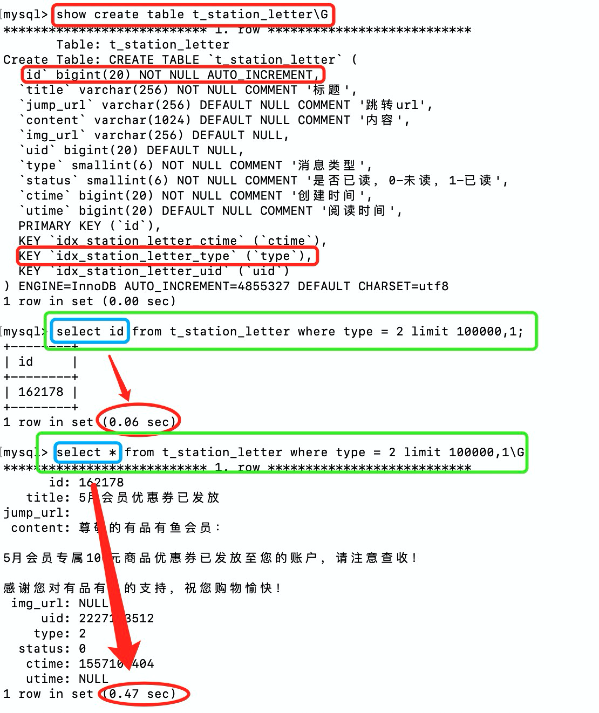

    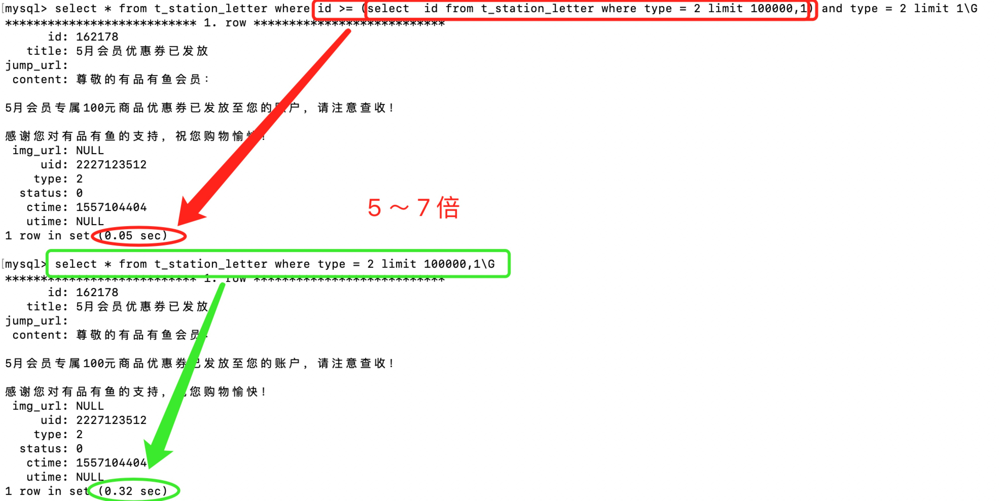

  + id 自增，事先计算出 id 范围

    假设 id 是连续递增的，则可以根据查询的页数和查询的记录数，事先在 内存中结算出 id 的范围，然后使用`id between and，或者直接 id >= minId`，这种查询方式也能够保证查询速度在 几十ms 内。

    ```sql
    select * from table_one where id >= minId limit 1000;
    select * from table_one where id between minId and maxId limit 1000;
    ```

  + in 查询限定 id

    in 查询常常用在多表关联的时候进行查询，使用其他表的 id 集合进行查询。

    ```sql
    select * from order_pid_table where id in (select order_id from order_table where goods_type = 2) limit 10000;

    -- 注意：mysql 某些版本不支持在 in 子句中使用 limit。(5.5 是支持的)
    ```

  + **Id 限定优化只适用于 id 递增的情况（in 查询除外），因此，一般建表时，都会创建一个 long / int 类型的 id 字段，用于优化分页查询。**

+ 使用临时表优化

  实际上，就是使用 临时表 保存分页的 id，然后通过 in 查询结果。这样能够极大的提高传统分页查询的速度，尤其是数据量上千万的时候。

###### 索引类型

```
MySQL 为什么使用 B+ 树？不使用 B树，也不使用 红黑树？
```

+ 使用 B+ 树

  + 结构上：
    + B+ 树是 B 树的扩展，在 B 树的基础上，将索引保存在 非叶子结点上，数据全部保存在叶子结点上！
    + 叶子结点之间有前后引用，形成链表！
  + 优点：
    + 所有数据保存在叶子结点，叶子结点之间形成链表：找到某叶子节点，在链表上向后遍历，便能够**实现 分组、排序、范围查询**！
    + 非叶子结点上只保存 索引，单个**非叶子结点上能够保存更多的索引**，能够有效的**降低 B+ 树高度**，**减少 磁盘 IO** 获取页的次数。
    + 非叶子结点保存，能够实现 **覆盖索引** 查询，避免回表。

+ MySQL 不使用 B 树

  + 结构上：

    B 树就是多叉树，所有的叶子结点都在同一层且为 null，所有的非叶子结点保存数据。

  + 优点：

    ```
    数据都在节点上，适合做单一查询，不适合做数据遍历。
    单一数据查询时，性能不稳定，最好为 O(1)，最坏为 O(logN)，对于 B+ 树而言，单一查询性能稳定，都是 O(logN)
    ```

  + 使用场景：B 树是 MongoDB 的索引结构！

    ```
    MongoDB 是 “非关系型数据库”，多数场景下，非关系型数据库 执行单一查询的 频率 比关系型数据库大，而关系型数据库的范围查询等涉及到数据遍历的操作 比 非关系型数据库 多。因此，使用 B 树能够在 单一查询的场景下有更好的性能
    ```

  + 追问：MongoDB 为什么不使用 Hash 结构呢？单一查询始终在 O(1)

    ```
    B+树 和 Hash 分别是 范围查询和单一查询的两个极端。

    对于 MongoDB 而言，多数情况下是 单一查询，也会出现 范围查询的情况。在范围查询时，B树 不如 B+树，但是 B树 的性能要比 Hash 好。因此，MongoDB 使用 B树。
    ```

+ MySQL 不使用 红黑树：

  + 结构上：

    红黑树出度为 2，并且拥有自平衡特性。

  + 优点：

    在内存中，红黑树的性能高于 B树：虽然时间复杂度上都是 O(logN)，但是精确的来说，红黑树的常数为 1，而 B树 的常数为 (m-1)

    即：`log2(N) < (m-1)logm(N)`

  + 缺点：

    数据库每个结点都存放在 磁盘中，只有使用的时候，才会以页的大小取出数据。

    因此，涉及到 磁盘IO！

    红黑树高度 比 B树 高，自然就会比 B+ 树高，会涉及到更多的 磁盘IO！

    ```
    1000w 条数据，B+树高度为3～4，而红黑树的高度为 23～24
    ```

###### B+ 树结点

+ B+ 树中的一个**结点的大小**？

  1页 或者 页的整数倍数合适。

  ```
  磁盘 IO 默认以 页 为单位，如果结点不足 1页，那么读取磁盘时，也会读取出 1页，那么，使用该结点数据时，超过结点大小的那部分页数据并不会被使用到，造成内存资源的浪费！
  因此，结点最好以 1页或者 整数倍数页 比较合适。
  ```

+ B+ 树中的一个结点，使用 **多少页** 合适？

  + 结点内容：

    + 非叶子结点：key\_value + child\_node\_point

    + 叶子结点：next\_leaf\_node\_point + 数据

      ```
      数据：
      1. 主键索引：数据行纪录
      2. 辅助索引：primary_key_value（主键值）
      ```

  + 页是 Innodb 的内存单位，默认大小为 16K。

    + 非叶子结点：

      指针在 MySQL 中占 `6Byte`；假设：key 为 bigint 类型，占 `8Byte`

      则，一个 key 总共占用 `14Byte`

      则 1页 能存储`16 * 1024 / 14 = 1170 `个 key

    + 叶子结点：

      假设：数据行记录大小为 1K（普通业务足够了）

      则 1页 能存储 16 条行记录。

+ 即：当 B+ 树高为 3 时，就能够存储`1170 * 1170 * 16 = 21902400`条纪录（2kw 条纪录）

  因此，一个结点大小为 1页 就足够了。

###### 三范式

- [理解](https://blog.csdn.net/iteye_3352/article/details/82679117?utm_medium=distribute.wap_relevant.none-task-blog-BlogCommendFromMachineLearnPai2-2.nonecase&depth_1-utm_source=distribute.wap_relevant.none-t)：

  数据库范式用来定义 数据表的冗余程度

  - 第一范式：

    每个字段都是不可再分的最小字段

    ```
    address：江苏南京 -> province、city
    ```

  - 第二范式：

    非主键字段 必须全部依赖主键字段，一个表只能描述一个事

    ```
    一张表既有学生信息，又有该学生的课程信息，即 student+course -> student、course 分为 学生表 + 课程表
    ```

  - 第三范式：

    非主键列 不能出现对 主键列的传递性依赖：非主键列必须直接依赖于主键列，消除冗余信息

    ```
    班级表中，既包含了 studentId，还包含了 studentName、studentAccount 等 student 表中的信息
    此时，只需要保留 studentId 即可，其余 student 信息为冗余信息。
    ```

- **数据库范式有什么优缺点：（为什么有 反范式？）**

  - **遵循范式**：降低数据的最小冗余度
    1. 写数据表时，避免多表之间的数据不一致性。（多个表之间存在冗余字段，则修改时，都需要修改，增加时都要增加）
    2. 若不遵循范式，则写操作时，会涉及到多个表的修改，无疑增加了 IO 次数，同时多个表的数据冗余，会占用多余的磁盘空间。
  - **反范式**：冗余数据，提高查询性能
    1. 多个表之前存在冗余字段，能够直接通过某个表获取到所要的全部信息，避免表之间的联表查询

- *实际应用中，往往都没有遵循第三范式*（实习认知）

##### 操作系统

+ [进程通信](https://mp.weixin.qq.com/s/mblyh6XrLj1bCwL0Evs-Vg)详解 | [进程通信机制](https://blog.csdn.net/qq_14978113/article/details/80738787)
+ 用户态和核心态
+ [Linux 服务端最大并发数](https://mp.weixin.qq.com/s/CAPU8bjJWobQs6JHHMasvQ)
+ [进程、线程、协程](https://mp.weixin.qq.com/s/sot23Qe9yCfEzH1iLeqR9Q)
+ 打开一个文件的过程

###### 进程通信

+ 每个进程的用户地址空间都是独立的，一般而言不能够直接访问，但是内核空间是每个进程共享的，所以，进程之间的通信必须通过内核完成**？？？？？**

1. 匿名管道

   + 匿名管道 是特殊的文件，只存在于 内核内存中，不存在于 文件系统中！

   +  `int pipe(int fd[2])` 系统调用在当前进程中创建匿名管道，并返回两个文件描述符`fd[0], fd[1]`

     `fd[0]` ：管道的读取端文件描述符

     `fd[1]` ：管道的写入端文件描述符

     从管道的一端写入数据，从另一端读取数据，所有的写入与读取都是基于内核完成的！

   + 匿名管道的进程间通信作用：

     当前进程 **fork 出的子进程会复制 父进程 的文件描述符**。此时，父子进程都会拥有 fd[0] 和 fd[1] 文件描述符。

     于是，两个进程通过各自的文件描述符，对同一个管道文件进行读写，实现进程通信。

     为了避免两个进程同时 读，或者同时 写，需要限制某个进程只能读，另一个进程只能写，因此，匿名通道是一个半双工通信通道，如果要实现全双工，就必须另外创建一个 匿名通道！

     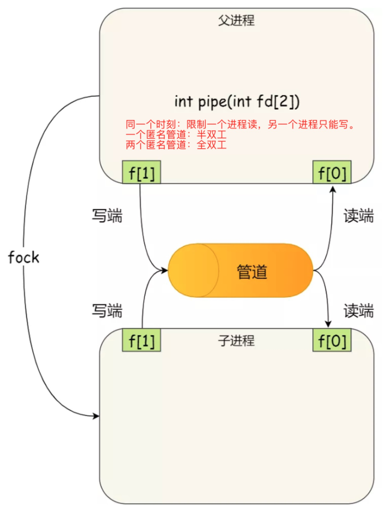

   + shell 中的管道`A | B`

     其中的 `|` 就是匿名管道，可以看出管道是半双工的！

     对于 shell 而言，并不是父子进程之间的匿名管道，shell 就是一个父级进程，shell 中每执行一条命令都会创建 shell 的一个子进程执行。因此，shell 中的 ｜ 是兄弟进程之间进行通信。

     shell 会创建一个 匿名管道，然后 fork 出两个子进程，最后，关闭 shell 进程中的文件描述符，然后两个子进程之间，一个进程只写，另一个进程只读！

     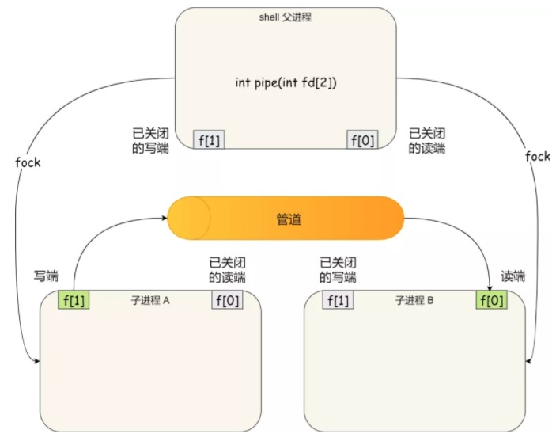

   + 对于匿名管道，通信范围仅仅存在于 父子进程关系之间，因为，匿名管道没有实体，没有管道文件，只能通过 fork 复制父进程的 fd 文件描述符达到通信的目的。

2. 有名管道

   + 对于命令管道，他可以在不想关的进程之间进行通信。

     命令管道提前在内核中，创建了一个 类型为管道的设备文件，只要在进程中能够使用这个设备文件，就可以进行进程间的通信。

   + 命令管道使用 `mkfifo` 命令创建

     ```shell
     $ mkfifo my_pipe
     # my_pipe 就是创建的 管道的名称
     ```

     基于 Linux 一切皆文件的理念，创建的管道也是以文件的形式存在，因此，使用 ls 命令查看，可以看到文件类型是 p(表示 pipe 管道)

     ```shell
     $ ls -l
     prw-r--r--. 1 root root ...
     ```

   + 通信示例：

     ```shell
     $ # 当前终端 A 写入数据后阻塞
     $ echo "test name pipe" > my_pipe  # 将字符串“test name pipe” 写入 my_pipe 通道
     								   # 当前终端阻塞！
     ```

     ```shell
     $ # 另外启动一个终端 B 读取管道数据
     $ cat < my_pipe	# 读取管道中的数据
     test name pipe

     # 当读取出管道中的数据后，终端 A 终止阻塞，继续执行，终端 B 继续执行！
     ```

   + 管道（匿名管道、有名管道）都是 fifo 的方式进行数据通信.

     通道写入之后，必须等待通道数据被读取才能够继续执行（至少 命令管道是这样的）。

     通道读取时，如果没有数据，则阻塞，直到通道写入数据后，继续执行。

     不适用于进程间的频繁通信。

3. 消息队列

4. 共享内存

   + 进程间的通信效率最高！

   + 现代操作系统中，对于内存管理都是采用 虚拟内存管理技术。

     每个进程都有自己独立的虚拟内存空间，不同进程的虚拟内存映射到不同的物理内存中。因此，即使 进程A、B的虚拟地址一样，两者访问的都是不同的物理内存地址。

   + 共享内存机制，就是两个进程分配一块虚拟地址空间，映射到相同的物理内存。

     这样某个进程写入的数据，就能够被另一个进程访问，不需要数据的拷贝与传递，大大提高进程间的通信速度。

5. 信号量

6. 信号

7. socket

##### 计网

+ http 可以基于 udp 实现吗

+ HTTP、TCP 长连接如何保持？

  + [长连接](https://segmentfault.com/a/1190000012894416)


  + HTTP：Keep-Alive

    + HTTP1. 0 默认使用的短连接，可以通过 Connection:Keep-Alive 开启长连接。

      ```
      短连接：一个请求一个连接
      长连接：多个请求共用一个连接，一个请求得到响应后，并不会马上关闭连接。

      现在的 web 页面，都含有大量的 js,css,图片 等静态资源，如果每一个资源都需要重新 建立连接断开连接，则会浪费大量的服务器资源，也会降低整个页面的响应。因此，使用 长连接 可以复用一个连接，避免了重复的 建立连接断开连接 过程。
      ```

    + HTTP1.1 默认使用的是长连接，可以通过 Connection:Close 关闭长连接。

  + TCP：keepalive

    + HTTP 长连接，本质上就是 TCP 层面的长连接，需要 TCP 层维护这个连接过程。

      因此，**TCP 层面的 keepalive 机制用于 连接保活、心跳检测。**

    + **保活原理**：

      Linux 提供了 TCP KEEPALIVE 机制，在应用层不用关心 保活 的过程，全部由 OS 管理。

      建立 TCP 连接时，Linux 为其绑定 保活计时器（默认是 2 小时），如果在 2 小时内，没有任何的数据传输，则会给 对端 发送一个（不包含数据）探测报文，若在 75s 内没有收到探测回应，就再探测一次，当连续探测 9 次之后，就会自动关闭连接。

    + **keepalive 机制的作用：**

      1. 心跳检测：监测连接的有效性，自动关闭无效连接，防止对端出现异常，而本端一直持有连接，占用资源。
      2. 连接保活：网管层会删除无用的连接？？？

+ HTTP 与 HTTPS

  1. HTTP 使用 80 端口，HTTPS 使用 443 端口

  2. HTTPS 是由 SSL + HTTP 协议构建的网络协议，用于进行加密传输、身份认证。

     SSL 安全套接在传输层。

- HTTP2.0
- get put post 区别
- dos 攻击是怎么回事，怎么解决
- tcp 三次握手过程，isn 的变化，syn 在 tcp 头部是什么结构
- 滑动窗口什么时候会滑动，算法是什么
- 对称加密、非对称加密的区别
- [TCP 大量 time_wait 处理](https://mp.weixin.qq.com/s/3evkQq-7jx2Gn_cqLIEqAA)
- [IPV6 详解](https://mp.weixin.qq.com/s/Mo8jl5EagdndlvB3Wv9JIg)
- [TCP keepalive](https://suiwo.xyz/2019/04/13/%E5%B8%B8%E8%A7%81%E9%9D%A2%E8%AF%95%E9%A2%98%E7%9A%84%E5%9F%BA%E7%A1%80%E6%80%BB%E7%BB%93%EF%BC%88%E8%AE%A1%E7%BD%91%E7%AF%87%EF%BC%89/)


##### Spring

+ SpringBoot 是干什么的，如何理解 boot，与 Spring 的区别，Spring 是干什么的

  > **SpringBoot：** 
  >
  > + SpringBoot 是 Spring 的扩展框架，它简化了 Spring 框架开发应用程序的复杂度，以 spring-boot-starter 的形式引入需要的所有外部依赖，并且它几乎免去了所有的 xml 配置文件。为 Spring 应用的开发带来了极大的便利性！
  > + 但是 SpringBoot 并不能 取代 Spring，相反，SpringBoot 依赖于 Spring 框架，是 Spring 框架的再次封装。
  >
  > **与 Spring 区别：**
  >
  > 1. SpringBoot 内置了 tomcat 服务器，通过启动类，直接启动应用程序；
  >
  > 2. SpringBoot 能够创建独立的 应用，通过将 应用程序打包成 jar 包形式，可通过命令直接执行 jar 包；
  >
  >    Spring 需要打包成 war 包，并放在在 tomcat 目录下，由 tomcat 管理应用的启动。
  >
  > 3. SpringBoot 集成了许多 第三方模块`spring-boot-starter`，支持开箱即用，通过引入一个 `spring-boot-starter`依赖，省去了大量的依赖配置，所有所需要的资源都会通过自动配置的方式实现。
  >
  >    Spring 需要在 maven 文件中引入所有所需要的 jar 包，并需要在 context、application 两个 xml 配置文件中配置 Bean。
  >
  > 4. SpringBoot 中有个一概念 “约定优于配置”：我认为，它的实现方式就是，通过注解，触发相应的 AutoConfiguration 类开始工作，这个 自动配置 的过程，就是一个 默认配置的过程，也就是一个 约定的过程。
  >
  >    通过自动配置，就不需要人为配置所要注入的 Bean。

+ Spring AOP 实现方式

  动态代理：JDK 动态代理、CGLIB 动态代理

+ 如何理解动态代理

+ cglib 和 jdk 动态代理的区别？仅仅是 类和接口的区别吗？

+ [spring boot 内置 tomcat  启动原理](https://mp.weixin.qq.com/s/ze-vAkIaSP-e_aHLjhbgTg)

+ [Spring Bean 的创建过程](https://mp.weixin.qq.com/s/URqtpFm6Gp7HnfxpOUIi_w)

+ [Spring Bean 生命周期](https://mp.weixin.qq.com/s/_4IoJO5Ybmw4RpudwrNRDA)

+ [Spring 中的 9 中设计模式](https://mp.weixin.qq.com/s/cFnFEh9kInUp3vXHws06pA)

+ [Spring 启动流程](https://segmentfault.com/a/1190000020549887)

+ SpringBoot 启动类源码

+ Spring MVC 和 [servlet](https://blog.csdn.net/JavaWildcat/article/details/97003190) 区别

###### 拦截器 vs 过滤器

- 介绍

  - 过滤器 Filter

    依赖于 servlet，用于过滤所有的 url（包括 静态资源），或者对 request、response 头部进行修改（例如：实现跨域）。

  - 拦截器 Intercept

    依赖于 AOP，使用面向切面编程的思想，在执行应用程序的方法前，拦截请求，根据业务逻辑，织入请求的预处理逻辑。

- 区别

  - *作用域：*

    Filter 是 Servlet 规范规定的，由 Servlet 容器支持，只能够用于 Web 程序中。

    Interceptor 是 Spring 内部支持的组件，能够运用在 Web 程序、Application、Swing 程序中。

  - *实现：*

    Filter 基于函数回调实现

    Interceptor 基于 Java 反射机制（jdk 动态代理）实现

  - *作用对象：*

    Filter 能够在请求进入 servlet 容器前，或者退出 servlet 容器后，对请求/响应 做预处理，能够拦截所有的 url（包括静态资源）

    Interceptor 在 servlet 内部被触发，只能够拦截 action 请求。

  - *可用资源：*

    Interceptor 是 Spring 内部组件，能够使用 Spring 中的资源，ioc 中的 Bean 对象。（例如：将 service 注入到 interceptor 中）

    Filter 只能够对 request、reponse 做修改，无法获取 Spring 内对资源。

- 配置生效

  - 过滤器

    直接在 Filter 实现类上标注如下注解：

    ​	@WebFilter：表示该组件是一个 web 过滤器

    ​	@Component：会自动扫描成组件，并注入到 Bean 容器

  - 拦截器

    编写config 配置类（@configuration）：实现 WebMvcConfigurator  接口，配置类中返回 拦截器实现类的 Bean 实例（@Bean）

- 图解

  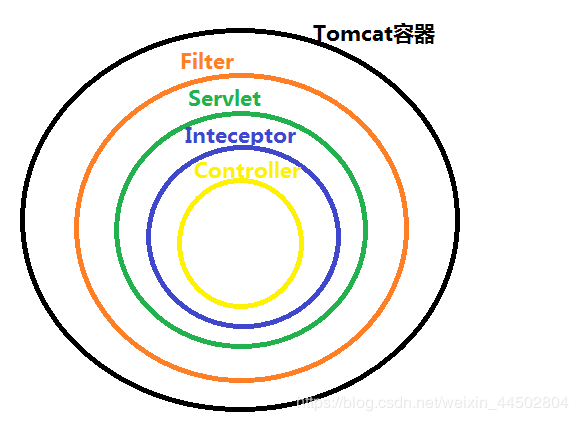

  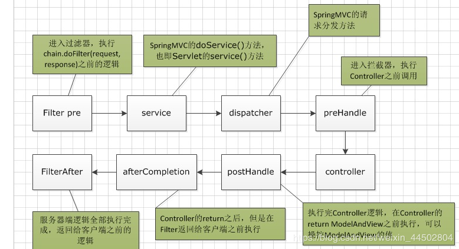

  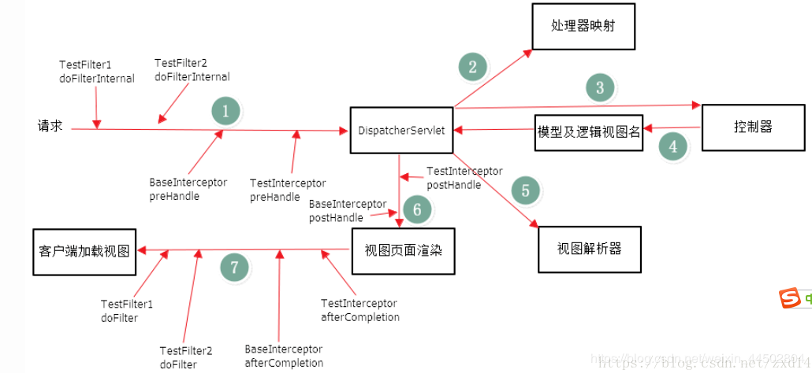

###### Spring Session

- 介绍

  HttpSession 是通过 Servlet 容器创建和管理的，Tomcat、Jetty 等服务器都是直接保存在 内存中，不适用在 分布式环境中。

  在分布式环境中，可以将用户的 session 信息存放在 redis/memcache 中，相对于直接存放在应用服务本地而言，这不仅能够实现分布式 session 的管理，还能够避免 tomcat 闪退重启后用户需要重新登录的情况。（tomcat 闪退，本地的 session 将丢失）

- **Spring Session 实现**

  1. 自定义过滤器 **Filter** 实现类`SessionRepositoryFilter`，在该过滤器中自定义 **HttpServletRequestWrapper** 的子类，实现自定义的 **getSession** 方法。

     ```
     在自定义的过滤器上，添加 @Order(-2147483598) 注解，表示组件最优先执行！
     @Order 控制组件的执行顺序：值越小优先级越高！
     ```

  2. 在 getSession 方法中读取 requst 中的 Cookie，找出 key 为 SESSION 的 cookie 列表，对应的 value 就是 sessionId

  3. 根据 sessionId 到 redis 中找到对应的 用户session 信息，如果过期，则直接删除，否则获取。

  4. 如果存在多个 sessionId，则多次从 redis 中获取，并且会覆盖 已获取的 session。

  5. 如果用户的 session 不存在（redis 中没有用户的信息），则根据 getSession 传递 boolean 参数，决定是否新建一个 session。


- [SpringSession 中 session 的维护](https://www.cnblogs.com/softidea/p/10323310.html) ： *3种 key-value*

  1. sessionId : user_session_map（hash 结构）
     保存用户的 session 信息，sessionid 为 key

  2. expire_timestamp : sessionId_set（set 结构）

     用于用户过期时长续签，key 为某个时刻的 timestamp，value 为该时刻应该过期的 key

     spring session 会在程序中使用定时任务，通过 haskey 触发该 key 的删除操作

     这因为 redis 采用了**`定期删除+惰性删除`**的方式清除 sessionId_key，导致，某些 sessionId_key 到过期时间时，并没有被删除，因此，可以在应用程序中通过 访问该 sessionId_key 的方式，由 redis 决定是否删除 key。

     ```
     使用 haskey 的好处：是否删除 sessionId_key，将由 redis 决定，而非认为决定。只监测当前 sessionId_key 是否过期，如果过期，redis 会自动删除，如果没有过期，则不删除！
     ```

  3. sessionId : 空值**（没搞懂）**

     用于完善过期通知事件。

     在 key 自身过期后，触发过期监听事件。

     用于解耦  session 的存储与过期。

##### Redis 

+ redis zset 跳表如何实现

  要从跳表中查找一个出现次数最多的元素，流程是什么样的

+ [Redis 内存碎片处理](https://blog.csdn.net/F_Hello_World/article/details/103848703?utm_medium=distribute.wap_relevant.none-task-blog-BlogCommendFromMachineLearnPai2-4.nonecase&depth_1-utm_source=distribute.wap_relevant.no)

##### Depth

+ 10 亿数据找到第 10W 个，quick select 复杂度是多少？有没有更优的算法

+ 100 万个数中找出最大的 100 个数

  堆排序：控制容量为 100！！！


+ 如何实现单点登录，有哪些安全性问题

+ 项目业务、职责、方案的选择、有哪些难点、如何解决

  问难点，优化，瓶颈，设计缺陷等

  介绍项目的时候，多介绍业务，少介绍技术


+ [双 key 解决缓存并发问题](https://mp.weixin.qq.com/s/UXeJSoOA-8-6KezV0T0Xmw) ：存在短暂性的 数据不一致性：满足可用性
+ [消息队列：消息不丢失、处理重复、消息有序性、消息堆积处理](https://mp.weixin.qq.com/s/lPcJZfpw_vQYD8OP6E47Yw)
+ [消息队列技术选型](https://mp.weixin.qq.com/s/RouWfjpHdmjJkdBMzre7og)


##### 网络编程

###### select / poll

- 文件描述符 FileDescriptor（FD）

  - 文件描述符 是 内核为了高效管理已经被打开的文件 所创建的索引。它是一个从 0 开始的整数，程序所有执行的 IO 操作都是通过文件描述符进行的。

  - 在程序刚刚启动时，0、1、2三个文件描述符就已经被占用了，因此，打开一个文件时，文件描述符会是 3。

    0：代表标准输入设备 stdin，例如：键盘

    1：代表标准输出设备 stdout，例如：屏幕

    2：大表标准错误 stderr

  - 在 unix 中一切皆文件。

    文件就是一串 二进制流，不管是 socket 还是 FIFO、管道、终端，等都是文件，都是流。

- select 本质：

  采用大小为 32 的整型(32 bit) 数组，标志 文件描述符，即 32\*32=1024 个文件描述符标志，即 fd 取值范围为 1～1024，当 fd 超过该限制时，就必须修改 FD_SETSIZE 的大小，此时可以标志的数量为 32\*max。

- poll 本质：

  与 select 不同，poll 通过一个 pollfd 数组向内核传递 socket 连接，因此，没有 描述符个数 的限制。

  pollfd 存在两个字段：

  - events：socket 连接事件
  - revents：socket 连接上到来的事件类型

  因此，pollfd 只需要被初始化一次。

- select、poll 在用户缓冲区中维护整个 socket 连接列表，然后传递到 内核中。

###### epoll

- [IO 多路复用](https://mp.weixin.qq.com/s/IVspRdudk4uLajwtgjP5BA)


- epoll 优点

  1. 没有最大 并发连接 限制：理论上上限是可以打开的 文件的数量，和系统内存相关。

     ```
     具体可打开文件数量可通过 cat /proc/sys/fs/file-max 查看
     ```

  2. 效率高：epoll 只关注“活跃”链接，与连接总数无关，在实际网络环境中，epoll 效率远比 select 、poll 效率高

  3. 减少内存拷贝：不需要从 用户态 拷贝 socket 句柄列表到内核态。

- epoll 文件系统

  epoll 会在 Linux 内核中申请一个简易的文件系统（文件系统一般用 B+ 树实现），用于存储连接的 socket

  当调用 epoll_create 时，就会在这个虚拟的 epoll 文件系统中创建一个 file 结点（file 只服务于 epoll）

  epoll 在内核被初始化时（操作系统启动时），会在内核开辟 高速缓冲区，用于存放每一个连接的 socket，这些 socket 会以红黑树的形式保存在 内核的 cache 中，以支持快速的查找、插入、删除。

  该高速缓冲区建立连续的物理内存页，然后在纸上建立 slab 层

- **epoll 系统调用**：

  epoll 中将原本的 select/poll 系统调用分为三个部分：

  1. epoll_create

     进程启动，执行 epoll_create 系统调用时，会创建一个 epoll 对象，其结构体为 **eventpoll**，并在 epoll 文件系统中为该对象分配资源

     ```c
     struct eventpoll{
       // ...
       
       // 红黑树根结点：红黑树用于存放 所有添加到 epoll 中需要监控的事件【？不应该是所有 连接的 socket？？】
       struct rb_boot rbr;
       // 双向链表：存放 读写就绪的 socket 连接
       struct list_head rdlist;
     }
     ```

     多个进程（多个应用）就建立不同的 epoll 对象（nginx、redis 等）

  2. epoll_ctl

     - 将到来的 socket 连接，添加到 epoll 的 红黑树中，如果该 socket 连接已经存在，则直接返回。

       红黑树的能够在 O(logN) 的时间内，检查出是否为重复添加。

       ```c
       /* 在 epoll 中，每一个 socket 连接都会建立一个 epitem 结构体：*/

       struct epitem{
         // 红黑树结点
         struct rb_node rbn;
         // 双向链表结点
         struct list_head rdllink;
         // socket 句柄信息（epoll 文件系统中的句柄？）
         struct epoll_filefd ffd;
         // 所属的 eventpoll 对象
         struct eventpoll *ep;
         // 到来的事件类型
         struct epoll_event event;
       }
       ```

     - 在设备(网卡)驱动程序中，为*添加到 epoll 中的 socket 连接* 注册 回调方法`ep_poll_callback`

       ```
       当 socket 连接上有读写事件到来时（产生中断），会执行中断处理子程序，执行对应的回调方法，将 socket 连接添加到 rdlist 双向链表中。
       ```

  3. epoll_wait**（何时执行？？）**

     检查 eventpoll 对象中的 rdlist 双向链表 是否为空，如果 rdlist 存在上述 epitem 元素，则将发生的 事件复制到用户态，并将 事件数量 返回给用户。

- 流程：

  - select/poll  应用程序中，执行 accept 接收 socket 连接时，会将 socket 文件描述符 注册到 selector 中，在用户态维护 socket 连接列表。

    查询就绪 socket 连接上的读写事件时，会将 socket 连接列表拷贝到 内核态。由内核遍历 socket 连接列表。

    最后，内核态将 读写事件对应的 socket 文件描述符 拷贝到内核态，应用程序做后续的读写处理。

  - epoll 直接在内核态申请文件系统，新到来的 socket 连接，直接在 文件系统中分配资源，并由红黑树持有 socket 句柄。

    通过回调方式，一旦某个 socket 连接有读写事件到来时，会直接将 socket 句柄信息，存入读写就绪列表( rdlist )中。

    最后遍历 rdlist，将就绪的 socket 文件描述符 拷贝到用户态，由应用程序做后续读写处理。

- 流程优势：

  1. 从接受连接，到通知应用程序读写事件到来的过程中，epoll 只有 1 次 socket 文件描述符的拷贝。

     而 select/poll 需要将 socket 连接列表 拷贝到 内核，再由内核拷贝出就绪事件列表。

  2. 检查就绪事件时，epoll 能够在 O(1) 内完成 就绪事件的收集

     而 select/poll 需要在 O(n) 内完成，并且 n 表示 socket 连接的数量

  3. epoll / poll 可持有的 socket 数无上限。

     select 默认最大连接数为 1024，不过可配置。

- epoll 两种模式：*LT(水平触发)、ET(边缘触发)*

  - 当一个 socket 句柄上有事件时，内核会把该对应的 socket 插入到 就绪链表 中，当调用 epoll_wait 时，会将就绪的 socket 拷贝到 用户缓冲区，然后清空就绪列表。
  - 最后，epoll_wait 会检查上述 socket，如果当前模式不是 ET(边缘触发)，并且这些 socket 上存在未处理的事件时，就将未处理的 socket 句柄重置到 就绪列表 中。

  因此：**LT 模式**具有**未处理 socket 句柄重置**的过程，能够保证事件一定被处理，但是效率比 ET 低。

###### epoll vs select

+ select 缺点

+ epoll 提升

+ select 比 epoll 适用的场景：

  连接数少，并且大多数 socket 都处于活跃状态（可读可写），这就类似于，某些情况下，插入排序比快排效率要高。

  因为，特定情况下，epoll / 快排 都有点大材小用，优化过剩的意思。

###### IO 模型

- 知道哪些 IO 模型，BIO / NIO  的区别，nio 组件

  [IO 多路复用面试题](https://mp.weixin.qq.com/s/iVfLZJ89UMtu3Z5IgpoCoQ)

- **IO 零拷贝**

  - 数据读取示例：

    ```java
    // 从一个文件读取数据，发送给另一个服务端
    file.read(sourceFile, targetBuffer, dataLen);
    socket.write(targetSocket, sourceBuffer, dataLen);
    ```

  - 涉及到多少次数据拷贝？**4 次**

    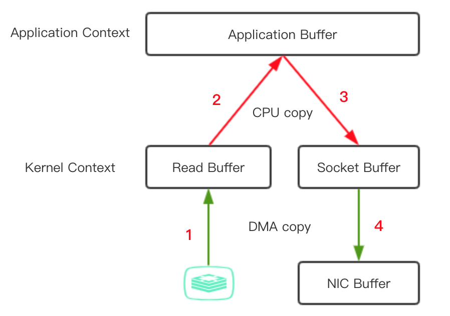

    1. 从 主存 / 磁盘 => 内核缓冲区（读缓冲）
    2. 从 内核缓冲区 => 用户缓冲区
    3. 从 用户缓冲区 => 内核缓冲区（socket 写缓冲）
    4. 从 内核缓冲区 => 驱动设备缓冲区（NIC Buffer）

  - CPU 参与的过程：

    整个过程中，数据在 内核缓冲区 与 外部设备/硬盘设备 之间的拷贝由 DMA 完成 （直接存储器访问控制），不需要 CPU 参与

    ```
    DMA：直接存储器访问控制：将数据从一个地址空间拷贝到另一个地址空间，此过程由 DMA 占用总线，不用依赖于 CPU
    ```

    即：数据在 内核缓冲区 和 用户缓冲区 之间的拷贝由 CPU 负责。

  - [IO 零拷贝](https://mp.weixin.qq.com/s/c01E7NJv9MLIGkS5PdmLUg)

    Linux 内核 2.4 开始，针对套接字缓冲区描述符做了调整，使得 DMA 自带收集功能。

    在 Java 语言层面，使用 FileChannel 的 transferTo 方法就能够支持 IO 零拷贝。

    具体过程如下：

    1. transferTo 方法使用 DMA 将文件内容拷贝到 内核读取缓冲区
    2. 内核将包含 数据位置 及 长度信息 的描述符追加到 socket 缓冲区，DMA 引擎直接把数据从内核缓冲区 拷贝到 驱动设备缓冲区，最终完成数据发送。

    数据发送的整个过程中，数据拷贝只在 内核缓冲区 和 磁盘/外部设备 之间完成，并且由 DMA 负责数据的拷贝工作，CPU 不再参与数据拷贝。

  - [深入理解 Linux IO 及 零拷贝 实现机制](https://juejin.im/post/6844903949359644680)


##### Width

+ awk 命令的应用

+ 操作系统中的 fork

+ 操作系统的文件管理

+ Redis 集群下的路由选择，如何更高效（nginx？？？）

+ redis 集群：一致性 hash、redis cluster、主从复制 怎么做的

  集群中一个结点挂了，会发生什么？新的请求打过来会怎么样

  结群中新增一个结点，又会作什么？新的请求打过来会怎么样

  ----

+ 分布式知识：CAP、Redis 场景题

+ 缓存的实现，LinkedHashMap 的实现，分布式缓存

  ----

+ rpc 的里了解，如果自己实现 rpc，需要考虑哪些方面

+ 介绍市面上的 RPC 框架，进行比较，如何设计一个 RCP 框架，高并发情况下的 RPC 框架有哪些注意的

+ 如果让你设计 tomcat 会怎么做？？？

  一个 request 过来，应该如何处理

+ TopK算法，分布式下呢？ 

+ [Dubbo 心跳设计源码](https://mp.weixin.qq.com/s/6CYn5K6FIlvt2axzKaaTDQ)

+ Redis

  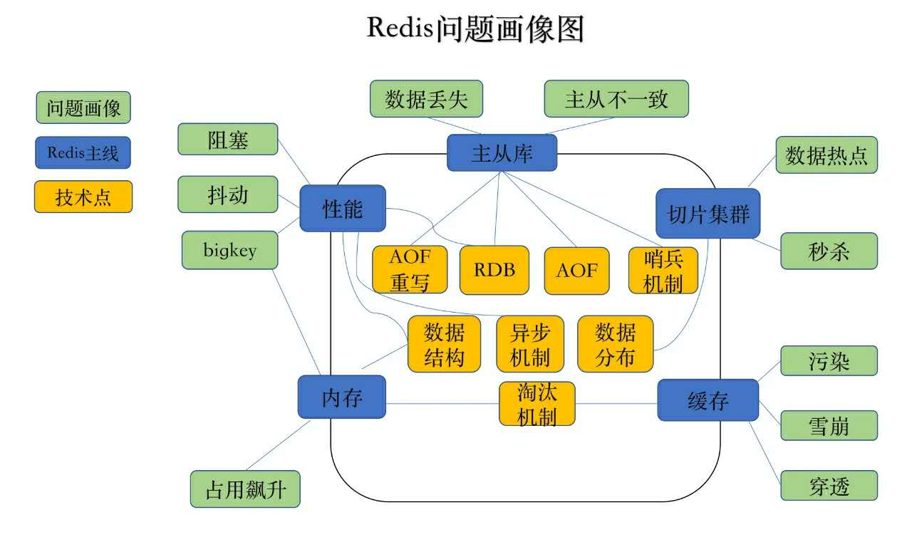


##### 剩

###### MySQL 专区

[数据库索引](https://mp.weixin.qq.com/s/_9rDde9wRYoZeh07EASNQQ)

[MySQL 索引是如何加快查询的](https://mp.weixin.qq.com/s/7TPVOT7sloDUKmhldf9uvg)


###### Redis 专区

[Redis 集权实战 & 哈希分片原理](https://mp.weixin.qq.com/s/Gaf2NAbY3K0ZdEeJzAUIUA)

[Redis RDB & AOF](https://mp.weixin.qq.com/s/1ovmN5Hd9o0lmCOKvBGvAg)

###### Spring 专区

[Spring 源码 —— IOC 控制反转](https://mp.weixin.qq.com/s/RjKKtaqcQgGBlqlbWKe_Tg)

[Spring 源码 —— AOP 切面编程](https://mp.weixin.qq.com/s/mLmQufSsQUd4atk4g6gd-g)

[Spring AOP 扫盲](https://mp.weixin.qq.com/s/0lslVEkzVW60MsF_gao4rw)

[Spring MVC：深入分析 DispatchServlet 源码](https://mp.weixin.qq.com/s/twMS5RuD74CYnaEVAHA2kQ)

[Spring MVC：过滤器和拦截器的区别](https://blog.csdn.net/heweimingming/article/details/79993591?depth_1-utm_source=distribute.pc_relevant.none-task&utm_source=distribute.pc_relevant.none-task)

[SpringBoot+Redis+拦截器 ：实现接口幂等](https://mp.weixin.qq.com/s/ts-vPhBD1EGF6BVr__4-9Q)（同时可以用作 权限控制！）

###### MyBatis 专区

[Mybatis 源码一：构造篇](https://mp.weixin.qq.com/s/J3ac3WvCXMSZNoYaUGktMw)

###### Nginx 专区

[Nginx 高可用解决方案 Nginx+Keepalived](https://mp.weixin.qq.com/s/0OqutgVQuBiCcjuZNL8vFw)

###### 算法 专区

[动态规划题解技巧](https://mp.weixin.qq.com/s/L9HkFpe9oulngfK8qoRgaA)

###### 高级 专区

[Kubernetes 网络模型](https://mp.weixin.qq.com/s/Jm8VynGd506wN5-yiLHzdg)

[设计 QQ、微信、微博等第三方登录](https://mp.weixin.qq.com/s/UZEwzBzYJ56XlhqPHrRy1g)

[SpringBoot + RabbitMQ 保证消息100% 投递成功](https://mp.weixin.qq.com/s/EFqoWycFrBnXU30RclYK6g)

[微博评论功能](https://mp.weixin.qq.com/s/n50nCnIXQO6C7uLBnrOJCw)

[美团面经](https://mp.weixin.qq.com/s/T64sLu5uvCL5B2RzZ_UKYg)


+ url 攻击这种异常，你是如何定位的？

  当时，是因为好奇心，删除了 ",request" 后请求服务端，才发现这种攻击。

  由于，我请求的是线上环境，首先为了验证是服务端出了问题还是 网关层出了问题，我就本地启动了一个应用实例，将请求换成 localhost 之后，请求本地。

  结果：本地只会有一个 url 异常报错！

  因此，可以判定，这不是服务端本身的问题，而可能是 Nginx 或者 网关层 出现了问题。

+ 博客系统，最核心的技术挑战点！

  为博客涉及缓存，是我认为我的主要创新，对我来说是具有挑战性的尝试。

+ 你的缓存是解决什么问题：

  + 总的来说有两个方面，一方面是 快速响应，一方面是 避免数据库崩溃！
  + 缓存是基于 内存的，数据操作 都比磁盘要快！
  + 将热点数据保存到缓存中，能够将大量的请求拦截在 数据库 之前，保证数据库的可用性。

+ 缓存主要缓存哪些内容？

  三个方面的内容：

  1. 阅读量、评论量、点赞量 的缓存
  2. 热门文章、热门用户、热门标签 列表
  3. 博客实体内容

+ 某个人某篇文章只允许点赞一次，整个数据结构是怎么设计的？

  + 在 redis 中使用 zset 做统计。

    ```
    key = blogId
    member = uid
    score = vote_timestamp
    ```

  + 通过 score 做排序，通过 zrange 可以取出前 n 个点赞的人。

  + 凡是点过赞的人，就将其从 sored set 中删除，未点赞的人，则直接插入到 sorted set 中

+ 实际上：我并没有将点赞的信息保存到 redis，只是保存了一个 点赞量！

  我的点赞信息，全部都是保存到数据库中。此外，还会同步更新到 ES 中。

+ 那如何保证数据的一致性：

  + ES 和 数据库

    如果写失败，那么，直接将失败信息保存单独使用一张表保存，然后启动异步任务，异步刷新到 ES 中。

  + 缓存 和 数据库

    只缓存了点赞量，在 redis 中做修改，然后启动定时任务将其刷新到数据库中。

+ 缓存更新失败会带来什么问题？

  缓存更新失败，最直接的问题：数据不一致！

  但是，由于我 DB 中实际上保存了 用户的点赞信息，所以，我目前是每次从 DB 获取文章的时候，就会根据 DB 中的点赞数量更新缓存中的点赞数量。

+ 博客内容在写入的时候，会不会做保护机制：例如同时打开两个 tab 页，同时编辑文章，提交之后会不会出现相互覆盖的情况？

  其实这种情况，我认为不需要做处理，用户打开两个 tab 页，同时修改，但是提交的时候，必定是有先后顺序的。

  所以，这其实相当于用户修改了两次。因此后一次的提交会覆盖前一次的提交，这是合乎常理的情况。

+ 还有其他技术的难点吗？

  限流锁兼顾解决 缓存击穿、缓存雪崩 问题！

  ```
  令牌桶算法：通过获取令牌的方式对 线程进行放行。能够满足请求激增的情况。
  漏桶算法：获取令牌/线程放行的频率是一定的，不能满足请求激增的情况。

  我认为 这两种限流算法，都不能很好的利用到我的应用场景中！
  这两种限流算法，其实是对所有请求的限流，相同 key 的请求之间会争夺 令牌，也就是说，相同 key 的请求都会占用令牌。这对于我的应用场景而言，其实是不合理的。这种令牌数没有设定的标准。

  如果 令牌设置少了，那么相同 key 的请求全部占用令牌，其他 key 的请求无法使用！
  如果 令牌设置多了，那么，如果请求都是不同的 key，那么一下打到数据库的请求数就多了。

  合理的方案：相同的 key 的请求只会占用一个 令牌，不同的 key 的请求占用不同的令牌。
  ```


> - 单机的 QPS 能够支持 1w，那么现在有 10w 人，同时刷新博客，服务器应该如何应对！
>
>   1. 服务端多实例部署，前端负载均衡
>
>      ```
>      应用服务层的 性能瓶颈 解决了，接下来的性能瓶颈就主要来源于 数据库层面。
>
>      ```
>
>   2. 能够缓存，尽量缓存，将大量请求拦截在数据库之前。
>
>      ```
>      如果每一个请求都会 两三次 访问数据库，那么 10w 个请求就总共会有 20、30w 个请求达到数据库。
>      一般来说，数据库能够同时处理的请求大概在 3000 左右，再多的话就我的数据库就会崩溃。
>      1. 因此，我首先判断，查库的请求，能不能走缓存，如果可以缓存，那么尽量都走缓存，将一大部分请求直接拦截在数据库之外。
>
>      2. 在数据操作上，应该尽可能使用索引，并且使用的索引都应该要生效，使得数据库能够通过索引提升查询效率。此外，还应该尽可能的对 sql 语句做优化，一句话，就是最大地提升数据库的性能。
>
>      3. 如果说，现在数据库的压力还是很大，那么就可以采用 主从部署，将读写请求分摊到不同的 服务器上。
>      	主库执行写操作，从库上执行读取操作。
>      	将单个库上的压力分摊到多个数据库服务器上。
>      	
>      4. 如果说，主库的写压力依旧很大，那么，同步的写操作 变成 异步写入。就是使用 MQ，实现削峰填谷。
>      	不过，这种方式，不适用于 实时性、强一致性 的场景。
>      	
>      5. 如果说，我的资源有限，受到条件限制，使得某些接口不足以支撑这么大的并发量，那么，暂时关闭这些接口的服务，直接返回一些静态提示页面，提示系统繁忙！这样能够避免，因为单个接口导致整个系统的崩溃。保证系统整体的可用性。
>
>      6. 在系统访问的高峰期，可以对用户的访问频率做限制，防止用户连续发起大量重复的请求，也用来防止黑客的刷接口攻击。
>      ```

+ 你目前的系统能够支持 分布式部署？如果改造成 分布式的部署，你应该做哪些事？

  目前的系统是单击部署的，分布式部署如下：

  1. 限流锁是单机的，可以采用分布式的限流机制，例如 redis 实现分布式限流。

  2. 分布式下会涉及到数据不一致性的情况。

     分布式数据库：全局唯一性 ID（单独记录一张 ID 表）

+ 如果 单表只能够支撑 2亿 用户，但是目前你有 10亿  的用户，你的数据库表该怎么设计？

  + 分表：采用水平拆分的方式，将不同的用户量分担到多个表中。（切分记录）

  + 表的划分原则是什么样的？（如何将 不同的用户 数据划分到不同的表中？采用什么机制划分？）

    1. **方案一：根据 ID 的范围划分**

       ```
       优点：简单易于实现，扩容缩容不影响元素的存储位置。
       缺点：
       	1. 需要使用单独一张表维护 全局性的 ID，所有的 ID 都通过该表的 自增主键实现，
       	2. 
       ```

    2. **方案二：Hash 划分**

       ```
       优点：多数情况下，数据是均分到各个表中的，并且简单易于实现。
       缺点：
       	1. 可能会碰巧出现，严重的 hash 冲突的情况，那么此时，冲突严重的表数据量将会增多。所以需要有一个比较好的 hash 函数。
       	2. 这种普通 hash 的方式，有其固有的问题，在扩容的时候，需要将所有的元素移动，在分表的环境下，实现扩容的话，会导致系统暂时的不可用性。
       ```

    3. **一致性 hash**

       解决普通 hash 带来的问题！

+ TCP 握手过程

  seq、ack 的作用：我认为是通过 seq 和 ack 之间的交互确定对方以及自己的收发过程都是正常的。

  win（滑动窗口）：滑动窗口是如何设置的？滑动窗口的底层的数据结构是什么，需要几个指针？

  ```
  滑动窗口是一个列表，维护了 当前未接收到 确认应答的报文数据，相当于已发送的报文的缓存，当接受到确认应答时，就向后移动窗口，表示可发送下一条报文了，可以将下一条已发送的报文保存到滑动窗口中了。
  滑动窗口涉及到报文列表的移动过程，因此，我认为是两个指针。
  ```

+ 滑动窗口的增长速度，怎么控制的？

  先以指数增长，后来是线性增长。

+ 分布式服务，客户端调用服务器出现时间超长，或者 RRT 超长，此时需要做什么设计，对应可以解决什么问题？

  [详见如下：响应优化]()

+ *平时写代码时，有考虑过对 DB 的访问比对 Redis 的访问的超时时间的设置吗？*

  ```
  没听懂面试官想要问啥，当时没听清，以为是 Redis 键超时时间的设定如何考虑，就按照 kv 超时时间的考虑来答了。

  就拿我实习时候，做的 订单页展示 返佣/返利/成长值 这个功能来说。
  由于需要防止被攻击，因此，需要做缓存，就是用来防止攻击的！因为订单量很多，所以，过期时间不能设置的过长，否则会占用大量的内存。但是也不能设置的太短，否则起不到防止攻击的作用，因此，我咨询过 leader 设置 5 分钟是否足够，leader 认可了，但是实际上还是应该根据实际的场景做过期时长的限定。例如或许可以缩短为 1、2 分钟。
  ```

+ Spring 启动的过程

+ Spring 的扩展性（扩展点）的整个设计，是基于什么设计模式考虑的？

  后来改问：Spring 的学习中，你了解的设计模式，能说多少说多少。

+ 你最近看了哪些书、博客、站点？

  最近在学 Dubbo，通过 Dubbo 的官方网站，以及官方文档进行学习（这是第一手资料）。

  实习的时候，公司有资源，所以，也有借助公司资源来学习的（先 RPC、RPC 框架了解、选择 Dubbo 学习，都是通过 公司的资料一步步驱动学习的）

  平时琐碎的时间，会看 微信公众号，这其实比较方便。

  以前学习的时候，会看教学资源，也会买一些书来看，例如：JVM、Java、MySQL、Redis 都有通过看书学习。

  平时找资料的时候，会看 掘金、CSDN 也会去 国外网站，例如 StackOverFlow 查找。

+ 技术深度上还需要加强一下，尤其是动手能力上，学校学生的话，更多的是要动手能力。

  这时你可以补充，你是有经过压测，比较底层的方案选择。（先解决动手能力上的问题，技术选型的问题另外再说！）

----

四面：

**失策：重点谈实践，什么场景该用什么方案，而不是只谈方案**

> 结构化思维（学习、架构、技能树）
>
> 系统结构化思维：
>
> 1. 首先这是一个网站
>
>    - 基本的网站设计
>    - 高性能网站设计
>
> 2. 如何设计高性能网站
>
>    我认为，系统架构的演化都是流量正反馈结果！关于高性能网站设计，都围绕两个问题展开：
>
>    - 如何保证系统的可用性
>
>      凸显的问题就是流量激增，系统如何应对，即：服务端如何设计才能承受流量，这就需要系统有一个合理的架构设计方案。
>
>    - 如何进行响应优化，提升用户体验性
>
>      凸显的问题是系统的内部细节优化！
>
> 3. 系统架构方案：从一个请求完整的请求响应过程而言，分为三个部分：
>
>    - 客户端
>
>      1. CDN 静态资源加速
>
>    - 网关层
>
>      1. 流量分离，动态资源、静态资源的流量分离。
>
>         静态资源单独放在一个文件服务器上，同台资源分流到应用实例
>
>      2. 负载均衡：根据服务端实例的性能，合理分配流量到不同的应用实例
>
>         - 无差别轮询：一般来说服务器性能上没有什么差别的话，就使用 无差别轮询。**（实习）**
>         - 加权轮询：服务器性能上有明显的差别。
>         - 最少连接数优先：服务器上的仍然处于连接状态的连接数少，则优先分配请求该服务器上。
>         - 最短处理时延优先：平均处理请求快的服务器优先
>         - IP 哈希分流：按照 IP hash 将请求分配到固定的服务器上
>         - URL 哈希分流：按照 URL hash 将请求分配到固定的服务器上。
>
>    - 服务端
>
>      1. 启动多个应用实例，部署在不同的服务器上（网关负载均衡）
>
>         解决单个应用实例上的流量压力。
>
>      2. 数据库多实例部署：读写分离
>
>         部署多个数据库实例，选择一个作为主数据库，其余的作为从数据库。主数据库上写入数据，同步到从数据库，在从数据库上执行写操作。
>
>         解决单个数据库上的流量压力。
>
>         ```
>         读写分离的应用场景：读请求的数量远远大于写请求的数量。
>         ```
>
>         ```
>         读写分离为什么能提升性能：
>         1. 主库只负责 事务性操作（写操作），从库只负责单纯读 select 操作，读写压力分离的同时，由多个从库分担所有的读压力。
>         2. 从库可配置 myisam 引擎，提升查询性能以及解决系统资源开销（不需要事务）
>         ```
>
>         
>
>      3. 缓存部署
>
>         过滤可缓存的请求，降低数据库压力。
>         同样考虑到缓存的可用性，可靠性等问题，可以进一步部署集群。
>
>      4. MQ 部署，削峰填谷：写请求异步写入数据库
>
>         将请求堆积在 MQ 中，然后直接响应提示信息“系统正在处理”。
>
>         异步服务实时从 MQ 中订阅消息，处理之后写入数据库。
>
>         这样，能够根据当前数据库的压力，按需取出 MQ 消息写入。即使是流量洪峰，由于 MQ 的存在，数据库也是按照一定的频率写入数据，并不会受到影响。
>
>         
>
> 4. 系统内部优化：（依旧三个部分）
>
>    - 客户端
>
>      - 静态资源加速：CDN
>      - 浏览器本地缓存（静态资源）
>
>    - 网关层
>
>      - 代理服务器缓存（静态资源）
>
>        ```
>        http cache 相关
>        ```
>
>    - 服务端
>
>      - 缓存：加速响应（支持高并发，基于内存的快速访问）
>
>        1. 冷热数据分离：LRU 策略
>        2. 频繁修改的数据
>
>      - 应用实例本身的性能问题：
>
>        1. 程序调优：使用合适的数据结构、使用合适的算法
>        2. JVM 调优：缩短 GC 频率，提高 GC 效率
>
>      - 数据库数据访问
>
>        1. 查询优化
>        2. 索引优化
>
>      - MQ：解耦、异步处理
>
>        1. 解耦：
>
>           使用 MQ 解耦一个完整的处理流程，每个子服务并发执行，全部执行完成后，再响应。
>
>        2. 异步处理：
>
>           请求被当作消息存入 MQ 后，立即响应，给出提示信息“xxx正在处理中”。
>
>           对应的处理服务订阅 MQ 消息，并执行相应的处理逻辑。
>
>

+ qps 高你的系统怎么设计？

+ 【追问】：你谈到几个关键点

  1. tomcat 是单实例还是单机？

     答：单机

  2. Nginx 做负载均衡，你会采用哪种负载均衡策略？

     **一定！！！ 实践为主！！！什么场景适合什么方案，不是列出方案就可以了！**

  3. 你谈到数据库*读写分离*，那么**主从复制和读写分离**有什么关系，他们分别解决了什么问题！

     在我的理解中：

     + 主从复制：

       + 主从复制：一个主库一个或者多个从库的架构部署，实现**数据的热备份**！

         主库是准实时的业务数据库，从库是主库的热备，作为后备数据库，主数据库故障后可切换到从库，继续工作，提高**系统的可用性**。

       + 主从复制原理：

         1. 主库执行 更新操作，当事物成功提交，将更新的 sql 写入 binlog，通过 log dump 线程生成 binlog dump

         2. 从库生成两个线程，一个 IO 线程，一个SQL线程

         3. 从库 IO 线程，请求主库 binlog，并将得到的 binlog日志 写到 relay log（中继日志） 文件中；

            建立主从连接时，从库会请求 主库 binlog，而建立连接后，若有更新操作，主库主动推送给从库（TCP 连接）

         4. 从库 SQL 线程，会读取 relay log文件中的日志，并解析成具体操作，来实现主从的操作一致，而最终数据一致；

       + 怎么保证**主从一致性**：

         1. 异步复制

            主库执行完客户端的 事务后就直接返回，并不会管从库是否接收到 同步信息 并处理。

         2. 半同步复制（5.5）

            主库在应答客户端提交的事务之前，需要保证至少一个从库接受并写道 relay log 中，通过接收 slave 的 ack 来确认从库接收并处理了更新操作。

         3. 全同步复制（5.7）

            调用 binlog sync 之后，engine 层 commit 之前等待 slave ack，只有确认 slave 收到 event 事务之后，事务才会提交。

         4. cache

            

            （1）先到cache里查看，对应库的对应key有没有相关数据
            （2）如果cache hit，有相关数据，说明这个key上刚发生过写操作，此时需要将请求路由到主库读最新的数据
            （3）如果cache miss，说明这个key上近期没有发生过写操作，此时将请求路由到从库，继续读

     + 读写分离：

       主库写，从库读，解决了单机数据库带来的性能瓶颈。

       读写分离利用**主从复制**实现**主库和从库的数据同步**。

  4. 使用 MQ 实现削峰填谷，能讲一下 MQ 的原理吗？MQ 的出现是为了解决什么问题？

     + MQ 原理：

       + MQ 是一个队列，通过**先进先出**的方式实现数据的读写。

       + 作为消息队列，MQ 中有一个消息生产者，有一个消息消费者。

         **生产者**负责生产消息，并存入队列中，并不负责消息的处理；

         **消费者**负责订阅队列消息，当队列中有消息时，就从队列中获取出消息进行处理，并不需要关注消息的来源。

       + MQ 的作用：

         1. 正是由于 生产者和消费者 不存在相互依赖的关系，所以，MQ 可以用于**解耦**互不依赖的服务。
         2. 正是由于 生产者生产消息后就可以直接返回，并不用关心消息的处理过程，所以 MQ 可以用于消息的**异步**处理。
         3. 正是由于 MQ 可以堆积消息，并且 消费者只会按照一定的速率从队列中获取消息，所MQ 可以用于 **削峰填谷**。

  5. MQ 中数据的处理需要保证最终一致性，你对最终一致性的理解是什么？

     MQ 中数据不一致的情况：[消息队列保证数据一致性！](https://www.bilibili.com/read/cv1923046/)

     1. MQ 中可能会有 provider 丢消息的情况，导致 数据不一致！

     2. MQ 队列弄丢了消息！

     3. MQ 的消费者服务突然宕机，导致消费未能成功处理，而 MQ 中已经将消息移除，此时数据不一致！

        Rabbit MQ 中有 消息确认机制 ACK，只有当确认消费者成功消费后，才会移除消息，否则重复发送该消息。消息确认机制默认是开启的！

        ```
        消息确认机制的问题：若消费者永久宕机，则会对 MQ 带来灾难性的问题：
        1. 若消费者一直不确认，则消息就会一直重复的发送，相当于一个死循环，占用 CPU 资源。
        2. 消息不被确认，MQ 中一直保存这些消息，这就会发生潜在的内存泄漏问题。

        解决方法：
        1. 在 消费者 处理消息的逻辑中，使用 try-catch 代码块，如果消费者出现异常，则直接返回 ACK
        2. 在 MQ 配置文件中配置消息失败重试的次数。超过该数量，则移除消息！
        ```

  6. 分享一个学有所用的案例！

     **学习的方法！！！！**

     


##### 一致性 Hash

- 分布式一致性 hash 

- 初始算法：

  1. 将 哈希的阈值 设置为 0～2^32-1，形成 hash 闭环。
  2. 在 hash 闭环上取有限个 hash结点
  3. 将 元素 hash值 按照 2^32 取模，映射到 hash环上。
  4. 将元素分配到 hash环 上的第一个 结点。

  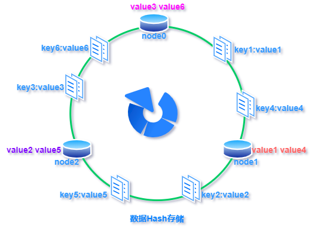

- 优点：

  - **扩展性：**

    扩容时，直接将新增的 hash结点 映射到 hash环 上，此时，受影响的元素，就是顺时针方向上第一个 hash结点 的元素。

    只需将该结点 中的部分元素，重新分配到 新结点上即可。

    ```
    普通的 hash 方式（直接对 结点总数 取模），在扩容时，结点总数增加，将影响到所有 元素 的取模分配。
    ```

  - **容错性：**

    当某个结点不可用需要时，仅仅是不可用结点上的元素会受到影响。

    只需将该结点上的 元素 重新分配到 顺时针方向上的下一个结点。

    ```
    普通 hash 方式（直接对 结点总数 取模），结点不可用时，结点总数减少，将会影响到所有 元素 的取模分配。
    ```

- 缺点：

  - **数据倾斜**

    若 hash环 上的结点数量少，并且结点散布较为紧凑，就可能导致 大量的 元素被分配到同一个 结点上，极少数的元素分配到其他结点上，则表现为**数据倾斜**

    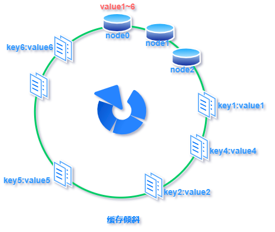


  - **结点雪崩**

    数据倾斜、结点不可用，都可能导致结点雪崩。

    某个结点上的数据访问量激增，使得该结点不堪重负，导致结点不可用，于是，数据访问量将会直接下嫁给下一个结点，最终导致整个集群不可用。

- 虚拟结点

  - 虚拟结点 用于解决 数据倾斜、结点雪崩的问题。本质上就是解决 数据集中到某个结点上的情况！

  - 算法：

    为 物理结点 定义出 多个虚拟结点，并将各个虚拟结点散布在 hash 环上，每个虚拟结点上的分配的 元素 都将直接分配到 物理结点上：**解决数据倾斜的情况！**

    当物理结点不可用时，结点上的元素，会通过该物理结点的虚拟结点，散布出去：**避免了结点不可用时数据量过于集中的情况。**

  - 如下图：（左边没有虚拟结点，右边存在虚拟结点）

    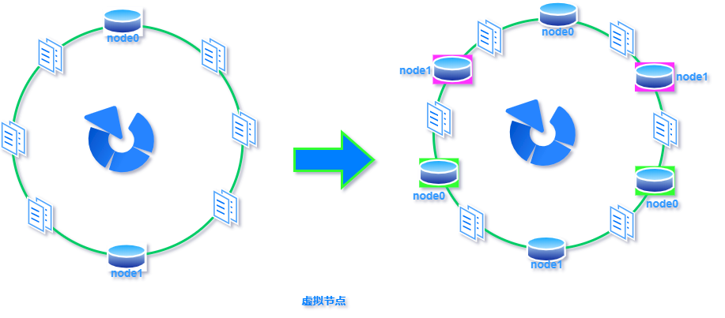


##### 响应优化

- 如果用户响应变慢了，RRT 变长，应该如何排查优化？

  > - 网络传输方面：可能是当前网络拥堵，使得 RRT 往返时延增加
  >
  >   - 出现这种情况，没有太好的解决方案，只有在 设计接口的时候，尽量精简响应的数据量，避免不必要的数据占用带宽。*【实习：优化首页响应】*
  > - 服务端数据处理方面：可能是服务器端处理请求时过于耗时，导致 RRT 增加
  >   1. 线程是否出现死循环（不会出现在这个场景中）？top（线程占用 cpu 情况）-> jstack（线程在做什么）
  >
  >   2. 线程是否阻塞、死锁、等待时间过长？jstack（TIME_WAITINT、WAITING、BLOCKED：这些状态的线程，在做什么，在等待什么资源，占有什么资源）*【实习：死锁】*
  >
  >   3. 用户是否请求了大量的数据，导致服务端正常的数据处理过程变长？top（线程占用 cpu 情况）-> jstack（线程在执行什么方法）->查看接口是否做限制
  >
  >   ```
  >   如果接口返回的数据量比较大，会带来如下的后果：
  >      1. 将数据从 用户缓冲区 拷贝到 进程缓冲区，再将数据从 进程缓冲区 拷贝到网卡（大量的数据拷贝过程）
  >      2. 在服务端处理数据时，如果查询到的数据量很多，将会创建临时大对象，会严重占用 年轻代 内存空间，导致 parNew 频繁 GC。
  >
  >   这些都会引起 响应缓慢。
  >
  >   解决方案：
  >      1. 尝试调大 新生代 的内存大小
  >      2. 尝试切分接口
  >      3. 尝试缓存接口数据
  >   ```
  >
  >   4. 数据库是否查询过慢？**（慢查询优化）**找到 mapper，查询条件是否使用到索引，是否索引失效，是否查询过于复杂，优化查询、优化索引！
  >
  >   5. 接口是否收到大量的恶意访问攻击，占用了资源，使得正常请求阻塞在 tomcat 外！*【实习：攻击】*
  >
  >   6. 服务端是否 GC 耗时？jstat（GC 频率、GC 效率、GC 时长、各个堆区域回收情况）
  >
  >      例如：[YGC 导致 RRT 变长](https://mp.weixin.qq.com/s/rBlo-_Hdhf1TLAliHeaisg)
  >
  >   7. 服务端连接其他 中间件 是否频繁出现 timeout（其他中间件是否可用）*【实习：RPC timeout】*
  >
  >   8. **数据库是否锁竞争严重？**

- 如何优化页面响应速度？

  1. CDN、代理服务器缓存：静态资源加速
     - CDN 原理？
     - 代理服务器缓存相关设置？
  2. 服务器端使用缓存，能缓存尽量缓存，不走 DB
  3. 服务端接口设计，尽量精简请求
  4. 数据库层面，优化索引设计，优化查询设计

##### 分库分表

+ 垂直切分

  + 垂直分库：实现业务耦合，将没有关联性的数据存储在不同的数据库中。（可以按照业务类型独立划分）

    与“微服务治理”的做法类似，每个服务使用一个单独的数据库。

  + 垂直分表：基于表中的列进行切分。如果表中的**字段过多**，可以将**不常用的字段，或者较大的字段**拆分到扩展表中。

    ```
    大表拆分成小表，便于开发和维护，能够避免跨页问题：
    1. MySQL 底层时通过数据页存储的，一条纪录占用过大会导致跨页，造成额外的性能开销。
    2. 如果单条纪录数据量过大，会导致一页可存放的记录数减少，可能会中增加树高，增加 磁盘 IO；由于 MySQL 会将整个页拷贝到内存查找数据，因此，如果单个记录的数据量变少，就能够提高页内的记录数，提高命中率，减少 磁盘IO。

    将不常用的字段、较大的字段分离到另外一张表中，能够在多数情况下，加快正常数据的查询（单个表数据量减少，树高降低，页内数据量增多，内存命中率提高）。
    ```

+ 水平切分

----

##### 交叉面（压力面/开放性问题）

+ 千万千万：不要让面试官抓到你的把柄，千万不会的不要说！

+ 

+ 框架、技术学习：

  ```
  你关注过哪些框架的新技术，挑一个具体讲讲，这个框架的下一个版本，你希望带来什么功能？
  最近有没有关注什么新技术，挑一个讲一讲？你学到了什么？如果你自己设计一个，你会关注哪些点？这么做会有什么优缺点？有没有更好的解决方案？
  ```

  + 【问】你关注过哪些框架的新技术，挑一个具体讲讲

    【答】最近在学 Dubbo，搭建起一个 Dubbo 项目之后，就跟着官方文档，阅读部分源代码了。

    1. RPC 是什么，有什么作用
    2. 有哪些 RPC 框架，区别是什么？
    3. 为什么选择 Dubbo 学习

    ```
    一定要好好充分准备好 rpc 基本概念 以及 dubbo 基础知识，把自己做的都了解清楚。
    ```


  + 【追问】读过 Dubbo 的哪些源代码

    【答】

    1. Dubbo 与 SpringBoot 集成的过程
    2. Dubbo 的服务导出过程

  + 【追问】阅读了这些源代码，你学到了什么？

  + 【追问】如果你自己设计一个，你会注意哪些问题？

    ```
    关键字：高可用、高可靠、强一致性、高并发、安全、高效
    ```

  + 【追问】高并发环境下，又应该注意哪些问题，或者你的设计方案如何能够应对高并发场景？

  + 【追问】这么做又什么优缺点，分别有什么影响？

  + 【追问】有没有更好的设计方案？

+ 关注哪些前沿技术？这个前沿技术如何优化？


+ 垃圾回收器设计

  + 【问】自己设计一个垃圾回收器，尽可能提高回收效率，你会怎么设计？
  + 【追问】你这么设计有什么缺点，这种缺点有什么解决方案
  + 【追问】有没有更好的方案？

+ JVM 的设计角度，gc 怎么优化
  + 还有呢？还有呢？


+ MD5 加密算法【2】

  + 【问】MD5 加密算法，不使用 hashmap 和 映射，你自己来设计一个同类型的，给定字符串可以生成 64 位随机数，怎么设计？

  + 【追问】如何保证结果 和 明文密码的一致性（唯一性，且一一对应）

  + 【追问】如何保证加密结果不被轻易解密（加密的安全性）

  + 【追问】如何保证加密的高效性（高并发环境下的高效性）

  + 【追问】怎么优化，怎么优化？


+ 自身

  + 【问】你觉得你最大的优势和劣势是什么？
  + 【追问】举个例子


+ 项目

  + 【问】各个项目，分别最大的挑战是什么？最大的问题是什么？
  + 【追问】说出两点需要改进的地方


+ 其他

  1. 30 min 手写跳表
  2. Linux cpu调优

+ 面试官

  ```
  新技术学习方法要正确，需要足够自信，以后工作中遇到的很多问题都是新问题，不能去背总想着用以前的方法去解决问题，旧方法是解决不了新问题的！！！

  面试官会不断打断！！！

  现在：以旧推新！！！
  ```

----

+ dubbo 底层原理
+ mysql 如何设计分库分表
+ redis 缓存雪崩和击穿
+ 如何设计一个高并发系统，需要从哪些方面考虑
+ 如何限流
+ 对自己优势劣势总结

----

+ 句柄，说一下句柄的原理

  **句柄 是 windows 下的概念，在 linux 中对应的概念是 fd（文件描述符）。**

  [详见：文件描述符 与 文件句柄](https://blog.csdn.net/yanjun_1982/article/details/79421528?utm_medium=distribute.pc_relevant.none-task-blog-BlogCommendFromMachineLearnPai2-1.channel_param&depth_1-utm_source=distribute.pc_relevant.no)

  ```
  通俗的解释：操作系统中，内存的管理经常会涉及到数据存储的移动，此时，如果数据位置移动了，那么上层应用使用数据时，就需要同时更新对应的数据访问位置。为了解决这个问题，在进程中会管理一个 句柄池，用来保存数据的位置，针对于该数据的访问，通过句柄就能够间接访问到。
  ```

  Java 程序从开始打开句柄，到关闭句柄，说一说操作系统的工作过程

+ 如何实现一个数据库（DBMS 的思想）

  从打开命令行到发送请求，mysql 服务器的整个响应流程

+ CAS 底层设计思想，能够模拟一下锁升级吗？

+ 进程通信的集中方式，实现原理，应用场景

+ NIO 的应用场景，如何设计一个 聊天室

+ 线程池拒绝策略的应用场景

+ 场景题目：分布式事务的解决方式：2pc、3pc、TCC

+ 详细说说 redis 为什么会使用 跳表 而不使用红黑树

  (有人压测过：红黑树的效率比 redis 效率高很多倍，所以唯一的原因就是 跳表实现简单)

  redis 作者如是说：[redis 使用 skip list 而不是 rbTree](https://www.zhihu.com/question/20202931/answer/30983057)

+ Spring IOC 如何实现，循环依赖如何解决，SpringBoot 自动启动的流程说一下

----

+ 讲一下做的最有成就感的项目

+ 这个项目如何变现，带来价值？

+ 如何吸引用户，怎么获取用户增长的数据？

+ 如果重新接手这个项目，有什么想法？

+ 只有对自己有什么规划？

+ 对手淘有什么样的认知？（产品很优秀，团队技术能力很强）

+ 

+ 

+ 哪个项目做的最好，挑战最大，收获最多

+ 项目为什么要使用 SSM、SpringBoot、Dubbo（当然是为了学习）

+ 说说系统业务

+ 介绍下市面上的 RPC 框架，进行比较

+ 如何设计一个 RPC 框架，高并发下 RPC 框架有哪些需要注意的？

+ 序列化的方式

  JSON 和 protoBuf 比较

  二进制如何序列化


（实习 交叉面，问题应该都与项目相关）

----

1. session token 是怎么解决的，讲一下具体的实现细节

2. 用户名、密码 等都是加密的还是明文的？

   答：数据库中使用 md5+盐 的方式加密后存储。

3. 如何防止用户伪造 token 的方式进行登录？

   答：token 有三个部分，第三个部分相当于 证书，用于验证 token 是否被 被篡改，是否伪造。第三部分，使用了第一个部分声明的 加密算法，将 第一部分 和 第二部分 加盐后 使用该加密算法进行加密，将加密后的密文使用 base64 编码就形成第三部分。

   ```
   1. 第二部分中，我会将登录成功的用户的 session 的 key 简单的处理后存入，用户消息的传递，验证 token 成功后，如果 key 不存在，或者 key 对应的 value 不存在或者过期，则认为该用户需要重新登录。

   2. 盐会根据用户信息结合系统本身设定的盐动态生成的：盐 = 设备信息 + 系统设定的盐
   ```

   因此，如果用户想要 伪造 token 他必须知道 盐是什么，并且，他需要知道我生成盐的方式。

   另外：即使用户能够成功的伪造 token，能够成功伪造登录态，但是，如果他没有 session 信息，则认为是登录过期，依旧需要重新登录。

4. 加密使用的是什么算法？对称加密还是非对称加密？

   答：对称加密！

5. 追问：为什么考虑使用对称的加密算法？对称加密算法破解难度比较低呀！

   **密钥、公钥 ：好好看看！！！**

   **私钥加密，公钥解密：身份验证**

   **公钥加密，私钥解密：数据保密传输**

   答：

   1. token 作为登录态的验证机制，每一个请求都需要携带 token，每一次请求都需要验证 token，因此，如果使用非对称的加密，那么，每一个请求都需要有一个 非对称的加密解密过程，虽然非对称的加密方式更安全，但是它最大的缺点就是慢。这会大大折损用户的体验性。对称加密是比较安全的，只要别人不知道对称加密的私钥，整个传输过程就是相对安全的。

   2. 非对称加密有一个 公钥和私钥，私钥服务器自己持有，公钥公开。所有持有公钥的人，都能够解密信息。

      在我看来，不管 token 中是否存有私密信息，都不应该把公钥公开。

      ```
      1. 如果 token 中有私密信息，则毫无疑问，公钥不能公开。
      2. 如果 token 中没有私密信息，那么各个服务端之间需要如何传输公钥呢，又如何保证自己接受到的公钥就是 对方 的公钥呢。
      	因为公钥的传递会经过 客户端 作为中转，这个传递过程 公钥就可能被修改。
      ```

      因此，如果在系统中使用 非对称加密，并且 token 中传递某些比较隐秘的信息，那么公钥是不能够公开的，那就必须实现就内置到各个应用实例中。

      那么，在接受 token 后，需要对应的公钥解密 token，那如何知道这个 token 是哪个服务端到 私钥加密的呢？

      如果，我又要新加一个 应用端实例呢？

      如果，我要换一个应用端实例呢？都是问题。

      **所以：不使用非对称加密！**

6. 为什么不考虑使用非对称加密的方式，传递对称加密的密钥，然后在后续整个通信中都使用 对称加密的 方式，极大的整个 token 的加密速度，既能够兼顾性能，也能够兼顾加密的可靠性。

   答：

   1. 首先这个方案，就类似于 HTTPS 的加密方案。在 HTTPS 中一个很重要的特性：CA证书。

   2. 在最开始的时候，如果使用非对称加密传输密钥，那对方就需要持有对方的公钥。

      在我的设计过程中，如果使用非对称加密，那么，必须是“私钥加密、公钥解密”，而不是“公钥加密，私钥解密”，因为，用户在各个服务端之间点击过程，并不能提前知晓 用户下一步 要跳转到哪个服务端应用，因此，只能是“当前服务端的私钥加密，传递当前服务器的 公钥 给下一个服务器，下一个服务器使用公钥 解密”。

      那么，公钥的传递过程就是“当前服务器 -> 客户端浏览器 -> 下一跳服务器”，在这个传递过程中，是无法保证整个传递过程不会被别人监听篡改。

7. 这不是一个 统一的登录服务吗，为什么要从“服务器->浏览器->服务器”这样的传递过程？

   （原来我没说清楚：虽然我使用了 JWT Token 的方式解决了服务端技术栈不匹配导致 登录态 无法统一的问题，但是，当时并没有将其抽离出来，单独做为登录模块，至于为什么不做，完全是因为，初次接触，没有了解到 单点登录 这个场景。这也是我现在觉得我没有做的很好的一个地方）

   *面试官如是说：一个大而全的系统，拆成了多个分布式的服务，因为你都单独作为一个 session 的缓存了，所以，这个事情，应该是从整体架构上去封装才合理。*

8. **你用 redis 做缓存，为什么考虑使用 redis**

   答：首先，redis 做缓存，一个特点就是 快，它是基于内存的。

   【追问】*其他的缓存中间件就不快吗？缓存都是基于内存的。*

   答：其次，第二个特点：支持多种数据结构，每一种数据结构都有自己的独特的应用场景。

   【追问】*你用不用得到，你用不用得到嘛？*

   答：虽然，在保存 session 的过程中不一定使用得到，但是，我系统中还有其他的应用场景，可能会使用 redis 的其他数据结构，这样就不用引入其他的 缓存中间件，直接使用 redis 就行，也方便系统功能的扩展。

   答：redis 第三个特点：支持持久化机制。当 redis 突然宕机，并且立即重启后，能够根据持久化机制恢复内存数据。这样的话，就不需要用户重新登录了，直接沿用之前的 session 即可。

   【追问】*其他的缓存也有持久化机制啊，又不是只有 redis 拥有！*

   答：我了解到的 缓存中间件，是 redis 和 memcache，并且据我了解 memcache 没有持久化机制。

   【追问】*memcache 有持久化机制，可以通过设置开启！*

9. redis 里面，过期时间是怎么考虑的？

   答：session 信息设置的过期时长是 30min，如果在 半个小时 内，用户没有再一次访问系统，就会自动失效，如果用户再一次访问了系统，就会延长过期时长，重置为 30min。

10. **redis 里面过期键的删除策略有哪些？**

  答：redis 里面有两种过期键的删除策略。

  + 定时删除：指定的时间内遍历 kv，如果 k 过期，则直接删除，每次只会遍历部分 kv，并不会全盘遍历。

  + 惰性删除：访问 kv 时，如果 k 过期则删除，否则返回。

      【追问】*这两种实现，有什么优缺点？*

    ​	 答：

     + 定时删除：每次只会扫描一定量的 kv，并不会全盘扫描。优点是它，缺点也是它！
       + 优点：性能稳定，扫描的过程，**会阻塞主线程的执行**，如果进行全盘扫描，那么，将造成用户的请求暂时无法响应。
       + 缺点：可能存在某些已过期的 k 长时间或者永远不会被定时扫描到，造成**内存泄漏的可能性**。
     + 惰性删除：访问到时再判断是否清除 kv！
       + 优点：作为 定时删除 的补救措施，兼顾性能的同时，能够避免某些 k 不会被扫描，却依旧存在于内存的情况！
       + 缺点：如果过期 k 永远不会被定期扫描到，并且也永远不会被用户访问到，那么，将永远存在于 内存中，造成**内存泄漏的可能性**。

      【追问】*redis 执行 kv 删除的操作也是主线程来执行吗？*

    ​	答：（其实我不是很清楚，全靠猜测）扫描 kv 的过程是会阻塞主线程的，而扫描后，会批量的删除这些 kv，这个时候涉及到 集中性 的数据迁移操作，redis 是会启动后台线程执行这个数据迁移/删除的。

      【追问】*redis 中不是有两种持久化机制吗？这两种持久化机制，对于过期 kv 的处理是什么样的？*（其实我也不清楚，全靠记忆 + 猜测）

      答：持久化时，对于设置了过期时长的 kv 依旧是会持久化的！

      【追问】*详细给出两种持久化的处理方式，不要一个笼统的答案！*

     + RDB

       对于 RDB 而言，它直接保存数据快照，因此，如果在内存中检测到一个过期 kv，就会直接执行删除操作。

     + AOF

       对于 AOF 而言，它持久化的是 命令，因此，监测到一个国企 kv 时，就会追加一条 删除命令。

     【追问】*然后呢？数据恢复的时候会怎么样？*

     + RDB

       **恢复**的时候，数据已经被删除，直接恢复即可。

     + AOF 

       恢复时，如果对于已过期的 kv，由于已经追加了一条删除操作，因此，恢复时直接执行该删除命令即可。

     【追问】*AOF 如果删除的命令没有写进去呢？恢复的时候怎么办？AOF 中的这个数据会不会恢复*

     答：这个时候还是会恢复的。恢复在内存中后，依旧会有 kv 的过期删除策略 修复这个问题。

11. 你认为缓存最核心（最重要）的解决的是什么样的问题，或者说基于 它的稳定性 和 可用性 需要考虑哪些点？（**缓存的理解**）

    答：我认为，缓存最核心的解决的是两个方面的问题。

    + 加速用户响应，避免重复走库的 磁盘IO！
    + 其次，一定程度上，能够防止数据库被攻击！

    缓存比较重要的特点就是 过期限定，这个是有讲究的，过期限定不合理，就可能导致系统崩溃不可用。

    + kv 的过期时长离散设置，能够很大程度上避免 kv 的雪崩情况。
    + kv 过期时长的动态延长，能够避免某个 热key 的突然失效带来的 击穿问题。

    其次，过期时长的限定会影响到 系统的稳定性。

    + expire 过长，会导致大量 kv 占用内存，如果进一步没有多余的 内存 可用，那么，会启动kv 删除策略清除 kv（不论其是否过期），即：可能会出现 冷key 占用内存，挤出 热key 的情况。
    + expire 过短，会导致 redis 缓存的命中率降低。

    缓存会出现的最大的问题，我认为是 数据的一致性！根据应用场景的不同，可以分为强一致性和弱一致性。

    + 强一致性：缓存中要么没有数据，要么就必须和 数据库中的数据时刻保持一致。

      强一致性，采用“双删”的策略，可以达成目的。在写库的过程中会出现 缓存暂时的不可用性，并且可能会在写库完成之前可能会出现短暂性的数据不一致性；但是，能够保证写完库后，数据的强一致性，

      ```
      “双删”：先删除缓存，后写库，再删除缓存。
      ```

    + 弱一致性：缓存中的数据，可以暂时保持是旧数据，保证写库过程中缓存的可用性。

      若一致性，采用“先写后删”的策略，可以达成目的。

      ```
      “先写后删”：先写库，后删除缓存。
      ```

    **【追问】**在保证强一致性时，有没有考虑使用事务的方式处理？因为，双删除也不能百分百保证能够成功！

    答：添加事务！如果缓存删除失败，则回滚！

    **【追问】**强一致性其实就是 数据库操作的绑定，要么全部成功，要么一起失败！你怎么就保证双删操作就一定能够成功呢？

    **【追问】**为什么不考虑写完之后直接删除就行，这和双删有什么区别吗？双删过程中，也可能会出现并发时短暂的不一致性，而先写后删操作，也会在写库的过程中有短暂性的不一致性。那么，双删操作相对于 先写后删 到底好在哪里呢？

    **【追问】**你说缓存能够加速用户的响应，这应该也是需要分情况的吧，某些情况下，走缓存未必比走 DB 要快，因为 缓存中间件 也需要一次 socket IO，所以，你认为哪些情况下，缓存会比 DB 要快？


你说缓存能够加快用户的响应，那么，这个是体现在哪些点呢？

----

+ **解决问题要总结更深层次的问题原因，这很好！**

+ **有时候不确定面试官的意思的时候，我会反问一句，您是想考察XXX方面的知识吗？我有一些理解，可以给您讲讲。**

+ 引导面试官：

  **比如，面试官问是否了解Spring或者JVM？回答不应该只是：了解。然后等着面试官问你问题。**

  **回答中应该涉及具体的问题（说两三个就行），比如“IoC加载流程、AOP的实现、类加载机制、java内存模型、垃圾回收算法......等比较熟悉，可以给您讲一讲”。而这些问题，应该都有提前准备，面试官的问题就比较容易限定在你上面给出的范围之内。**

+ socket 有几种类型

+ 如果服务器的一个 socket 的 queue 满了，应该如何排查故障？

+ 如何使一个 CPU 的使用率保持在 50%：设置忙闲比，忙：空循环，闲：睡眠

  ```java
  public class Main{
    public static void main(String[] args){
      Long relax = 5L;
      Thread th = System.currentThread();
      while(true){
        Long lastTime = System.currentTimeMillis();
        while(System.currentTimeMillis - lastTime <= relax){
          
        }
        try{
          th.sleep(relax);
        }catch(Exception e){
          break;
        }
      }
    } 
  }
  ```

+ 你如何触发一次Full GC？new 一个特别大的对象。多大？

  [大对象直接进入老年代](https://blog.csdn.net/not_in_mountain/article/details/78118713?utm_source=blogxgwz2&utm_medium=distribute.pc_relevant_bbs_down.none-task-blog-baidujs-1.nonecase&depth_1-utm_source=distribute.pc_releva) 

----


#### 操作系统 专区

[IO 多路复用](https://mp.weixin.qq.com/s/IVspRdudk4uLajwtgjP5BA)

#### 计算机网络 专区

#### MySQL 专区

[Mysql 如何执行一条 SQL 语句](https://mp.weixin.qq.com/s/wXoJbjn1y0bvBgIyTlxBdw)

[为什么 Mongodb 使用 B 树，而 Mysql 使用 B+树](https://mp.weixin.qq.com/s/ZbkRWFT5rXIA9ZXzwTZTTA)

[数据库索引](https://mp.weixin.qq.com/s/_9rDde9wRYoZeh07EASNQQ)

[MySQL 索引是如何加快查询的](https://mp.weixin.qq.com/s/7TPVOT7sloDUKmhldf9uvg)

#### Redis 专区

[Redis 集权实战 & 哈希分片原理](https://mp.weixin.qq.com/s/Gaf2NAbY3K0ZdEeJzAUIUA)

[Redis RDB & AOF](https://mp.weixin.qq.com/s/1ovmN5Hd9o0lmCOKvBGvAg)

#### Spring 专区

[Spring 源码 —— IOC 控制反转](https://mp.weixin.qq.com/s/RjKKtaqcQgGBlqlbWKe_Tg)

[Spring 源码 —— AOP 切面编程](https://mp.weixin.qq.com/s/mLmQufSsQUd4atk4g6gd-g)

[Spring AOP 扫盲](https://mp.weixin.qq.com/s/0lslVEkzVW60MsF_gao4rw)

[Spring Bean 的创建过程](https://mp.weixin.qq.com/s/URqtpFm6Gp7HnfxpOUIi_w)

[Spring Bean 生命周期](https://mp.weixin.qq.com/s/_4IoJO5Ybmw4RpudwrNRDA)

[Spring 中的 9 中设计模式](https://mp.weixin.qq.com/s/cFnFEh9kInUp3vXHws06pA)

[Spring MVC：深入分析 DispatchServlet 源码](https://mp.weixin.qq.com/s/twMS5RuD74CYnaEVAHA2kQ)

[Spring MVC：过滤器和拦截器的区别](https://blog.csdn.net/heweimingming/article/details/79993591?depth_1-utm_source=distribute.pc_relevant.none-task&utm_source=distribute.pc_relevant.none-task)

[SpringBoot+Redis+拦截器 ：实现接口幂等](https://mp.weixin.qq.com/s/ts-vPhBD1EGF6BVr__4-9Q)（同时可以用作 权限控制！）

#### MyBatis 专区

[Mybatis 源码一：构造篇](https://mp.weixin.qq.com/s/J3ac3WvCXMSZNoYaUGktMw)


#### Nginx 专区

[Nginx 高可用解决方案 Nginx+Keepalived](https://mp.weixin.qq.com/s/0OqutgVQuBiCcjuZNL8vFw)

#### 算法 专区

[动态规划题解技巧](https://mp.weixin.qq.com/s/L9HkFpe9oulngfK8qoRgaA)

#### 高级 专区

[Kubernetes 网络模型](https://mp.weixin.qq.com/s/Jm8VynGd506wN5-yiLHzdg)

[设计 QQ、微信、微博等第三方登录](https://mp.weixin.qq.com/s/UZEwzBzYJ56XlhqPHrRy1g)

[SpringBoot + RabbitMQ 保证消息100% 投递成功](https://mp.weixin.qq.com/s/EFqoWycFrBnXU30RclYK6g)


了解实习业务！！！！

----

+ 你实习的小组是业务型小组，所有的技术都被抽象成中台服务，那就应该弄明白，小组负责的业务是什么，着重解决的是哪方面的问题，你自己的负责的是什么，要给别人说明白业务，先谈业务后说具体的解决方案，而不是一来就谈解决方案！要弄清楚业务层面上的架构设计！！！

+ 说说你们的系统业务设计？

  

+ 站内信重构说一下？

  + 站内信业务

    + 按照个人发送
    + 按照等级群体发送

  + 站内信原有方案

    + 无论是个人，还是等级群体。每个人每发送一条信息，都会插入一条记录，这是一种 push 的方式。

  + 重构方案

    将个人的和群体性的站内信分离。个人的依旧采用 push 的方式，群体性的站内信，我改成了 pull 的方式。

    重构原因：

    + push 个人：其实，在实际应用中，针对于个人的站内信，量级并不大，延用原来的方案，能够沿用以前的代码，重构上会比较方便。**？？？？**
    + 群体 pull  ：现在的用户量有 百万级别，push 方案中，发送一条群体消息，就会涉及数十百万的数据库操作，因此，采用了 pull 的方式。

    pull 方案：

    + 设计了一个 群发站内信 table，保存每一次的 群发站内信。

    + 设计了一个 用户已读站内信 table，用来保存用户已读的站内信。

      该 table 中使用维护了一个  已读 id 列表，并且该列表会有一个压缩维护的过程，如果之前用户可见的站内信全部已读，则只需要保存连续已读的最后一次 letter id 即可。

    优缺点：**......**

    

+ 你说你解决的客服问题？

  

+ 说说你解决的 BUG？

  

+ 说说你解决的线上问题？

  **“,request”**

+ **解决问题要总结更深层次的问题原因，这很好！**

+ **有时候不确定面试官的意思的时候，我会反问一句，您是想考察XXX方面的知识吗？我有一些理解，可以给您讲讲。**

+ 引导面试官：

  **比如，面试官问是否了解Spring或者JVM？回答不应该只是：了解。然后等着面试官问你问题。**

  **回答中应该涉及具体的问题（说两三个就行），比如“IoC加载流程、AOP的实现、类加载机制、java内存模型、垃圾回收算法......等比较熟悉，可以给您讲一讲”。而这些问题，应该都有提前准备，面试官的问题就比较容易限定在你上面给出的范围之内。**

+ socket 有几种类型

+ 如果服务器的一个 socket 的 queue 满了，应该如何排查故障？

+ 如何使一个 CPU 的使用率保持在 50%

+ 你如何触发一次Full GC？new 一个特别大的对象。多大？

+ 

+ 

+ 学习途径和习惯

  1. 方法途径：

  2. 1. 首先查阅资料，了解技术的梗概，对该技术的功能做一个了解。

     2. 学会使用该技术，可以从 官网、掘金、GitHub、StackOverFlow、CSDN 等网站上找到该技术的使用教程。

     3. 深入该技术，根据官方给出的第一手资料开展学习，途径：官网、StackOverFlow

        深入学习的过程中，最好对比同类技术的解决方案，掌握什么应用场景应该使用到该技术，什么应用场景下应该使用其他同类技术。

     4. 实战+深入底层源码学习该技术的底层原理

  3. 习惯：

  4. 1. 每次的学习都需要做笔记，学习完一个完整的模块后，最好对整个模块的学习笔记进行复盘，进一步归纳整理。
     2. 时刻记录下自己的疑问点，并且针对性的查找资料进行解决。

   


1. Spring（bean创建 及其 生命周期（初始化到销毁）、ioc、aop）

2. JVM（垃圾回收器、jmap 解决内存溢出和内存泄露）

3. MQ：生产者消费者模型

   当生产者生产数据，消费者消费数据，消息队列出现消息积压，怎么排查问题所在

   答：检查消费者是否处理消息过慢，使其无法快速消费太多数据，其次就是看日志信息排查

4. 微服务（如何理解微服务）

5. Redis

6. ConcurrentHashMap

7. 数据库

   + 问：数据库压力太大怎么办？ =》 缓存：redis、memcache =》缓存压力也变大了怎么办？

   + 答：数据库压力变大，此时可以采用 主从库，将数据库的读写压力分离。

     如果单个库上的压力还是很大：

     1. 读压力大：使用缓存，将大量的请求拦截在数据库之前
     2. 写压力大：使用 消息队列 MQ 异步写入数据库，削峰填谷，缓解压力

     如果压力还是很大的话：数据库层面可以使用集群部署，缓存和消息队列也可以使用集群部署。

8. 常用的设计模式：

   我常见：单例模式 + 模板方法模式 + 责任链模式

   如果责任链不断膨胀应该如何处理，例如 handler 从 10 个膨胀到 100 个？

   答：做业务拆分，使用 ForkJoin 分治的思想

9. 设计一个秒杀场景：

   1. 特点：流量突增

   2. 秒杀的过程：商品浏览 + 购买下单 + 支付 + 减库存 + 出货

      + 页面上：使用静态页面，将页面一次性缓存，降低服务端的压力

      + 秒杀 url ：使用动态 url，防止在秒杀前就能够通过 url 下单（加盐）

      + 秒杀快速响应：

        由于是单点秒杀，可以在内存中缓存当前的库存余量，直接通过内存上扣减余量实现商品的秒杀

        如果扣减成功，那就提示秒杀成功，否则提示商品售罄

        上面说的 内存保存库存余量：避免每次秒杀都访问数据库，对数据库造成压力。

      + 异步秒杀：

        如果扣减 库存余量 成功，则生成消息，存放到 MQ 中，各个与商品下单秒杀相关的服务，都从 MQ 中读取出下单信息异步执行后续的操作。

      + url 接口防刷：防止多次秒杀

   3. 如此一来，系统就通过 MQ 将同步的下单操作，变成了异步的下单操作，使得响应更快速。


1. 讲自己做的东西，最好挖掘一两个遇到的难点 

2. 看项目源码，看他们为什么这么设计，向其他人请教，包括但不包括代码结构、项目点等等。(突出自己好学上进、对设计模式、架构的理解)

3. 通过实习经历 体现出 潜力

4. 体现出优势

5. [面经](https://www.zhihu.com/question/264198516/answer/341999235)

   