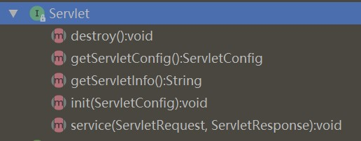
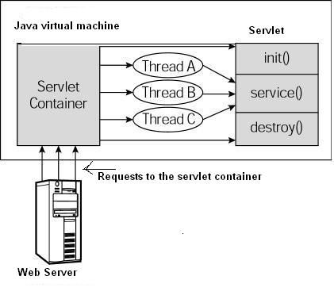
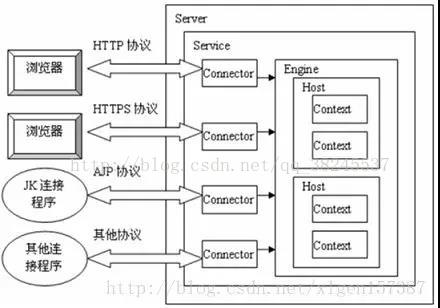

##### 项目/开放

+ 

+ **项目相关，项目细节，遇到的困难，是如何解决的**

  我的项目数据量有多大，假如公司的项目当数据量大的情况下，你觉得瓶颈会在哪里？

  面试官说分库分表过时了，支撑不住大数据量（天哪？我学习的太落后了）

+ **实习经历**

+ 

+ 你自己的最大优势是什么，举个例子  

+ 编译原理课程做了什么 

+ 
+ 开放题： 要实现一个像京东商城中的购物车，数据存储应该如何设计 
   追问 1： 对于游客账号，这些数据应该如何存储 
   追问 2： 如果数据量超过数据库承载能力，有什么方案

##### JVM

+ jvm了解吗，如果项目上线出现了 异常，怎么排查  
+ 堆栈区别 
+ Jvm 垃圾回收的大致原理 
+ Java 的内存模型 
+ static 什么时候被初始化 
+ Java 的垃圾回收机制 
+ Jvm 分代回收模型    
+ 持久代的作用（不会） 
+ GC 垃圾回收机制
+ JVM内存模型 
+ JVM(记不太清): 
+ JVM构成部分 
+ 垃圾回收机制 
+ GC的种类 
+ JVM分区 
+ 垃圾回收讲一下 
+ 对象是否存活  
+ 垃圾回收俩次标记(忘了。。。)  
+ 讲一下JMM  
+ happens-before，举个例子 
+ CMS原理 
+ CMS 中Stop the word阶段 

##### 操作系统

+ 如何查看系统的启动时间（我答了查看日志，应该是回答 uptime） 

+ CPU Load 和 CPU利用率的区别（不会） 

+ 查看系统当前所有的 Python 进程 

+ top 的作用 

+ 管道的作用 

+ IO 重定向 

+ 死锁线程的方法 互斥资源 

+ 死锁的条件，从破坏死锁必要条件答如何避免死锁 

+ 进程和线程的区别      

  - 介绍协程（不会） 

+ 死锁相关      

  - 死锁的产生 
  - 预防和检测死锁 

+  用户态到内核态 

+ select,poll,epoll 

  epoll数据结构 

+ IO 多路复用，select、poll、epoll 调用

+ 网络编程讲一下 socket 同步通信 异步通信 select poll epoll 

+ 僵尸进程与孤儿进程的区别 

+  进程通信方法 

+  常用的linux命令 

##### 计网/网络编程

+ 拥塞控制原理 

+  AIMD算法中在包丢失情况下，窗口大小

+  不同语言之前通讯方式（跨语言通信方案） C和Java之间 

+  长短连接实现 

+ TCP 和 UDP 的区别 

+ HTTP 状态码 

+ SSL 握手的过程    

  - 有几次RTT 
  - 快速恢复SSL的方法 

  对称加密和非对称加密的对比

+ 浏览器请求的过程 

+  HTTP无状态 

+  1.1和1.0区别 

+  讲一下https 

+  抓包 工具 能否看到ack和状态码 

+ NIO原理 

+ http协议 

+ 从浏览器输入一个url，到客服端得到反馈渲染页面的总过程 

+ 为什么我们输入域名时不用输入端口号，而我们通过IP访问时要输入端口号 

+ TCP协议的概念 

+ TCP的三次握手 

+ TCP和UDP的区别 

+ HTTP状态码 403什么意思

+ cookie知识   

+ Http请求头 

+ Http2.0与1.0的区别 

+ HTTP1.1与1.0的区别 

##### 算法 

+ 算法题：有序整型数组的二分查找

+ 堆排序

+ 快速排序 

+ 单向链表 如何快速得到长度

+ 日志文件很多行 rest接口提供 如何能够快速去对某个字符串进行筛选？？

+ 排序算法 

+ 第K大个数

+ 大量数字中只出现过一次的数字

+ 手撕了个代码：用数组实现循环链表

+ 在10亿数中找到一个数（bitmap） 

+  找数据流的中位数（剑指offer）

+ 思考题

  有100万个IP和对应的地址，你使用什么结构实现他  

  思考问题二，如果让你用二分，你怎么做   


##### Spring 

+ spring boot 了解吗 

+ spring cloud 了解吗

+ SpringMVC 的大致流程是什么？ 

  Spring Aop 的实现原理 

+  Spring核心: IOC AOP 

+  Spring中事务性的体现，还有具体如何实现的 

+  Spring Cloud熟悉么，Spring Cloud有哪些重要的组件

+ spring boot加载bean过程？？？我说了spring bean的生命周期

+ springboot启动类放置目录在哪里？  

+ spring 拦截器知识 

+ 讲一下spring，springmvc，springboot(概述，常用注解)  

+ spring IOC，AOP  

+ AOP原理，静态***和动态***讲一下  

+ Spring AOP实现原理 

+ Mybatis $与#的区别 

+ Mybatis与Hibernate的区别 

##### Redis 

+ redis有哪些高可用方案？我是单机实例，我不会
+ Redis 如何部署 集群 RDB和AOF介绍
+ Redis了解么。Redis除了了解用于缓存,还了解作为消息队列的用法么 
+ 你对redis的了解有多少，我自己会多少说了多少，有哪些类型，持久化，底层数据结构 
+ Redis怎么用的？数据类型有哪些，存验证码的话用的哪个数据类型？数据持久化方式RDB和AOF的优缺点？  
+ Redis缓存怎么解决数据一致性？redis集群用过吗？ 
+ 讲一下Redis 
+ Redis数据结构及其实现
+ Redis跳表  

##### MySQL

+ 手写SQL语句：给出一张表，字段有学号、名字、年龄、性别    

  - 找出最大年龄的人 
  - 找出最大年龄的人有几个 
  - 找出最多年龄人数的年龄

+ MySQL 索引的原理    

  - 对名字、性别、年龄建立组合索引      
    - 哪个字段不适合作索引 
    - 查询名字、年龄会走索引吗？ 

  - 交换链表中的两个节点 
  - 二叉树的层序遍历 

+ 数据库 聚集索引和非聚集索引区别 

+ 一条sql语句是怎么执行的 

+ 隔离级别 一般使用哪种 存在哪些问题 

+ 数据库 单体部署吗？集群有哪些问？主从复制的问题？ 数据不一致怎么解决？？ 

+ MongoDB与MySQL(问的啥不太清楚了) 

+ MySQL的默认隔离等级 

+ MySQL与MongoDB的区别，什么情况适合用mongodb，什么时候适合用MySQL 

+ 数据库用的是什么？MySQL，索引建立过吗？

+ ACID讲一下  

+ 脏读，不可重复读，幻读  

+ MVCC，CAS  

+ ABA问题，解决  

+ 乐观锁，悲观锁，行锁读写锁，表锁    

+ MySQL隔离级别 

+ InnoDB与MyISAM区别 

+ 什么是聚簇索引 

+ MySQL可重复读下如何解决幻读 

+ GAP锁

+ 可重复读与未提交读区别

##### ES 

+ ES原理，倒排索引
+ ES 索引和文档的区别 分片和副本 配置 分片缺失对检索有影响吗 
+ 用过ElasticSearch么 

##### MyBatis 

+ mybatis 分页原理有了解吗？ 不会 。。。
+ mybatis的支持延迟加载吗？ 不了解。。。

##### 设计模式

+ 手写DLC单例模式（突然忘了）      

  - 为什么要DLC？ 
  - 不用 volatile 会怎么样？（不会）

+ 设计模式 命令模式和策略模式。。

+  Java中比较熟悉的设计模式 

  知道的Java设计模式，除了工厂与单例 

##### 框架中间件

+ 还有了解哪些中间件
+ 中间件有用过吗 ZK？kafka？
+ zoo[keep]()er有用过么 
+ RabbitMQ与RocketMQ的区别 
+ 对docker和K8S的了解  
+ 介绍一下 RPC（不会）
+ 分布式消息队列之类的我都没有深入学习，面试官也没问啥 

##### 开放性

感觉面试官层次高了一截，问题也比较发散，而且不太好答，面了一个多小时 

1.  树的遍历 两种方法 计算节点的兄弟节点的差 
2.  大数据 日志 时间最长的10个url mapred 
3.  线程调度 内核态和用户态切换 用户态内的进行线程调度 协程 
4.  了解哪些开发框架 共同点 响应式编程 
5.  BIO NIO Tomcat的作用 
6.  反向代理的作用 静态资源具体怎么处理 
7.  印象深刻的事情 

##### 其他

+ Git中Rebase和Merge区别 
+ Git的内存结构，实现原理 


+ Callable 如何创建线程

  + 将 Callable 对象传递给 FutureTask，创建 FutureTask 对象
  + 将 FutureTask 对象传递给 Thread 类，创建线程实例

+ 线程池的执行原理：新提交一个任务

  + 线程池执行原理

    > 1. 判断运行的线程数量 < corePoolSize，若小于，则创建新线程执行，否则下一步
    > 2. 判断工作队列是否满了，若未满，则将任务加入工作队列，否则下一步
    > 3. 判断运行的线程数量 < maximumPoolSize，若小于，则创建新线程执行，否则下一步
    > 4. 执行拒绝策略

  + 线程池如何复用线程

    > 复用的线程只会从 workQueue 队列中获取任务执行
    >
    > 1. 新任务 submit 时，**无论当前线程池中的线程是否空闲，都会依据 active 的线程的数量判断是否新建新线程。**
    >
    > 2. 若 active 线程的数量达到 corePoolSize，则会尝试将该任务加入 workQueue
    >
    > 3. 此时，**处于 active 的线程，若处于空闲状态，则会从 workQueue 中获取任务执行**
    >
    >    因此，新加入 workQueue 的任务可能被 free 的线程立即执行，让 workQueuue 变空，达到线程复用的目的
    >
    >    若，没有 free 的线程，当工作队列被填满，并且处于 active 的线程的数量达到 maximum 限制，则会执行拒绝策略。

  + 示例：

    ```java
    package test;

    import java.util.concurrent.*;

    public class Main{
        private static class RunnableTest implements Runnable{
            @Override
            public void run() {
                // System.out.println("---- execute work - " + Thread.currentThread().getId());
                // System.out.println(Thread.currentThread().getName());
                try {
                    // 模拟耗时操作：使得新任务加入时，没有 free 的线程可用，也就不会执行加入 workQueue 的任务
                    Thread.sleep(10000);
                } catch (InterruptedException e) {
                    e.printStackTrace();
                }
            }
        }

        public static void main(String[] args) {
            ThreadFactory factory = new ThreadFactory() {
                @Override
                public Thread newThread(Runnable r) {
                    Thread thread = new Thread(r);
                    // thread.setName("lxk-test-thread-" + thread.getId());
                    System.out.println("create thread - " + thread.getId());
                    return thread;
                }
            };
            int corePoolSize = 5;
            int maximumPoolSize = 10;
            BlockingQueue workerQueue = new ArrayBlockingQueue<>(1);
            long timeout = 1;
            ExecutorService threadPool = new ThreadPoolExecutor(corePoolSize, maximumPoolSize, timeout, TimeUnit.MINUTES, workerQueue, factory);
            for(int i = 0; i < 3; ++i){
                System.out.println("第 " + (i + 1) + " 阶段");
                for (int j = 0; j < 6; j++) {
                    threadPool.submit(new RunnableTest());
                }
                try {
                    Thread.sleep(10);
                } catch (InterruptedException e) {
                    e.printStackTrace();
                }
                System.out.println();
            }
        }
    }
    /*
    第 1 阶段
    create thread - 11
    create thread - 12
    create thread - 13
    create thread - 14
    create thread - 15

    第 2 阶段
    create thread - 16
    create thread - 17
    create thread - 18
    create thread - 19
    create thread - 20

    Exception in thread "main" java.util.concurrent.RejectedExecutionException: Task java.util.concurrent.FutureTask@36baf30c rejected from java.util.concurrent.ThreadPoolExecutor@7a81197d[Running, pool size = 10, active threads = 10, queued tasks = 1, completed tasks = 0]

    可见：第二个阶段中，最后一个任务执行了拒绝策略，因为，有 10 个线程处理耗时的任务，另一个任务被加入到 workQueue 中，整个线程池只能够被消化 11 个任务
    */
    ```

    

+ Spring 事务传递，如何验证当前使用的哪种传递


  + 7 种传递机制：两大类

    ```
    注意：传播行为 标注在 被调用者上
    ```

    1. 兼容当前事务

       + Required：

         当前存在事务：加入当前事务（调用者、被调用者使用同一个事务）。

         当前不存在事务：被调用者自己创建一个事务执行自己的业务逻辑。

       + Supports

         当前存在事务：加入当前事务。

         当前不存在事务：被调用者已非事务的方式执行。

       + Mandatory

         当前存在事务：加入当前事务

         当前不存在事务：抛出异常

       + Nested

         当前存在事务：在当前事务中内嵌一个新事务执行被调用逻辑

         当前不存在事务：被调用者自己创建一个事务执行自己的业务逻辑。

    2. 不兼容当前事务

       + Requires_New

         当前存在事务：当前事务挂起，被调用者自己创建一个事务执行，执行结束后当前事务继续执行。

         当前不存在事务：创建一个事务执行被调用者逻辑。

       + Not_Supported

         当前存在事务：当前事务挂起，被调用者自己创建一个事务执行，执行结束后当前事务继续执行。

         当前不存在事务：已非事务的方式执行。

       + Never

         当前存在事务：抛出异常

         当前不存在事务：已非事务的方式执行。

+ Servlet

  Servlet 是 运行在 Java 服务端上的程序，作为 Http 客户端 与 服务端应用程序或者数据库 的中间层，接收 Http 客户端请求，处理请求之后做相应的响应。即：交互式地浏览和生成数据，生成动态 Web 内容。

  + [Servlet 详解_源码解析](https://mp.weixin.qq.com/s/F_3ZpRfH5YQX54aFMTcZ1g) | [Servlet 请求与响应](https://www.cnblogs.com/liushiqiang123/p/11053802.html) | [Servlet 介绍](https://www.runoob.com/servlet/servlet-intro.html)

  + Servlet 接口

    

    + getServletConfig()

      获取 Servlet 的配置信息，例如从 servlet.xml 配置文件中读取配置的相关信息，返回 ServletConfig 实例

      ```xml
      <servlet>
          <servlet-name>LoginServlet</servlet-name> <!-- 3 -->
          <servlet-class>demo.servlet.LoginServlet</servlet-class> <!-- 4 -->
      </servlet>
      <servlet-mapping>
          <servlet-name>LoginServlet</servlet-name> <!-- 2 -->
          <url-pattern>login</url-pattern> <!-- 1 -->
      </servlet-mapping>
      
      <!-- 
      Servlet 接收请求，并匹配到对应的 Servlet 处理程序过程：
      1. 根据 servlet-mapping 标签中的 url-pattern 标签匹配到配置的 servlet-name
      2. 根据 servlet-name 到 servlet 标签中匹配对应的 servlet-class
      -->
      ```

    + init(ServletConfig)

      + 通过 servlet 的配置信息，初始化 servlet 实例。

      + Servlet 能够接收 http请求，**但 Servlet 并不能直接监听服务端端口，直接监听端口的是服务端“容器”，例如 tomcat。**tomcat 会根据 url 信息，将请求交给对应的 servlet 处理。

        tomcat 启动时，会根据 web.xml 中配置的 load-on-startup 参数决定 servlet 的加载时机。

        + load-on-startup = 0（默认）：第一次请求到该 servlet 时，加载 servlet，执行 init 方法
        + load-on-startup = 1 ：tomcat 容器启动时加载 servlet，执行 init 方法

    + service(ServletRequest, ServletResponse)

      + 将请求匹配到对应的 servlet 处理类后，执行调用 service 方法处理请求。

      + 参数：

        ServletRequest ：Tomcat 解析 http 请求报文，封装成 HttpServletRequest 实例，作为请求信息传入 Servlet 处理。

        ServletResponse ：Tomcat 根据 HttpServletResponse 内容，生成响应报文，返回给浏览器。

      + 并发环境下，service 方法的线程安全问题

        若 service 方法没有访问 Servlet 的成员变量，静态资源，文件，数据库连接 等，只是用了当前线程自己的资源，则该方法本身就是线程安全的。

        

      + 示例：

        ```java
        // 重写了 doGet doPost 方法，service 会根据 请求的方式将请求转发到指定的方法上
        // 多数情况下都是 get、post 请求
        public class LoginServlet extends HttpServlet implements Servlet {
            @Override
            protected void doGet(HttpServletRequest request, HttpServletResponse response)
                throws ServletException, IOException {
                
                doPost(request, response);
            }
        
            @Override
            protected void doPost(HttpServletRequest request, HttpServletResponse response) 
                throws ServletException, IOException {
                
                String result = "";
                // 获取用户名  
                String userName = request.getParameter("userName");
                // 获取密码  
                String passwd = request.getParameter("password");
                // 数据中查找此人
                UserDao.SelectForLogin(userName, password); 
                request.getSession().setAttribute("userName", userName);
                // 设置返回页面
                response.sendRedirect("login_success.jsp");     
            }
        }
        ```

    + destroy()

      服务端关闭之后，调用 destroy 卸载所有的 servlet。

  + 容器中 Servlet 执行过程

    

  + Servlet 缺点：**url 与 类 对接**

    ```
    每一个接口都有对应的 Servlet 处理类，都需要在 servlet.xml 中进行配置。
    导致：
    1. Servlet 实现类繁多，系统复杂度增大
    2. servlet.xml 配置过于庞大，难以维护
    ```

+ Spring MVC

  Spring MVC 是基于 MVC 模式实现 Web 框架（轻量级）。

  SpringMVC 是 Servlet 的上层封装，通过一个 DispatcherServlet 的调度，实现 **url 与 方法 的对接**。

  

  + **SpringMVC vs Servlet（我的理解）**

    > 1. SpringMVC 只需要在 servlet.xml 中配置一个 DispatcherServlet，所有的请求都能够通过该 servlet 找到对应的处理程序。
    > 2. 由于 DispatcherServlet 的调度，请求的处理程序不再需要实现 Servlet 接口，@Controller 注解标注的普通类便能接收请求并处理。
    > 3. 请求的处理程序，从类级别，变成了方法级别。

+ Tomcat 整体架构


  + [Tomcat 架构](https://mp.weixin.qq.com/s/wh2MEJa0VjfG2FWjUmsElA)

  + [Tomcat 系统架构及请求执行过程](https://blog.csdn.net/qq_38245537/article/details/79009448) | [Tomcat 整体架构](https://mp.weixin.qq.com/s/zxdwg0qwYQNzIwyF1UzLHg) | [Tomcat 处理连接](https://mp.weixin.qq.com/s/zxdwg0qwYQNzIwyF1UzLHg) | [Tomcat 组成与工作原理](https://juejin.im/post/6844903473482317837)

  + tomcat 是一个 Java Web 服务器（轻量级），能够接收请求并做相应的响应，本质上 tomcat 就是 servlet 容器。

    tomcat 可以处理静态资源的请求，可以通过 servlet 处理动态资源的请求。tomcat 接收动态请求，通过 url 定位到具体的 servlet 处理类，响应处理结果。

    + 前后端未分离：

      响应的是 jsp 页面：tomcat 会通过 jasper 组件将 jsp 翻译成 java 代码（servlet），编译成 class 后运行，最后转换成 html 格式响应给浏览器。

      ```
      jsp：在 html 中通过 <% %> 标签扩展 Java 代码的页面格式，文件格式为 ".jsp" ，需要通过 web 服务器翻译成 servlet 类，运行之后，生成 html 格式的字节流响应给浏览器。
      ```

    + 前后端分离：响应的是 servlet 处理后的数据。

  + tomcat 顶层结构

    

    + **Server**：代表整个 tomcat 服务，掌握 tomcat 的生杀大权；*一个 tomcat 只能有一个 Server*

    + **Service**：用于提供具体的服务；*一个 Server 下支持多个 Service 共存，表示同时对外提供多个服务*

    + tomcat 两大核心组件：Connector + Container

      **Connector**：连接器；处理连接相关的任务，并提供 Socket 与 Http Resquest、Response 之间的转换；*一个 Service 支持多个 Connector，表示一个服务可以被并发访问。*例如：不同协议的连接、相同协议不同端口的连接、同协议同端口不同域名的连接、不同 url path 的连接。

      

      **Container** ：Servlet 容器，用于封装和管理 Servlet 并处理具体的 Http Request。*一个  Service 只能有一个 Container*

  + tomcat —— Connector 组件

    

    + Connector 需要同时支持 Socket 与 HTTP 协议；Socket 与 客户端进行通信；HTTP 与服务端处理程序进行通信。
      + 接收 Socket 请求，解析成 HTTP Request、Response 实例，传递给 Container 处理
      + 接收 Container 处理结果，通过 Socket 响应客户端。
    + **ProtocolHandler** ：Connector **通过 ProtocolHandler 处理请求，不同的 ProtocolHandler 代表不同的连接类型**。例如：Http11Protocol 使用普通的 Socket 连接，Http11NioProtocol 使用 NioSocket 连接。
      + **Endpoint**：处理底层 Socket 连接
      + **Processor**：将 Endpoint 接收到的 Socket 封装成 Request
      + **Adapter**：将 Request 适配到 Container 进行处理

  + tomcat —— Container 组件

    

    + Engine 引擎：用于管理多个站点；一个 Service 只能有一个 Engine

    + Host：虚拟主机，代表一个站点，课通过配置 Host 添加站点，一个 Engine 支持多个 Host 共存。

    + Context：应用上下文，代表一个 应用程序；webapps 目录下的每个文件都是 context，其中 ROOT 是主应用，通过 Host 指定的域名即可访问

      

    + Wrapper：封装 Servlet，每个 Wrapper 都封装着一个 Servlet

+ jdbc 中使用到了 策略模式吗？

+ 算法：两个栈实现一个队列

+ dubbo 中的监控中心使用的是哪个组件？

+ 多码代码：细心

+ Java 的发展多了解

+ Spring 需要深挖一下，Spring 与 SpringBoot 区别，Spring 的优点

+ ORM 框架，中 MyBatis 如何实现行级共享锁 **lock in share mode**

  ```
  select * from table_name lock in share mode;
  ```

  Hibernate 有了解过嘛

  JDBC Template、Hibernate、MyBatis 各自的优缺点

+ 反射，反射慢在哪儿？

+ **Redis 使用场景**

  > + 主要运用在分布式的场景中
  >
  > + 作为一个中间件：分布式锁、分布式缓存、分布式限流、分布式数据去重
  >
  > + 拥有特定的数据结构：
  >
  >   简单的消息队列、权重队列（排行榜）、延时队列、一对多的发布订阅
  >
  >   bitmap 做大数据标记
  >
  >   计数器（线程安全）
  >
+ **GC 频繁应该如何排查**

+ 堆使用场景

+ 

+ 小米实习的收获：

  1. 深刻理解编码风格的重要性，有时候代码质量差也会导致 bug 的出现。 --- 实习过程中找 bug，leader 提醒！
  2. 实战经历：能够在真实的线上环境试错，提出方案，leader 给出建议。
  3. 了解开发上线的流程。
  4. 主动学习的热情，在实习的时候，我经常会问我的 leader 一些问题，一方面 leader 会给我答疑解惑，另一方面，如果这个问题我们的项目还没有解决的话，这也会促进这个问题在项目中的落地。
  5. 经历过 816，能从 leader 那里了解一些大促之间的应急策略。出现问题之后，需要复盘，找到问题的根本原因，避免类似的问题再次出现造成损失。

  


##### 加密算法

- [七种常见的加密算法](https://juejin.im/post/6844903638117122056)
- [JWT 签名算法中 HS256 和 RS 256 的区别](https://www.jianshu.com/p/cba0dfe4ad4a)
- [HMAC 加密算法](https://www.jianshu.com/p/35630d32b3e7)
- [抓包工具能够获取 https 数据，所以 https 并不安全](https://learnku.com/articles/19238)
- [HTTPS 能够防止中间人篡改内容吗](https://www.zhihu.com/question/65464646)
- [网络抓包原理](https://www.jianshu.com/p/03b30c8e9117)
- [黑客抓包原理](http://www.jeepxie.net/article/75737.html)
- [网络安全之数据监听](https://www.jianshu.com/p/14c9a4294c31)
- [WEB 安全之 CSRF](https://www.jianshu.com/p/855395f9603b)
