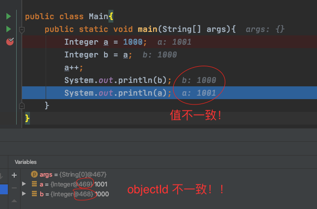

##### Java

+ Java数据结构 
  +  常见的集合类
  +  ArrayList和LinkedList讲一下
  +  ArrayList 和 LinkedList 的原理和实现 
  +  链表和数组的区别 

- HashMap 的实现原理，如何通过Key获得Value 

  - HashMap 和 HashTable 的区别和原理 

  - 哈希冲突解决方法 

  - HashMap原理 

    链表转红黑树阈值，红黑树转链表阈值，为什么 

  - **hashmap讲一下 resize做了啥** 

    + 计算新的桶容量、计算新的阈值、使用新计算的 桶大小 创建一个新的 哈希表（数组）。

    + 将 HashMap 中的哈希表指向新的哈希表。

    + 遍历 旧哈希表 中的桶，分离旧桶中的 链表：原位置 链表，新位置 链表

      将这两条链表存入 新表 中指定的位置。

  - ConcurrentHashMap原理

  - 看过源码吗？我说HashMap  

  - **HashMap当在扩容时候进行put操作时，会怎么办呢？**  

    - put 的时候不会做任何的安全措施，直接
    - *（没问尽量不要说，你没看过 辅助扩容的源码）ConcurrentHashMap 在 putVal 的时候，如果正在 resize 就会辅助扩容。*

- lock 和 synchronized区别  

  + sychronized 静态方法和不同方法的区别 

  + Lock锁，synchronized,volatile

  + 什么时候使用 synchronized，[内部实现](https://www.pianshen.com/article/8275204637/)是怎么样的？

    + synchronized 加锁的目标是 Java 对象，对类加锁也借助 Java 对象实现的，加锁对象为 Class 实例。

    + synchronized 对象锁，在 JVM 层面是通过 对象的 monitor 实现。

      monitorenter：加锁

      monitorexit：释放锁

      每一个对象都有一个 monitor 与之相关联，当线程执行到 monitorenter 时，会尝试获取锁，将 monitor 的 owner 设置尝试获取锁的线程。并且 monitor 中的 锁记数器 count 会执行 +1 操作


  + lock和synchronized区别  

  + Synchronized与ReentrantLock区别 

  + Synchronized锁方法和锁代码段的实现，主要是对象头（markword）与monitor_enter讲一下

  + Synchronized会响应中断么 

- 多线程

  - 进程和线程的区别，为什么不使用多进程而是多线程
  - 线程状态 主线程能拿到子线程的执行结果和异常吗 
  - **线程安全，如何解决多线程下数据不安全的情况 ，线程安全在JVM中的体现 ** 
  - 自旋锁和互斥锁区别 
  - Java中的乐观锁，CAS及其缺点 
  - Java中创建线程的方法 
  - Java中锁的种类 
  - ThreadLocal 
    + ThreadLocal怎么用的？内存泄漏，弱引用问题，垃圾回收（本来想把面试官引过来，没得逞）  
    + 内存泄漏 内存溢出  
  - 线程池参数 
  - 若线程池中2个线程，执行完毕，现有新任务会怎样 

+ 

+ 强引用、软引用、弱引用、虚引用

  **强软弱虚**

+ 

+ 如何设计一个线程池，线程池拒绝策略有哪些，都适用于什么场景

+ 阻塞队列的实现原理


+ 

- 

- ConcurrentHashMap 的 put 操作如何实现 size + 1 操作，就是 putVal 中的 addCount 操作如何实现的？

  [ConcurrentHashMap#addCount 分析](https://www.jianshu.com/p/749d1b8db066)  ｜ [JDK 1.7 ConcurrentHashMap 并发计数](https://blog.csdn.net/striveb/article/details/84106768)

  [ConcurrentHashMap#transfer 分析](https://www.jianshu.com/p/2829fe36a8dd)

  [ConcurrentHashMap#helpTransfer](https://www.jianshu.com/p/39b747c99d32)

- [Java 线程池的 8 大拒绝策略](https://mp.weixin.qq.com/s/HTEwvMFLIFYetevJPop8tg)（包括第三方提供的拒绝策略）

- [Java 异步编程 —— FutureTask 源码分析](https://mp.weixin.qq.com/s/Ir3Asu57_KlvqRNms9EWDw)

- [异步编程中的 Future](https://mp.weixin.qq.com/s/RZqv0jkq644KcGBHaz7lUA)

- [如何停止一个正在运行的线程](https://mp.weixin.qq.com/s/bkIoi4Hro2HrH_dr7WHHIA)


- [LRU Java 实现](https://blog.csdn.net/lc13571525583/article/details/90642910)


- [JVM 基础](https://mp.weixin.qq.com/s/M0k6df14P7VP6vqyRcmJOA)
- 双亲委派机制，如何打破的
- 双亲委派是什么，为什么要用双亲委派模型，如何打破这种机制


- [单例模式的 9 种实现方式](https://blog.csdn.net/qq_35860138/article/details/86477538)
- [策略模式](https://mp.weixin.qq.com/s/ICQ-OBrO8i76suofFOdlzg)


- 红黑树的定义，是怎么实现平衡的？

  ```
  1. 树的节点位红色或者黑色
  2. 根结点为黑色
  3. 叶子结点为黑色
  4. 从某个结点到所有的叶子结点的路径上有相同数量的黑色结点
  5. 红色结点为子结点为黑色结点
  
  若不满足上诉任意一个原则，则进行调整。
  调整：1. 结点变色；2. 旋转调整
  ```

  


**多线程**

- 我看到你简历上写了锁机制，说说你知道的锁？

- 线程各个状态有哪几种，是怎么流转的？用什么方法来启动线程？调用 start()，sleep()，wait() 方法等从什么态到什么态？ 

- 什么情况下会从运行态到阻塞态？ 

- 对同一个线程使用start方报错么？什么错误字段？

  ```java
  public class Main {
      private static class RunnableTest implements Runnable{
  
          @Override
          public void run() {
              System.out.println("run!");
          }
      }
  
      public static void main(String[] args) {
          RunnableTest runnableTest = new RunnableTest();
          Thread thread = new Thread(runnableTest);
          thread.start(); // 成功执行
          thread.start(); // 再次调用 start 方法：报错 IllegalThreadStateException
      }
  }
  /*
  run!
  Exception in thread "main" java.lang.IllegalThreadStateException
  	at java.lang.Thread.start(Thread.java:708)
  	at test.Main.main(Main.java:16)
  
  */
  ```

- Java中怎么实现线程？线程1线程2同时执行，1一定会比2先执行完吗？如果任何阻塞态都没出现，还会比2执行完吗？Java中怎实现线程安全的？

- Java 线程安全手段：

  - 悲观锁

    - Synchronized
    - ReentrantLock

  - 乐观锁

    - CAS

  - 不可变对象

    - String

    - [枚举](https://blog.csdn.net/javazejian/article/details/71333103)

      ```java
      // 单例模式 ：解决了序列化、反序列化、反射等操作。
      public enum InstanceTest{
        INSTANCE;
        private String name;
        InstanceTest(){
          // todo
          this.name = "singleton instance";
        }
        public String getName(){
          return this.name;
        }
        public void setName(String name){
          this.name = name;
        }
      } 
      ```

    - 部分 Number 实现类：数值包装类、BigInteger、BigDecimal

      ```java
      public class Main{
          public static void main(String[] args){
              Integer a = 1000;
              Integer b = a;
              a++;
            	System.out.println(b); // 1000
              System.out.println(a); // 1001
          }
      }
      ```

      

      debug 窗口中变量的信息 Integer@xxx，其中的 xxx 不是 hashcode，而是 对象的 id，[详见](https://blog.csdn.net/baichoufei90/article/details/84102509)

      上述验证了，Integer 包装类是不可变的，执行了修改操作之后，当前对象变量会指向新的 对象。

  - 无同步方案

    - 方法内的局部变量
    - ThreadLocal 线程内的局部变量

- 了解线程池吗？线程池参数

- 什么是线程，什么是进程？

- 手撕三个线程无限循环打印 A,B,C （后面问的大多是线程和JVM，只记得一部分）

  - 线程通信机制

    ```java
    public class Main{
    
        private static class RunnableTest implements Runnable {
            private static final String[] printList = {"A", "B", "C"};
            private static final ReentrantLock LOCK = new ReentrantLock(false);
            private static final Condition BLOCK = LOCK.newCondition();
          
            private static final Object SYNCHRONIZED_LOCK = new Object(); 
          
            private static int idx;
    
            @Override
            public void run() {
                while (idx < 30) {
                    print();
                }
            }
    
            /**
             * 顺序打印 A、B、C
             * 线程之间的通信机制，使得无用线程暂时等待，但是在当前场景中，线程执行的任务少，执行速度快，这就导致了线程频繁的等待唤醒。
             */
            private void print() {
                reentrantLockPrint();
                // synchronizedLockPrint();
            }
            /**
             * ReentrantLock 和 Condition 联合使用，线程执行的顺序性，相当于线程与 A、B、C 相绑定
             */
            private void reentrantLockPrint() {
                LOCK.lock();
                System.out.println(Thread.currentThread().getName() + " --- " + printList[idx % printList.length]);
                idx++;
                BLOCK.signal();
                try {
                    BLOCK.await();
                } catch (InterruptedException e) {
                    e.printStackTrace();
                }
                LOCK.unlock();
            }
    
            /**
             * synchronized 和 Object 的 wait、notify 联合使用，无法保证线程顺序
             */
            private void synchronizedLockPrint() {
                synchronized (SYNCHRONIZED_LOCK) {
                    System.out.println(Thread.currentThread().getName() + " --- " + printList[idx % printList.length]);
                    idx++;
                    SYNCHRONIZED_LOCK.notify();
                    try {
                        SYNCHRONIZED_LOCK.wait();
                    } catch (InterruptedException e) {
                        e.printStackTrace();
                    }
                }
            }
        }
        public static void main(String[] args) {
            RunnableTest runnableTest = new RunnableTest();
            Thread threadA = new Thread(runnableTest);
            Thread threadB = new Thread(runnableTest);
            Thread threadC = new Thread(runnableTest);
            threadA.start();
            threadB.start();
            threadC.start();
        }
    }
    ```

  - 线程绑定 A、B、C

    ```java
    public class Main{
    
        private static class RunnableTest implements Runnable {
            private static final String A = "A";
            private static final String B = "B";
            private static final String C = "C";
    
            private String own;
    
            RunnableTest(String own) {
                this.own = own;
            }
    
            private static int idx;
    
            @Override
            public void run() {
                while (idx < 30) {
                    print();
                }
            }
    
            /**
             * 顺序打印 A、B、C
             * 通过线程绑定的 own 确定当前线程是否需要打印：该方法每个线程都会一直执行，占用 CPU
             */
            private void print() {
                switch (idx % 3) {
                    case 0:
                        if (A.equals(own)) {
                            System.out.println(Thread.currentThread().getName() + " --- " + A);
                            idx++;
                        }
                        break;
                    case 1:
                        if (B.equals(own)) {
                            System.out.println(Thread.currentThread().getName() + " --- " + B);
                            idx++;
                        }
                        break;
                    case 2:
                        if (C.equals(own)) {
                            System.out.println(Thread.currentThread().getName() + " --- " + C);
                            idx++;
                        }
                        break;
                    default:
                        break;
                }
            }
    
        }
        public static void main(String[] args) {
            RunnableTest runnableA = new RunnableTest(RunnableTest.A);
            RunnableTest runnableB = new RunnableTest(RunnableTest.B);
            RunnableTest runnableC = new RunnableTest(RunnableTest.C);
            Thread threadA = new Thread(runnableA);
            Thread threadB = new Thread(runnableB);
            Thread threadC = new Thread(runnableC);
            threadA.start();
            threadB.start();
            threadC.start();
        }
    }
    ```

- 如何让线程同步进行

- countdownlaunth cyclicbarrier 信号量（详细说一下）

- **fork join框架**

- **Reentrantlock怎么实现公平和非公平**

  - 锁空闲：

    - 公平锁：若阻塞队列中存在阻塞线程，则加锁失败，否则 CAS 尝试获取锁
    - 不公平锁：直接 CAS 尝试获取锁

  - 锁被占用：

    当前线程是否是锁的持有者

    - 是：重入
    - 否：加锁失败

- Synchronized：实现原理、锁升级、锁消除、乐观还是悲观 

- ReentrantLock：是什么、公平，非公平、原理 

- CAS：实现、应用 

- synchronized关键字实现原理，是否公平锁？为啥不公平？有公平锁嘛? 

- Lock/sychronized区别，底层实现原理

**集合**

- 一个线程读list、一个线程写list，这种操作是否允许？为什么？

- 常见的数据类型 ，List、ArryList、LinkList，ArryList和LinkList的区别及应用场景

- Hashmap底层实现，怎么往map中数据存储，而且数组和链表是怎么支持底层存储的？Hashmap是线程安全的吗？哪个map是安全的？

- Currentmap是安全的吗？

- ConcurrentHashMap结构，ConcurrentHashMap新版本（1.8）比旧版本（1.7）优点和缺点

- 集合框架 linkedlist和arraylist

- hashmap原理

- hashmap和hashtable的区别

- concurrenthashmap

- **线程安全的JAVA集合类**

  > - vector：加锁
  >
  > - CopyOnWriteArrayList：读写锁；线程安全的 ArrayList，写操作加锁、创建 array 副本，写操作完成后，用副本更新 array；读多写少的应用场景下，性能比 vector 高！
  >
  > - HashTable
  >
  > - ConcurrentHashMap：
  >
  > - ConcurrentSkipListMap：跳表的实现，跳表支持快速查找
  >
  > - Collections 中的工具类 synchronizedMap、synchronizedSet、synchronizedSortedSet、synchronizedList
  >
  > - 线程安全的 queue：
  >
  >   - 阻塞队列：BlockingQueue：加锁阻塞
  >
  >   - 非阻塞队列：ConcurrentLinkedQueue：CAS 非阻塞
  >
  >  ConcurrentLinkedQueue：线程安全的 LinkedList、queue，非阻塞队列，高效并发

- hashmap为什么线程不安全

  - 造成链表环的情况和数据丢失的情况

- concurrentHashMap怎么实现线程安全的

  - jdk1.7用分段锁
  - 1.8用synchronized和cas有什么区别

- HashMapkey和value可以为Null吗？**key为Null的时候 怎么计算Hash? put的流程？**

- hashmap初始化大小的计算 100个节点需要申请多大空间

- HashMap线程安全问题有哪些

- 数组和链表的区别

- HashMap底层原理，1.8为什么改成了尾插法？**为什么会形成环？**

- HashSet的底层实现原理

- HashMap怎么做到O(1) get 

- 哈希函数构造，哈希冲突解决方法

- Map用过哪些？hashMap相关，怎么实现线程安全？

+ 


**HashMap**

+ 说一说 HashMap、底层实现

+ 红黑树是什么、怎么实现、时间复杂度、为什么使用红黑树、何时树化、何时链表化

  ```
  treemap存取时间复杂度是多少？
  红黑树能够解决循环链表嘛，线程安全吗，怎么解决
  ```

+ 线程安全性、线程安全的解决方案

+ HashTable 、SynchronizedMap、ConcurrentHashMap 原理，如何保证线程安全，与 HashMap 的区别

+ HashMap get 和 put 实现、时间复杂度

+ 为什么要重写 hashCode 和 equals

+ 怎么解决 hash 冲突

+ hashmap 扩容，为什么是 2 的幂次

  ```
  大小为 100 的话，数组初始容量是多大
  ```

**集合**

+ ArrayList vs LinkedList 区别

  ```
  ArrayyList 动态数组
  LinkedList 双向链表
  ```

+ ArrayList 为什么快速失败

**并发**

+ Java 线程是什么、线程状态

+ Java 线程安全的手段

+ Java 中实现锁的方式；Lock 是如何实现的；ReentrantLock 和 Synchronized 的区别

+ 死锁的四个条件

+ 从避免死锁上区分 Lock 和 Synchronized 的区别（请求与保持 还是 不可剥夺）

  可以在阻塞时响应中断

+ 线程池：

  1. 线程池作用
  2. 核心参数
  3. 提交任务后，线程池的工作原理
  4. 常见的饱和策略（*丢弃并异常、丢弃无异常、丢弃最先进入的、使用 启动线程池的线程执行*）
  5. 默认提供了哪几种线程池，大概怎么实现的，为什么 不建议使用 这些线程池

+ sleep 和 wait 的区别（*是否需要对象锁的支持、属于哪个类、是否会释放对象锁、是否自动唤醒、等待通知机制？自我调度？*）

+ **介绍一下并发**

  ```
  综合性提问：
   1. 并发、并行
   2. 并发 =》 Java 线程
  	继续介绍 Java 线程的创建方式、Java 线程的状态
   3. 并发 =》 锁（介绍 Java 锁的两种实现方式）
   	lock 与 Sync 的区别、lock 比重量级锁 性能好在哪里（引出：阅读源码 lock 的加锁方式）
   	Sync 的优化
   4. 并发安全性手段
   	阻塞同步、非阻塞同步、无锁方案... ...
  
  线程池的优点：
  1. 降低系统资源的消耗
  2. 提高响应速度
  3. 提高线程的可管理性：线程是稀缺资源，如果无限制的创建并销毁线程，那将浪费大量的系统资源，同时也会降低系统的性能，因此，使用线程池能够对线程就行统一的 分配、调优 和 监控 等管理操作！
  ```

+ **Java 中锁的种类**，各自区别

  ```
  综合性提问：
   · 按照加锁的态度，可分为：
   	乐观锁：CAS 自旋锁
   		总是假设最好的情况，不会存在并发冲突，因此，访问数据时不会加锁，只会在修改数据时检测是否存在并发冲突，如果不存在，则成功修改，否则，采取补偿措施！
   		检测方式：CAS、（数据库）版本号 或者 时间戳
   		补偿措施：自旋（失败重试）
   	悲观锁：ReentrantLock、Synchronized
   		总是假设最坏的情况，任何时刻都存在并发冲入，因此，访问数据时都会加锁，当加锁失败时，就会被阻塞，直到锁被释放！
   		加锁、解锁：Synchronized、ReentrantLock
   	
   · 按照资源是否独享，可分为：
   	独享锁：
   		是指资源互斥访问，一个时刻只能有一个线程访问资源，其他线程被阻塞！
   		互斥访问使用 互斥锁：ReentrantLock、Synchronized
   	共享锁：使用 读写锁 实现：ReentrantReadWriteLock
   		是指允许资源被并发地读取，而只能被互斥的修改：读共享、写互斥！
   		读写锁：适用于读多写少的场景，将互斥锁中的一个锁，分裂为 读锁 和 写锁，允许在并发的读操作，但是写操作会阻塞所有的读写操作！
  
   · 按照是否抢占资源，可以分为：
  	公平锁：按照 FIFO 的方式，将 CPU 分配给阻塞队列中的线程！公平，不会出现线程饿死！
  	非公平锁：线程按照 CAS 的方式抢占锁，若没抢到则加到队列中等待被唤醒！吞吐量高，可能会出线程饿死！
  	
   · 对于 synchronized 而言：
   	偏向锁、轻量级锁、自适性自旋锁、重量级锁
   	
   · 其他锁：
   	可重入锁
   	分段锁
  ```

###### 1. 基础

3. NIO

   同步异步、阻塞和非阻塞 四个概念

###### 2. 多线程

1. 进程和线程的区别

2. 临界区、互斥锁、乐观锁、悲观锁及其使用场景

3. CAS

   自己写代码实现 CAS 的过程可以吗？

   ```
   可以但是要保证原子性，Java 的 CAS 底层是一条机器指令 CMPXHG，机器指令是原子性的。
   ```

   这个实现属于软件实现还是硬件实现？

4. Java 线程池有哪些参数

   核心池如何扩容

5. synchronized 内部实现

6. AQS 如何实现

7. volatile 底层实现

8. 线程状态

9. block 和 wait 区别

10. juc 下的包

11. 原子类的实现

12. CAS 为什么是原子性的

13. 线程池原理

###### 3. 集合

1. HashMap 底层存储、扩容流程

2. hashcode 是什么

3. hashmap 中如何计算下标

4. 如果所有对下个的 hashcode 都为 1，会发生什么？

5. hashset 的内容

6. 讲讲 consurrentHashMap，如果下标空 是怎么操作的

7. ConcurrentHashMap 如何保证并发安全问题

8. Java 默认用的是什么排序

   ```
   sort(int[])，数组长度< 47，用插入排序，47 -  286  使用快排       长度>= 286 ，看看数组是不是基本有序，基本有序用归并排序，基本无序，用快排，而且它的快排是什么双轴快排
   ```

###### 线程池 + Future

+ 线程池的核心数量、最大数量 如何设置

  ```
  NMaxThread = NCPU * (1 + w/c) = NCPU / (1- 阻塞系数)
  w : 阻塞时间
  c : 计算时间
  
  w/(c+w) : 阻塞系数
  ```

  + IO 密集型

    w/c 肯定 > 1，这种情况下，阻塞时间都是 计算时间的很多倍，由于每开启一个线程都需要内存空间（栈空间、程序计数器空间），因此，该公式仅仅作为参考，具体的线程数量可以通过该参考值 进行测试。

    多数情况下，保守起见，可以将 w/c 取为 1，**此时`NThreads = 2 * NCPU`**

  + 计算密集型

    计算密集型，可以认为 w = 0，此时 `NThreads = NCPU`，为了应对突发状况，某个线程执行过程中突然中断，则替补线程可以继续使用该 CPU 资源，该 CPU 资源不会被浪费。

    因此，在计算值的基础上多加一个线程，保证最优效率，**此时`NThreads = NCPU + 1`**

+ n 个任务，每次批量执行其中的 m 个，每执行一个任务都有一个 int 类型的返回值，计算 n 个任务的返回值

  ```java
  public class Main {
      public static void main(String[] args) {
  
          // 【1】：ThreadFactory 接口，实现 newThread 方法， 如果不知道是 newThread，则可以直接使用 lambda
          ThreadFactory factory = runnable -> {
              Thread thread = new Thread(runnable);
              thread.setName("kk-thread:" + thread.getId());
              return thread;
          };
          int n = 10, m = 3;
          // 【2】：注意参数顺序：core、maximum、time、queue、factory
          ThreadPoolExecutor pool = new ThreadPoolExecutor(
                  5, 10, 100, TimeUnit.MILLISECONDS, new ArrayBlockingQueue<>(n), factory
          );// 默认策略：new ThreadPoolExecutor.AbortPolicy()
          List<Future<Integer>> futureList = new ArrayList<>();
          while (n > 0) {
              if (n < m) {
                  n = m;
              }
              for (int i = 1; i <= m; ++i) {
                  futureList.add(pool.submit(new Task()));
              }
              n -= m;
          }
          int count = 0;
          for (Future<Integer> future : futureList) {
              // 【3】try catch 一定要注意捕获“中断异常”！
              try {
                  count += future.get();
              } catch (Exception e) {
                  System.out.println("error!");
              }
          }
          System.out.println(count);
      }
  
      private static class Task implements Callable<Integer> {
          // 【4】 继承 Callable 实现 call 方法
          @Override
          public Integer call() {
              return 1;
          }
      }
  }
  ```


###### HashMap

+ HashMap 数据太多，rehash 时间长怎么解决？

  + 在 HashMap 内部是一次性 rehash 的，rehash 并不会阻塞其他线程，其他线程依旧可以执行，即，rehash 时依旧可以执行 get、put 操作。

    **在 redis 中，采用了 渐进式rehash 的方式，将不同桶下的元素的 rehash 操作，平摊到不同的 客户端请求中！**

  + rehash 时的 get、put 操作

    rehash 时，如果执行 get 操作，可能会 get 到 null 值：key 还未开始 hash，还未 hash 到新桶中

    rehash 时，如果执行 put 操作，当 rehash、put(更新 value 时) 都完成后，put 的值可能被原值覆盖，也可能成功。

  + HashMap rehash 过程中

    1. 计算new threshold，并重置 old threshold
    2. 计算新桶数量，根据新桶数量创建 new table，并重置 old table，**此时，HashMap 中使用的是 新的空数据 table**
    3. 将 old table 中的元素移动到 new table 中。

+ **rehash**

  ```java
  // -------------------------------------------------------------------
  // put 操作可以返回数据！！！
  // 如果 put 的 key 不存在，则返回 null
  // 如果 put 的 key 存在，则返回 oldValue
  
  final V putVal(int hash, K key, V value, boolean onlyIfAbsent, boolean evict) {
    Node<K,V>[] tab; Node<K,V> p; int n, i;
    if ((tab = table) == null || (n = tab.length) == 0)
      n = (tab = resize()).length;
    if ((p = tab[i = (n - 1) & hash]) == null)
      tab[i] = newNode(hash, key, value, null);
    else {
      // 表示原桶中 key-value 对应的 node（不存在则为 null）
      Node<K,V> e;
      
      // 插入 key-value，如果桶内元素的数量达到 8 则，树化 treeifyBin ！
      // ... 
      
      // 如果原桶中 key 存在，则判断是否更新 key
      if (e != null) {
        V oldValue = e.value;
        if (!onlyIfAbsent || oldValue == null)
          e.value = value;
        // 留给 LinkedHashMap 的后门：更新结点后，LinkedHashMap 可自定义该结点行为。
        afterNodeAccess(e);
        return oldValue;
      }
    }
    // 说明 put 操作为 insert。
    // 注意：insert、delete 才会 修改 modCount，更新操作不会修改 modCount
    ++modCount;
    if (++size > threshold)
      // rehash
      resize();
    
    // 留给 LinkedHashMap 的后门：插入结点后，LinkedHashMap 可自定义该新结点的行为。
    afterNodeInsertion(evict);
    return null;
  }
  
  // -------------------------------------------------------------------
  // rehash
  final Node<K,V>[] resize() {
    Node<K,V>[] oldTab = table;
    int oldCap = (oldTab == null) ? 0 : oldTab.length;
    int oldThr = threshold;
    int newCap, newThr = 0;
    // 计算 newCap、newThr
    // ...
    
    // 重置 threshold
    threshold = newThr;
    Node<K,V>[] newTab = (Node<K,V>[])new Node[newCap];
    // 重置 table：将 table 重置为 newTable（此时 table 为空数据）
    table = newTab;
    
    if (oldTab != null) {
      for (int j = 0; j < oldCap; ++j) {
        Node<K,V> e;
        if ((e = oldTab[j]) != null) {
          oldTab[j] = null;
          if (e.next == null)
            newTab[e.hash & (newCap - 1)] = e;
          else if (e instanceof TreeNode)
            // 红黑树中元素的 rehash
            ((TreeNode<K,V>)e).split(this, newTab, j, oldCap);
          else {
            // 新 table 中：原 hash 位桶链表
            Node<K,V> loHead = null, loTail = null;
            // 新 table 中：高一位桶链表
            Node<K,V> hiHead = null, hiTail = null;
            Node<K,V> next;
            
           /*
           遍历桶链表：将元素 rehash 到高一位桶中，只需要元素 hash 的高一位为 1 即可。
           	生成 原 hash 位桶链表 loHead、loTail：高一位为 0（key.hash & oldLen == 0）
           	生成 高一位桶链表 hiHead、htTail：高一位为 1（key.hash & oldLen == 1）
           */
            // ... 
            
            // 将 loHead、hiHead 设置到新桶中！
            if (loTail != null) {
              loTail.next = null;
              // 原 hash 位桶
              newTab[j] = loHead;
            }
            if (hiTail != null) {
              hiTail.next = null;
              // 高一位桶
              newTab[j + oldCap] = hiHead;
            }
          }
        }
      }
    }
    return newTab;
  }
  
  // -------------------------------------------------------------------
  // 树化
  final void treeifyBin(Node<K,V>[] tab, int hash) {
    int n, index; Node<K,V> e;
    // 如果 桶的数量 < 64，则不树化，依旧是以扩容的方式解决 降低桶内的元素数量！！！
    if (tab == null || (n = tab.length) < MIN_TREEIFY_CAPACITY)
      resize();
    else if ((e = tab[index = (n - 1) & hash]) != null) {
      TreeNode<K,V> hd = null, tl = null;
      do {
        TreeNode<K,V> p = replacementTreeNode(e, null);
        if (tl == null)
          hd = p;
        else {
          p.prev = tl;
          tl.next = p;
        }
        tl = p;
      } while ((e = e.next) != null);
      if ((tab[index] = hd) != null)
        // 否则：真正的树化！！！
        hd.treeify(tab);
    }
  }
  ```

+ HashMap 的 Node

  ```java
  static class Node<K,V> implements Map.Entry<K,V> {
    /*
     key 的 hash 值（并不是 key 原有的 hashcode）
     为了解决散列冲突，让 key 分散到各个 hash 桶中，HashMap 会对 key 的 hashcode 进行 再hash
     新的 hash 值就保存到 结点中。
    */
    final int hash;
    final K key;
    V value;
    Node<K,V> next;
    // ... 
  }
  
  /*
   key 和 hash 属性都使用 final 修饰，表示不可变！
   红黑树中的 TreeNode 继承于该 Node 类，即：TreeNode 维护了一个 next 属性。
  */
  ```

+ [HashMap 加载因子为什么是 0.75](https://mp.weixin.qq.com/s/b6qHL-Mp5ttFb5UeRZ1m-Q)

  泊松分布

+ TreeMap HashMap 的区别

  1. HashMap 使用 **hash 表实现**，在解决 hash 冲突时，使用 **链地址法 解决冲突，当链长度达到 8，并且桶数量达到 64 时，升级为 红黑树**。

     TreeMap 直接使用 **红黑树实现，插入数据之后，会进行 红黑树 调整**。

  2. 由于 Hash 表的特性，导致 **HashMap 内部存储无序**

     由于 红黑树 的特性，导致 **TreeMap 内部存储会按照 元素间 约定的顺序进行排序。**

  3. 由于 Hash 需要 hash，HashMap 中的 key 需要**保证 equals 和 hashcode 语意的一致性**。即：要么全部重写，要么全部不重写。

     由于 红黑树 需要排序，TreeMap 中的 **元素需要保证可比较性**。

     ```
     1. 元素 所属的类(KeyType) 继承于 Comparable<KeyType>，并重写其中的 compareTo(KeyType k) 方法！
     2. 创建 TreeMap<KeyType, Object> 时，定义 Comparator<KeyType> 的子类，并将其实例传入 TreeMap 构造器。（一般是 匿名内部类、Lambada 表达式等方式）
     ```

+ HashMap 把链表换成数组会怎么样，为什么要替换成红黑树

  1. 替换成数组：

     要替换成数组，就需要考虑，如何通过下标获取到元素（使用 开放定址法）

     数组自身的缺点，删除、增加元素都需要 O(N) 的时间复杂度，本质上的问题还是没有解决。

  2. 替换成红黑树：

     对元素操作，都保证在 O(logN) 的时间复杂度，当元素数量增多时，优势就显现出来了！


###### OOM

- 常见类型：

  1. Java 虚拟机栈抛出 OOM：无法动态申请栈内存

     Xss：单个线程分配的栈内存大小（512～1024）

     ```
     1. 查看是否分配过多线程（一般是线程池问题）
     2. 减少 Xss，尽量多分配线程
     
     JVM 不设置 虚拟机栈 总大小！
     ```

  2. Java 堆抛出 OOM：

     1. 内存溢出

        是否在应用程序中产生大对象（一次性查询出百万级别的数据）

        是否是堆内存分配过小

        ```
        Xmx ：堆最大内存
        配置：
        	新生代内存 Xmn
        	新生代 eden:survivor 比例
        	新生代:老年代 比例
        ```

     2. 内存泄漏：检查程序

  3. 方法区抛出 OOM

     1. 是否动态生成很多 类
     2. 是否有大量的 字符串常量（jdk 1.7 之前）

- [OOM 分析](https://mp.weixin.qq.com/s/oNWwPZ56yLCp1KQyir17AA)

#### Java 专区

[Java 线程池的 8 大拒绝策略](https://mp.weixin.qq.com/s/HTEwvMFLIFYetevJPop8tg)（包括第三方提供的拒绝策略）

[Java 异步编程 —— FutureTask 源码分析](https://mp.weixin.qq.com/s/Ir3Asu57_KlvqRNms9EWDw)

[如何停止一个正在运行的线程](https://mp.weixin.qq.com/s/bkIoi4Hro2HrH_dr7WHHIA)