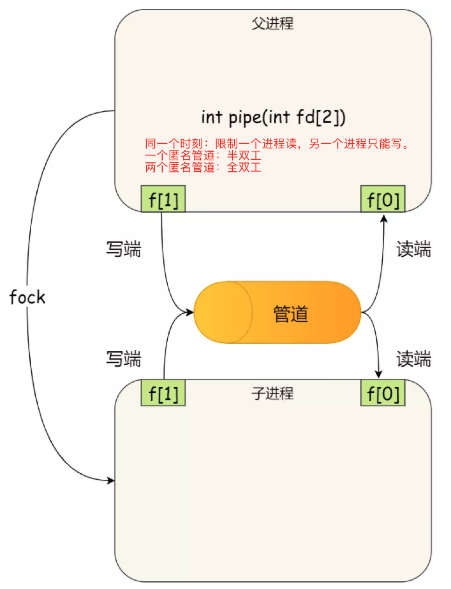
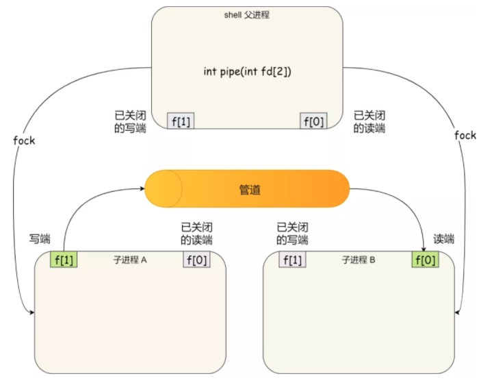

##### 项目

1. 项目背景、人员分工、项目过程、负责的任务、难点、如何解决的、缺陷、改进（深挖细节）

2. 从项目中学到了什么？前后有什么变化

3. 存穿透和缓存击穿，缓存一致性，及其解决办法

4. 除了redis，还了解其它可以用做缓存的技术吗

5. 

6. redis有哪些应用场景？

   提到啥 redis消息队列，扯错了，然后就问我redis消息队列什么的，不会

7. 消息中间件，MQ

8. 我看到你这用kafka发送系统通知，那说一下kafka？没答好

9. 了解哪些消息队列，除了kafka之外还了解其他的消息队列吗？

10. 

11. 你用了哪些些中间件

12. 

13. 你项目中token是存到了什么地方？

14. 说一说cookie和session的区别？

15. session存在服务端如果在分布式部署有问题怎么解决？

##### JVM

1. 说一下JVM内存

2. 那你说一下创建一个类应该存在哪个区域？创建一个对象呢？如果是String对象呢？

3. Volitate关键字用过吗？

   ```
   可见性、有序性
   ```

4. 了解JVM吗？说了内存模型，然后问**什么是堆和栈？**

   ```
   程序计数器：当前线程所执行的 字节码 行号指示器；改变程序计数器 获取下一步 执行的 字节码指令。
   Java 虚拟机栈：方法执行的内存模型，一个方法的执行时 对应一个 栈帧，方法从调用到执行完毕对应着一个栈帧入栈和出栈。
   	栈帧中包括：局部变量表、操作数栈、动态链接、方法出口
   本地方法栈：同 Java 虚拟机栈，为本地方法服务。
   堆：对象分配的主要场所，也是 垃圾回收器的管理的内存区域。
   方法区：类型信息、常量、静态变量、即时编译器编译后的代码缓存等信息。JDK 8 开始被 元空间 代替。

   直接内存区域：（不是 JVM 管理的内存区域，会抛出 DirectMemoryError 问题）
   ```

   ```
   广义来看：堆和栈
   堆是对象分配的主要场所，创建进程时就会为进程分配堆内存。但是线程运行时，在堆上为对象分配的内存是动态分配的。
   栈是线程私有的内存区域，创建线程，就会分配栈空间，操作系统上，栈有专门的寄存器支持，所以，运行时，栈访问比堆访问快。

   JVM 中对象分配在堆上，在栈上持有该对象的引用，栈数据的访问比堆内存的访问少一次寻址。

   栈是线程私有的，线程回收时，会自动回收栈空间，不需要开发者介入；堆内存是 JVM 垃圾回收器管理的，对象是否可回收一定程度上由开发者决定，容易造成内存泄漏。
   ```

5. Java中有几种类加载器？类加载机制有哪些？

   ```
   应用程序类加载器、扩展类加载器、启动类加载器 

   双亲委派机制
   ```

6. 了解什么是双亲委派机制吗？

   ```
   loadClass
   findClass
   ```

7. 怎么判断一个类是否可以垃圾回收？

8. volatile的作用？ 

9. 知道对象头吗？**对象头的作用？**（因为说到了 synchronized锁升级过程用到了对象头，所以后面就到了synchronized...） 

10. synchronized升级过程？ 轻量级锁为什么轻？ 

  因为说到了偏向锁主要设计思想是不会存在多个线程竞争锁，面试官问偏向锁是锁吗？既然不会出现多个线程，为什么还要加锁？ 

11. JVM内存区域？ 

12. gc roots有哪些？ 

    ```
    Java 虚拟机栈中局部变量表中持有的对象
    本地方法栈中持有的对象
    方法区中的静态变量
    方法区中的常量
    Synchronized 所持有的对象
    Java 虚拟机中的内部对象，基本数据类型的 class 对象，系统类加载器，NPE、OOM 等异常对象
    ```

13. **垃圾回收慢的原因？**（提示从垃圾回收主要消耗时间的地方考虑） 


14. 什么时候会出现full gc？ 

15. **什么时候会分配栈，什么时候会分配堆？** 

16. jvm内存模型

17. stackoverflow发生在哪个区域

18. 垃圾回收，判定，回收算法，回收过程

19. JVM：类加载、GC、垃圾回收器

20. 双亲委派机制？什么作用？怎么破坏？ 写一个String类 能加载进去吗？

21. JVM内存模型

22. OOM

23. 类加载的时机（一共6种，答出4种...）

    ```
    1. jvm 执行 new（创建对象）、getstatic/putstatic（获取/设置 实例字段）、invokestatic（调用静态方法） 等指令时
    2. 反射
    3. 初始化类时，父类未加载，则先加载父类
    4. 初始化类时，父接口未加载，且父接口中含有默认方法，则先加载父接口
    5. main 启动类优先加载
    6. 动态语言的支持中，关于关于静态字段、静态方法等的操作
    ```

24. 弱引用和软引用 

    ```
    软引用：高速缓存：第二次GC
    弱引用：ThreadLocal、WeekHashMap：下一次GC
    ```

25. Java的内存模型 

26. GC新生代和老年代交替出现问题会出现啥情况？ 

27. jvm垃圾回收器 

28. GC root 

##### MySQL

1. Mysql中有几种存储引擎？

2. 描述一下建表语句？

3. 常见的主键的数据类型 ？char和vachar的区别

4. Mysql中的锁？乐观锁和悲观锁分别是什么？

5. 什么是事务？

6. 索引用过吗？**索引创建原则？**

7. 数据库索引作用和缺点

8. 有两个表（Person (id_P, id_Name, id_Sex)；Orders(id_O, id_Num, id_P)）查出每个客户的订单总数

9. 数据库隔离级别

10. 可重复读和幻读是什么

11. 数据库索引的数据结构（b+树是啥样的），还有什么数据结构

12. 写sql语句 查找第一万页，每页十条，按时间倒序输，数据库表中重复字段怎么去除

13. 事务隔离级别，可重复读如何实现

14. 索引的结构，为什么会用B+树

15. 聚簇索引和非聚簇索引

16. 事务：四大特性ACID、隔离级别以及现象 

17. Mysql：事务实现、索引（类别、聚簇索引与非聚簇索引、优化、回表）、引擎、主从流程 

18. 什么叫主键索引和聚簇索引？ 

19. 以ABC做联合索引建的表查询C的时候会不会走索引？

20. 数据库DECIMAL(10,2)什么意思？  

21. Student table

    Name | Subject | Score
    张三 | 语文 | 80
    张三 | 数学 |100
    张三 | 英语 | 79
    李四 | 语文 | 59
    李四 | 数学 | 55
    李四 | 英语 | 56
    ...
    总成绩在200到260分之间的前十的学生。

22. 数据库的隔离级别和特性

23. Mysql默认那个级别

24. 怎么实现可重复读

25. 数据库索引底层结构？除了B+树还有那些？ B树 为什么不用B树？

26. 联合索引

27. 数据库查询慢怎么优化

28. 索引用来干嘛的

29. 索引的数据结构是什么？

30. B+树和B树的区别？为什么用B+树？

31. 聚族索引和非聚族索引的区别

32. B+树是聚族索引还是非聚族索引？主键索引呢？

33. 数据库的隔离级别？提交读解释下，这可以解决什么问题？

34. 四个隔离级别 

35. 谈谈对MVCC的理解 

36. **谈谈对间隙锁的理解**

37. 说说数据库的范式

38. 写个SQL语句，有10个班，每个班的学生都有成绩，返回每个班级的第一名（天啦撸，SQL语句我都有半年没写了，自己也没准备，一直在看MySQL的内部实现机制和相关实现原理，唉，得补起来） 

39. 说说索引的优缺点(过) 

40. mysql索引，联合索引失效的情况（手撕sql，刚开始没反应过来只写了个大概…憨杵在屏幕前…）

41. 慢查询日志使用 

42. B+树与B树比较，计算B+树可以容纳多少条记录 

43. SQL语句查询慢怎么检查 

44. 大表优化 

45. 写了个SQL语句 

##### 计网

1. 你说一下tcp，http分别在哪层？
2. 为什么会有TIME_WAITE？ 什么时候会出现很多 TIME_WAITE？？？ 
3. 了解TCP协议吗？比如都包括什么，多少位（不记得了，面试官就没问）
4. TCP为什么是握手是三次，挥手是四次？ 
5. 说一下tcp
6. 计算机OSI网络分哪几层？ 
7. 浏览器输入网址敲回车发生了什么？（说我回答的太模糊了） 
8. DNS如何寻址的？
9. tcp/ip模型，各层的协议
10. arp协议
11. **mac地址是唯一的吗，为什么用ip地址而不是mac地址去定位**
12. **IP地址 扮演了什么角色**
13. ip地址怎么区分不同网络
14. tcp和udp的区别
15. 拥塞控制
16. tcp连接的各种状态
17. **2MSL时间一般是多长**
18. 滑动窗口
19. HTTP和HTTPS的区别，为什么保证安全性？
20. OSI模型7层分别是什么？
21. 网络层有哪些协议？ping是什么？ 
22. 应用层有哪些协议？FTP用的什么端口？
23. 浏览器中输入URL之后用到了哪些协议？怎么找到对应的ip？
24. DNS说一下，域名的好处是什么(过) 
25. http状态码 
26. TCP/UDP区别 

##### 操作系统

1. 进程和线程的区别 

2. 打开文件属于进程还是线程，为什么？ 

   ```
   进程，我的理解是进程是资源分配和持有的基本单位，因此，涉及到操作系统中资源的访问，都是以进程为单位的，进程申请到资源后，进程内的线程才能访问资源。
   ```

3. 进程如何创建

   ```
   fork() 函数创建进程，返回值为 int 类型
   返回值 0:当前为 子进程
   返回值 1:当前为 父进程
   返回值 -1：创建进程失败
   ```

4. 进程和线程的区别，进程间的通信方式

5. 多线程如何运行

6. 对日志文件里的数据排序

   ```shell
   sort -rn # 按照数字大小，逆序排序
   head -5 # 输出前 5 行
   ```

7. 搜索日志文件里含有某字符串的语句

8. top命令的显示内容，有哪些参数

   ```
   top 命令
   pid commond进程名称 占用 cpu
   ```

9. 排查CPU飙高怎么排查

   ```shell
   top -H -p pid # 指定 pid 下的线程占用 cpu 的情况
   ```


1. cpu命中率怎么计算？ 
2. 讲一下虚拟内存技术？ 
3. 分段和分页
4. 虚拟内存，虚拟内存怎么管理和物理地址的映射
5. 线程的状态
6. 进程和线程的区别
7. 进程可以访问其他进程的资源吗，怎么实现
8. linux你常用什么命令？然后引出了几个简单的linux系统问题，我答了赶紧说linux其实用的不多，及时止损
9. 死锁条件，解决方法 
10. 线程与进程区别，进程间通信方法 

##### Redis

1. Redis常见的数据类型，过期策略
2. redis集群模式
3. Redis：数据结构、底层结构
4. redis如何实现持久化？
5. 既然你知道Java的HashMap，Redis的hash有看过源码吗（没有） 
6. Redis为什么单线程的性能这么好 
7. Redis如何解决热点key的问题
8. redis重哈希过程（**两张哈希表，渐进式哈希**） 
9. 多路复用模型，redis单线程是是怎么做到高效率的（多路复用），redis现在又引入了多线程，不知道😅（redis 6.0，有时间好好拜读下这篇 <https://www.cnblogs.com/madashu/p/12832766.html>）
10. Redis扩容集群 hash碰撞了之后怎么保证数据的一致性？

##### Spring

1. 你是用的springboot嘛，那它最初是spring，sspringmvc,mybatis那你说一下spring的依赖注入吧
2. Spring有哪些特性？IOC和AOP分别是什么？
3. Spring：IOC、AOP
4. SpringBoot ：注解、启动类
5. **Springboot相关……怎么实现自动配置?自动配置jdk中还有别的吗？**
6. **Ioc你该怎么设计** 

##### 算法

1. 最后一个是问题是，每对夫妇，生孩子，如果生的是男孩，就不生了；如果生的是女孩，就继续生，直到是男孩，问n年后男女比例？？

2. 快速排序思路描述一下，快速排序时间复杂度，快速排序是稳定的吗？为什么，举个例子说明一下

3. 智力题：一桶水，均分成21份，可以提供任何不带刻度的东工具，尽可能高效的完成

4. 手撕代码：给定一个输入字符串数组，对其处理，要求不出现b以及连续的ac，输出处理后的子串 

5. 编程题：合并区间

6. 前序遍历二叉树

7. 9个球，有一个比较重，怎么在两次之内找出来

8. 快速排序

   写完快排，测试用例要考虑哪些

9. Coding：最近公共父节点

10. 算法题：一个数组只需要排序一个子序列就可以实现整体有序，输出这个需要排序的子序列

11. 红黑树了解多少

12. 手写堆排序

13. 有100个数字，分为10组，每组至少2个数字，编写程序，问哪一种情况下使得10数组之间的和的差异最小(贪婪算法解决，但是也没写出来)

    每组至少2个数字，问哪一种情况下10组数据之间的差的和最小，

14. 智力测试题：北京有2000万人口，请推测一下每天大概有多少婴儿出生(搞了将近20分钟，一开始我用编程思路去解决，面试官说不要用，让我说思路，后面我又推测出孕妇、结婚率一些内容，结果面试官还是不太满意，说有点复杂了，唉，我的心态已经崩了，后来他跟我说思路，感觉跟我差不多，但是我语言组织的不太好)

15. 合并两个有序的单链表，写的递归，后来让改成非递归（要到点了又没让改）  

16. 手撕：单例模式（我是个憨憨，暗示我有个地方写错了我还狡辩 😥 😥 😥愧对面试官小哥） 

17. 手撕：重复子树 

18. 反转二叉树（递归/非递归） 

19. 手撕归并排序

##### 后话

1. 平时有啥爱好或者喜欢看啥书
2. 了解美团吗？
3. 最近有没有看什么书 
4. 问未来的规划（毕业后的），觉得自己的抗压能力怎么样，举个例子说明抗压能力，如果通过了，可以来实习吗
5. 学过的专业课程


##### 二面

###### 项目

- 项目背景、难点

- 简历上的项目深挖 

  - MySQL有没有优化？索引是怎么建的？ 
  - redis有没有优化？在项目中主要用来干什么？ 
  - kafka在你的项目中如何配置的？leader和follower怎么分配的？ 
  - zookeeper如何配置的？ 
  - 过程中有什么难点如何解决？ 

- 简历上写的主修课程，问有没有做过课设，深挖 

  - 学过计算机网络有没有写过网络编程？
  - 学过C++/JAVA，有没有写过多线程的项目？
  - linux有没有用过？熟悉哪些命令？
  - 学过J2EE，做的课设是什么？
  - 还有没有你用过我没问的技术？ 

- 登入怎么做的，登入状态认证怎么做的？

  和前端怎么协调工作的？

  项目里用到了redis哪些数据结构？其他数据结构有什么用途？

  redis中数据怎么设置过期？过期的数据怎么淘汰？还有其他的内存淘汰策略么？

###### Java

- java8新特性 
  - stream 流
  - optional 类
  - lambda 表达式、方法引用（配合函数式接口）
  - 接口中增加默认方法、静态方法
- 悲观锁 乐观锁 
- CAS具体原理
- ArrayList HashSet
- final static关键字
  - final：修饰符，修饰 实例变量、方法、类，表示最终的含义：即 final 修饰的目标定义之后就不可变
  - static：修饰符：修饰 实力变量、方法、类，表示静态的含义：即 static 修饰的目标属于类
  - final static 修饰的目标表示一个类常量，定义之后就不可变，并且属于类。
- **java出栈，入参是一模一样的，返回值不一样**
- finally 关键字，return会走到吗。
  + finally 无 return：finally 会在 try 中 return 执行之后，真正返回之前执行。（finally 代码块可能会改变 try 中return 的对象值，进而改变返回值）
  + finally 有 return：finally 的 return 值会覆盖 try 中的 return。
- 线程不安全的工具类，多线程的环境中使用，有哪些方式
  - 加锁（乐观锁、悲观锁）
  - 对于 集合 而言，可以使用 Collections 提供的静态方法，将对应的集合类包装成 线程安全的 类。
  - ThreadLocal
  - 作为局部变量使用
- 锁 和 ThreadLocal 分别适用什么场景？对于性能要求特别高的场景应该用哪个？
  - 锁：线程之前共享，所有线程的运行周期中都能够实现 锁对象 的共享
  - ThreadLocal：线程封闭的对象：某个线程独有的，并且在该线程的运行周期中都会使用到的对象。

###### JVM

- JVM  G1和CMS区别 

- 类加载

- violate

- JAVA运行时区域

- JVM垃圾收集器介绍下？垃圾收集算法有哪些？

  哪些收集器用到了复制算法？

###### 操作系统

- Linux指令 

- 进程间通信的方法？**管道是怎么样实现的。**

  - 每个进程的用户地址空间都是独立的，一般而言不能够直接访问，但是内核空间是每个进程共享的，所以，进程之间的通信必须通过内核完成**？？？？？**

  1. **匿名管道**

     - 匿名管道 是特殊的文件，只存在于 内核内存中，不存在于 文件系统中！

     - **`int pipe(int fd[2])`** 系统调用在当前进程中创建匿名管道，并返回两个文件描述符`fd[0], fd[1]`

       `fd[0]` ：管道的读取端文件描述符

       `fd[1]` ：管道的写入端文件描述符

       从管道的一端写入数据，从另一端读取数据，所有的写入与读取都是基于内核完成的！

     - 匿名管道的进程间通信作用：

       当前进程 **fork 出的子进程会复制 父进程 的文件描述符**。此时，父子进程都会拥有 fd[0] 和 fd[1] 文件描述符。

       于是，两个进程通过各自的文件描述符，对同一个管道文件进行读写，实现进程通信。

       为了避免两个进程同时 读，或者同时 写，需要限制某个进程只能读，另一个进程只能写，因此，匿名通道是一个半双工通信通道，如果要实现全双工，就必须另外创建一个 匿名通道！

       *那如何实现全双工的呢？父进程创建两个 管道，然后 fork 子进程？*

       

     - shell 中的管道`A | B`

       其中的 `|` 就是匿名管道，可以看出管道是半双工的！

       对于 shell 而言，并不是父子进程之间的匿名管道，shell 就是一个父级进程，shell 中每执行一条命令都会创建 shell 的一个子进程执行。因此，shell 中的 ｜ 是兄弟进程之间进行通信。

       shell 会创建一个 匿名管道，然后 fork 出两个子进程，最后，关闭 shell 进程中的文件描述符，然后两个子进程之间，一个进程只写，另一个进程只读！

       

     - 对于匿名管道，通信范围仅仅存在于 父子进程关系之间，因为，匿名管道没有实体，没有管道文件，只能**通过 fork 复制父进程的 fd 文件描述符达到通信的目的**。

  2. **有名管道**

     - 对于命令管道，他可以在不想关的进程之间进行通信。

       命令管道提前在内核中，创建了一个 类型为管道的设备文件，只要在进程中能够使用这个设备文件，就可以进行进程间的通信。

     - 命令管道使用 **`mkfifo`** 命令创建

       ```shell
       $ mkfifo my_pipe
       # my_pipe 就是创建的 管道的名称
       ```

       基于 Linux 一切皆文件的理念，创建的管道也是以文件的形式存在，因此，使用 ls 命令查看，可以看到文件类型是 p(表示 pipe 管道)

       ```shell
       $ ls -l
       prw-r--r--. 1 root root ...
       ```

     - 通信示例：

       ```shell
       $ # 当前终端 A 写入数据后阻塞
       $ echo "test name pipe" > my_pipe  # 将字符串“test name pipe” 写入 my_pipe 通道
       								   # 当前终端阻塞！
       ```

       ```shell
       $ # 另外启动一个终端 B 读取管道数据
       $ cat < my_pipe	# 读取管道中的数据
       test name pipe

       # 当读取出管道中的数据后，终端 A 终止阻塞，继续执行，终端 B 继续执行！
       ```

     - 管道（匿名管道、有名管道）都是 fifo 的方式进行数据通信.

       通道写入之后，必须等待通道数据被读取才能够继续执行（至少 命令管道是这样的）。

       通道读取时，如果没有数据，则阻塞，直到通道写入数据后，继续执行。

       不适用于进程间的频繁通信。

  3. 消息队列

  4. 共享内存

     - 进程间的通信效率最高！

     - 现代操作系统中，对于内存管理都是采用 虚拟内存管理技术。

       每个进程都有自己独立的虚拟内存空间，不同进程的虚拟内存映射到不同的物理内存中。因此，即使 进程A、B的虚拟地址一样，两者访问的都是不同的物理内存地址。

     - **共享内存机制，就是两个进程分配一块虚拟地址空间，映射到相同的物理内存。**

       这样**某个进程写入的数据，就能够被另一个进程访问，不需要数据的拷贝与传递，大大提高进程间的通信速度。**

  5. 信号

  6. 信号量

  7. Socket 通信

- 循环五次，每次都调用fork，创建了多少个进程。 32个

- **文件句柄**

- 缺页中断：

  虚拟存储中，请求页式管理时如果请求的页数据不在内存中，就会产生缺页中断，将需要的数据页从磁盘拷贝到内存中。

  发生缺页中断时，如果内存不够用，就会发生缺页置换：FIFO 置换算法、LRU 置换算法、LFU 置换算法、最佳置换算法

###### Spring

- spring  AOP 

- Spring中bean的作用域？request和session有什么区别？

  bean的生命周期？

  beanFactory和factoryBean有什么区别？

  Spring中还有其他什么容器么？

###### 设计模式

- 设计模式 

- 策略模式，解决什么问题

  [策略模式](https://mp.weixin.qq.com/s/HOnQf-S-w6A19tGnoIXBrg) 采用：**Map\<string_key, Function\<T1, T2\>\>** + **lambda 表达式** / **(方法应用 + 逻辑类)** 方式消除类原始的 if else 代码块。

  **在 if else 较多，或者 代码块较大 的情况下，能够提高代码的可维护性以及代码的可读性！**

  ```java
  import java.util.function.Function;

  public class Test{
      private static HashMap<Object, Function<String, String>> map;
      // 配置 条件 -> 特定业务逻辑 之间的映射
      static{
          map = new HashMap<>();
          map.put("1", Service::handleOne);
          map.put("2", Service::handleTwo);
          map.put("3", Service::handleThir);
          map.put("4", Service::handleFour);
      }
      // 业务逻辑
      private static class Service{

          public static String handleOne(Object obj){
              System.out.println("1");
              return "1 - " + obj;
          }
          public static String handleTwo(Object obj){
              System.out.println("2");
              return "2 - " + obj;
          }
          public  static String handleThir(Object obj){
              System.out.println("3");
              return "3 - " + obj;
          }
          public static String handleFour(Object obj){
              System.out.println("4");
              return "4 - " + obj;
          }
      }

      // 根据条件，执行特定的业务逻辑
      private static String handle(String obj) {
          Function<String, String> function = map.get(obj);
          if (function != null) {
              // 执行业务逻辑
              return function.apply(obj);
          }
          return "no such function!";
      }

      // 测试
      public static void main(String[] args) {
          System.out.println(handle("1"));;
          System.out.println(handle("2"));;
          System.out.println(handle("6"));;
      }
  }

  ```


- 观察者模式

###### Redis

- redis 如何实现高并发和高可用 

###### MySQL

- MYSQL如何优化 

- MySQL 锁

  > - 按照锁粒度：行锁、表锁、页面锁
  >
  > - 按照类型分：共享锁、排他锁、意向锁(意向共享锁、意向排他锁)
  >
  >   - 加上 行共享锁 时，先加上意向共享锁
  >   - 加上 行排他锁 时，先加上意向排他所
  >   - 其他事务想要加表锁时，首先判断该表上是否存在 意向锁，然后判断当前的表锁与意向锁是否兼容。兼容则加表锁，否则阻塞。
  >
  > - Innodb 支持 行锁和表锁
  >
  >   行锁有三种实现方式：Record 锁、Gap 锁、Next-Key lock 锁
  >
  >   Next-key lock 在 可重复读 的隔离级别下，解决了幻读读问题。

- InnoDB如何实现隔离机制：**MVCC：全局事务ID、行记录ID、undo log、行记录版本回滚字段、read view**

- 为什么用B+树 

  > 1. B+ 树叶子结点存放数据，并且叶子结点之间通过指针相连形成有序链表：有序是因为 B+ 树是通过索引构建的，会根据所以的值进行排序，是的叶子结点之间是有序的：使用 B+ 树做 范围、分组、排序 等操作时，更加高效
  > 2. B+ 树非叶子结点之存放索引：Innodb 采用页式存储的方式管理内存，一个B+树结点默认是一页，结点只存放索引，使得一个结点能够存放更多的行记录，行记录一定的情况下，结点所能存放的记录越多，树高就越低，意味着 IO 次数更少。

- 数据库索引，索引结构

- 大数据量表优化

- 查询学生表中重复出现的学生姓名

- 项目中为什么建立唯一索引，而不选择普通索引

  - 约束作用

- MySQL数据库默认的隔离级别

- 事务，隔离，脏幻读，等

- MySQL索引结构

- 事务特性

- 隔离级别

- 底层怎么实现可重复读

###### 计网

- TCP，可靠性如何保证

- http状态码，[502，504](https://juejin.im/entry/6844903462048628749)

  >- 500 服务端错误
  >- 502 网关从上游服务器接收到无效的响应
  >- 504 网关在规定时间内，未能收到上游服务器的响应
  >- 400 请求语法错误
  >- 401 需要认证
  >- 403 无理由拒绝
  >- 404 请求资源不存在
  >- 301 永久重定向
  >- 302、307 临时重定向
  >- 304 资源依旧有效
  >- 200 请求成功处理
  >- 204 请求成功处理，不返回数据
  >- 206 返回部分数据：Content-Range 范围请求
  >- 100 请求正常处理，可继续发起请求 

- tcp三握，http状态码，http请求，等

- TCP和UDP有什么区别？TCP连接的概念，相对于UDP来讲，体现在哪个方面

- TCP三次握手为什么是三次。三次握手的机制会不会有问题？两次握手后的半连接，会消耗服务器资源。怎么控制半连接的数量，具体怎么去控制。

- 访问网页的过程

- 三次握手状态：

  ```
  close
  			listen
  syn-sent	
  			syn-recv
  established
  			established
  ```

  四次挥手状态：

  ```
  established		established
  FIN-WAIT-1
  				close-wait
  FIN-WAIT-2
  			
  			
  				last-ACK
  time-wait
  				close
  (2MSL ：2*最大报文段寿命)
  close
  ```

  [大量 time-wait 怎么办？](https://draveness.me/whys-the-design-tcp-time-wait/)

  - 怎么查看 time-wait 的数量

    ```shell
    netstat -a | grep TIME_WAIT| wc -l
    ```

  - 产生原因：

    通信双方中，主动方（客户端）发起了 FIN 断开连接，最后服务端也发送 FIN 断开连接时，主动方（客户端）就会处于 TIME-WAIT 状态！

    同时等待 2MSL。

    既然服务器产生了大量的 TIME-WAIT 那么就是，服务器发起了大量的短连接！

    我认为，这是服务端应用 向 MQ、Redis、MySQL、RPC 框架等发起的大量的短连接，当服务端主动断开连接时，出现大量的 TIME-WAIT。（在这个过程中服务端就是一个客户端角色）

  - 产生影响：

    服务端发出 socket 连接时，会占用 服务端端口，端口最大数量 0～65535 个，其中 0～1023 的端口是系统已经分配的，其余的端口供给线程/进程随机分配的。而 Linux 中可供客户端使用的端口号大概在 28000 个。

    因此，如果出现 TIME-WAIT 则说明该链接并没有断开，依旧是占用着端口。

    如果说已使用的端口数量超过的上限，则后续的连接请求都会被阻塞，直到有空闲端口！

  - 方案：

    1. 如果高并发的短链接比较多，那么考虑不采用 4 次挥手，客户端想要断开就**直接发送 RST 报文**，服务端会认为客户端异常了，直接关闭连接。

       如果服务端数据没有传递完成，则容易造成数据响应不完整。

       ```
       RST 字段于异常的关闭连接，发送 RST 消息时，会自动清空缓冲区中的数据，对端收到 RST 消息后，直接关闭连接，不会确认关闭！
       ```

    2. 如果可以的话，采用**长链接**的方式，避免大量短链接的出现。

    3. 使用 `net.ipv4.tcp_tw_reuse` 选项，通过 **TCP 的时间戳选项允许内核重用处于 `TIME_WAIT` 状态的 TCP 连接。**

  SYN flood 攻击

  - 大量的 syn-rcvd 的连接状态

  - 影响：

    1. 半连接队列：保存 syn-rcvd 的连接，每一个到来的连接都会分配 **TCB 传输控制块**，保存连接时的相关数据（端口），会占用系统资源，导致可保存的半连接队列受到限制。

    2. 如果服务端发送了 ACK 之后，没有收到最后的确认，会自动重试，若还没有 ACK，则等待 syn-timeout 时间后丢弃该 半连接。

       syn-timeout 一般在分钟级别。

  - 解决方案：

    1. 调整 syn-timeout 时长，缩短 timeout 时长

       可能会正常的用户连接造成影响。

    2. 延后 TCB 的分配，连接成功后分配。

       SYN-Cookie、SYN-Cache

###### 算法

- 一个代码题  数组中最大差值，要求必须索引小的减索引大的 
- 一个系统设计题  门禁系统
- 二叉树递归和非递归的前序遍历
- 三数之和
- 实现哈希表find，insert，触及知识盲区，只说了思路（不实现整个哈希表咋实现find和insert……）
- 100个试管，1只有毒，10只小白鼠，检测哪个试管有毒？
- 7位电话号码，几千万个，有哪些排序方式？
- 7位电话号码，有重复，不超过5次，有哪些排序方式？
- 给定一个字符串，最少切刀，使得每个子串都是回文子串。
- 算法题：回文数
- 两个栈实现队列
- 二进制中1的个数

###### 分布式

- 一致性哈希
- 负载均衡

###### 后话

- 未来技术规划之类的闲聊

###### 高难度

- **[缓冲区 vs 缓存](https://blog.csdn.net/waS_TransvolnoS/article/details/101158854)区别**

  

  - 缓冲区 Buffer：**写数据暂存，当数据容量达到缓冲区大小时，真正执行 IO 操作：避免频繁 IO，侧重与数据写**

    IO 模型中有：用户缓冲区、内核缓冲区，用户缓冲区面向 用户进程服务，内核缓冲区 面向内核底层服务。

    应用程序层面执行的 read/write 操作都是用户缓冲区与内核缓冲区之间的交互，真正的 IO 操作由 操作系统底层实现。

  - 缓存 Cache：

    - 操作系统 [Cache（高速缓存）](https://www.cnblogs.com/yangyuliufeng/p/9203618.html)，接近于 CPU 执行速度，用于平衡 CPU速度 与 内存读写速度的差异。

      程序执行时，需要从 内存中获取 数据和指令，为了缓解 CPU 与 内存之间的速度，会事先将数据指令预加载到 高速缓存，当程序运行需要时，首先会查询缓存，缓存命中则直接使用，否则从内存中读取，并将数据指令拷贝到 缓存。

    - Web 应用中的缓存：避免数据重复处理，加快数据响应。

- 计算机中断

  - CPU 在执行程序的过程中，由于某种 **外部/内部 异步事件**的作用，使得 CPU **暂停执行当前程序**，**保存现场**后转而去**执行对应事件的处理子程序**，处理完成之后，**返回程序断点**，**恢复现场继续执行**。

- web应用中有什么安全问题，如何解决？ 

  - *XSS 跨站脚本攻击*

    在 Web 页面中插入 js 代码，当用户浏览网页时，嵌入的 js 代码就会被执行。

    XSS 可以通过 js 脚本读取 Cookie 信息

  - *CSRF 跨站请求伪造*

    利用用户在网站 A 上未过期的 cookie，当用户浏览网站 B 时，插入 A 网站的请求，让用户无意间向 A 网站发送请求。

  - *重放攻击*

    Token 技术会产生重放攻击。

    攻击者发送一个目的主机以接收过的包，达到欺骗系统的目的，主要用于身份认证过程。

  - *SQL 注入*

    在 sql 参数中加入恶意的 代码，当 sql 解析时，会受到该参数的影响，执行其他的语义。

    ```mysql
    # 参数：abc" or name != "add
    # sql ：
    delete from t_user where name = ?

    # sql 注入后
    delete from t_user where name ="abc" or name != "add"
    ```

  - *Dos 攻击*（服务停止攻击、拒绝服务攻击）

    发送海量的请求到服务器，服务器无法分辨请求正常与否，照单全收，造成 海量请求 霸占服务器资源，使得服务器无法对正常用户的请求做响应，即：拒绝后续服务。

  - *DDos 攻击*（分布式 拒绝服务攻击）

    [详见：百度百科](https://baike.baidu.com/item/分布式拒绝服务攻击?fromtitle=DDOS&fromid=444572)

    DDos 基于 Dos，是一种分布式的、协同的大规模攻击。

    Dos 是由单机发起的攻击

    DDos 是借助数百、甚至数千台被入侵的机器，通过安装攻击进程，向目标同时发起攻击的集团行为。

    + 例如：**SYN 洪荒攻击**

  - *中间人攻击（MITM）*

    攻击者伪装成代理服务器，作为客户端与服务端的中间者而存在，所有的会话都会被攻击者监听嗅探。

    - **会话劫持**

    - **DNS 欺骗**

    - *[ARP 欺骗](https://baike.baidu.com/item/ARP欺骗)*

      在局域网中，攻击者将自己的 MAC 地址伪造成 请求主机的 目标 MAC 地址，达到数据监听的目的。

      因为 **ARP 表是动态的**，在局域网中，若有两台主机A、B 同时做 ARP 报文广播，则攻击者可以同时获取A、B 主机的 MAC 地址，借此，**攻击者将向 A、B分别回应自己的 MAC 地址，误导 A、B 主机的 ARP 表的建立**。

      此后，**A、B之间都会将 攻击者作为目的主机进行通信，而攻击者就能够监听数据，甚至篡改数据后转发，甚至拒绝抓发数据，阻断A、B通信。**

- [快排优化](https://blog.csdn.net/hacker00011000/article/details/52176100) 

  > 1. 固定标准值：最坏 O(N^2)，平均 O(NlogN)
  > 2. 随机标准值：大概率降低最坏情况
  > 3. 三数取中值：完全消除最坏情况
  > 4. 三数取中值 + 插排：当区间分割较小时（5~20，10 比较推荐）区间内部已经部分有序，此时使用插入排序效率更高
  > 5. 三数取中值 + 插排 + 聚集相等元素：将与标准值相同的元素汇聚，划分区间时，这部分元素将不包含在内（重复率高的数组中优化明显）

- 如何实现一个乱序算法？ 

  ```java
  // 洗牌算法
  public int[] RandomSort(int[] origin){
      int newArr = Arrays.copyOf(origin);
      Random random = new Random();
      for(int i = origin.length - 1; i > 0; i--){
          int exchangeIdx = random.nextInt(i); // 产生 0~i-1 之间的数
          // random.nextInt() 产生 Integer.MIN_VALUE 到 Integer.MAX_VALUE 之间的值
          swap(newArr, exchangeIdx, i);
      }
  }
  private void swap(int[] arr, int x, int y){
      int temp = arr[x];
      arr[x] = arr[y];
      arr[y] = temp;
  }
  ```

- AVL树、红黑树、2-3树比较，为什么用红黑树不用AVL和2-3树 

- 实现一个给车牌号排序的算法（没答上来） 

- 12306中考虑到一个座位的票售卖时，时间和站点问题，如何正确下单 

- JAVA是编译语言还是解释语言，为什么 

- 算法：二叉搜索树中比k大的最小数 （二叉搜索树、二叉排序树、二叉查找树）

- 算法：01陆地和水源问题 

  又想不起来了，二面很多活跃的场景问题，感觉答得不太准确，只说了自己思路，感觉不太契合面试官思路

- 